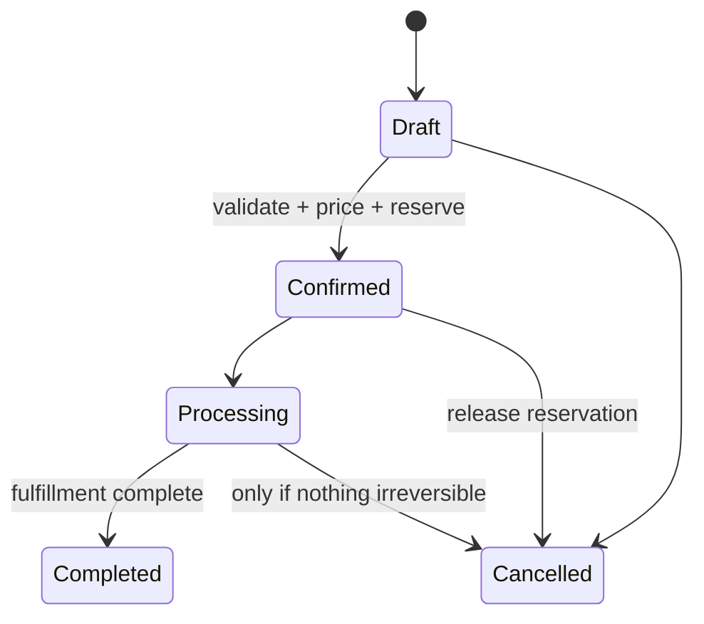
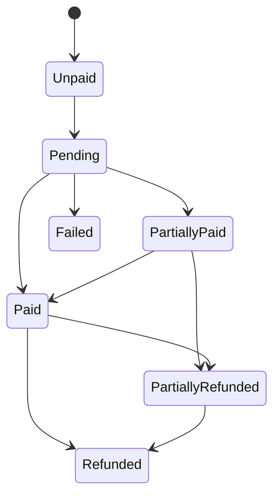
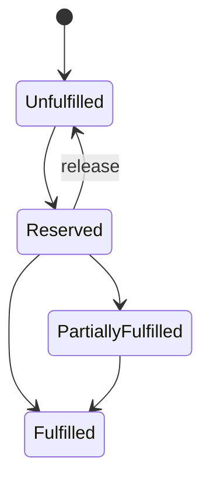
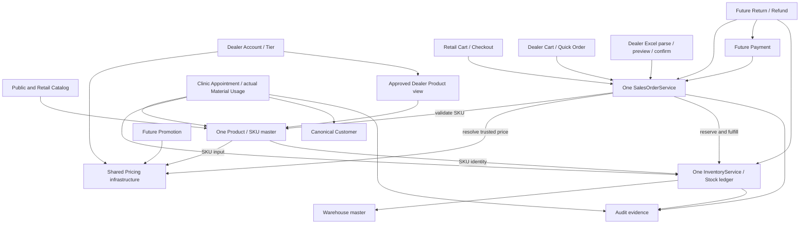

# ERP Core Design

> **Project:** Junie Clinic + Retail + B2B Dealer ERP
> **Document type:** Architecture and implementation design only  
> **Status:** Proposed baseline for phased delivery  
> **Scope guard:** This document does not implement ERP tables, migrations, APIs, UI, or production data changes.

## 1. Executive Summary

Junie should evolve as a **modular monolith**, preserving the existing Laravel REST API, React application, MySQL database, Sanctum authentication, appointment booking, and clinic operations. Retail commerce and approved B2B dealer commerce are separate channels alongside the clinic; they use one authentication system and shared commercial and stock services.

The target system has three business flows and one Product/SKU and Inventory kernel:

- Clinic: `Customer -> Appointment -> Service -> Doctor -> Material Usage -> Inventory`.
- Retail: `User -> shared Catalog -> Cart -> Checkout -> Sales Order -> Payment/Processing -> Fulfillment -> Inventory`.
- B2B: `Approved Dealer Account -> Tier -> shared Catalog -> Quick Order/Excel Import -> Sales Order -> Payment/Processing -> Fulfillment -> Inventory`.

Retail and Dealer orders use one `SalesOrderService`, `sales_orders`/`sales_order_items`, pricing infrastructure, fulfillment path, SKU master, and Warehouse/Inventory core. A normal User may buy at Retail Price without applying for Dealer status; that User can also hold a canonical Customer profile and one or more Dealer memberships. Retail Price and Silver Dealer Price are separate commercial concepts even when their numeric values coincide. Cart is shopping state, never an order or a stock reservation.

The current system already provides useful patterns: Form Requests and API Resources, database transactions and row locking inside `BookingService`, an append-oriented audit service, Sanctum session authentication, React Query, and role-gated application shells. Those patterns should be reused, but the large booking service must not become a general ERP service.

The principal architectural gaps are:

- `users.role` is a single identity role, while ERP access needs permissions plus business-profile scope.
- Registered Customer Foundation Step 2 is implemented and functionally verified; guest claim/merge and final constraints remain future work.
- Product/SKU, dealer, warehouse, inventory, order, payment, and import domains do not exist yet.
- Appointments and vouchers are clinic concepts and must not be repurposed as sales orders or ERP promotions.

Delivery remains additive. The next coding task after this architecture review is **Product Master + SKU + Retail Pricing Foundation**; this document introduces no production code.

## 2. Current System Audit

### 2.1 Runtime and structure

| Area | Audited state |
|---|---|
| Backend | Laravel 13.31, PHP 8.4, MySQL 8.4, Sanctum 4.3 |
| Frontend | React 19, TypeScript, TanStack Start/Router/Query, Tailwind CSS 4, Vite 8 |
| API | REST routes in `backend/routes/api.php`; 103 non-vendor routes at audit time |
| Backend inventory | Historical architecture-audit snapshot: 13 models, 35 controllers, 43 requests, 24 resources, 14 services, 1 policy; not a current recount |
| Frontend inventory | Historical architecture-audit snapshot: 69 route files, 21 pages, 11 API service clients, shared `AuthContext`; not a current recount |
| Database | 27 tables and 34 applied migrations at the Step 2 verification; no Commerce tables |
| Background infrastructure | Database queue/cache/session configured; after-commit queued notifications are already used |
| Baseline tests | Step 2 final functional verification: 360 tests / 1,935 assertions passing |

### 2.2 Current business data

The current database contains clinic users, canonical registered Customers, doctors, services, appointments, schedules, vouchers, loyalty records, reviews, audit logs, and framework infrastructure. At the Step 2 verification there were 8 users, 4 eligible registered Customers, 19 correctly linked registered appointments, 3 unlinked guest appointments, and 4 consistent Customer migration maps. Two database triggers still enforce appointment ownership compatibility.

The Step 1 Customer schema and Step 2 registered backfill/runtime dual-write exist. Admin Customer List/Detail and Receptionist Customer Search read canonical `customers`; registered bookings write `appointments.customer_id` while retaining `appointments.user_id` and legacy resource compatibility. Guest bookings still use `guest_*` and have `customer_id=null`. Guest claim/merge, remaining User-based loyalty/voucher/review compatibility paths, and constraint tightening remain separate work. See `docs/CUSTOMER_FOUNDATION_STEP2_IMPLEMENTATION.md` for the recorded verification and its historical Git-audit limitation; this architecture task starts from a clean Git baseline.

No current code or table implements dealer accounts, products, variants/SKUs, warehouses, stock balances, stock movements, price lists, sales orders, bulk order imports, payments, returns, refunds, or ERP promotions.

### 2.3 Reusable patterns and boundaries

| Existing pattern | Reuse | Boundary |
|---|---|---|
| `BookingService` transactions and `lockForUpdate()` | Transaction and locking discipline | Do not add ERP order/inventory responsibilities to this large service |
| Form Requests and API Resources | Validation and response contracts | Create domain-specific requests/resources |
| `AuditLogger` | Actor/action/module/snapshot conventions | Add explicit system actor support and redact import PII |
| Sanctum auth | One login/session for every profile | Authorization must move beyond a single role string |
| Appointment policy | Ownership checks | Dealer scope must be membership-based, not appointment ownership |
| React Query/API wrapper | Query invalidation and uniform error handling | Add feature-local keys and clients; keep backend authoritative |
| Queued after-commit notifications | Safe side effects | Order/import notifications must dispatch only after commit |

## 3. Current Architecture Findings

1. **Authentication identity and business identity remain distinct but authorization is still role-based.** `User` contains a single role; canonical registered Customers now exist, while ERP access needs independent permissions, context, and memberships.
2. **The registered Customer step is complete functionally, while guest identity remains transitional.** Dealer and Retail orders must not infer Customer identity from shipping recipient contact; guest claim/merge and legacy cleanup follow their own plan.
3. **Booking has strong integrity patterns but excessive domain breadth.** ERP logic should use small application services such as `PricingService`, `InventoryService`, and `SalesOrderService`, coordinated within explicit transactions.
4. **The audit trail is suitable as a base, not as a stock ledger.** Audit entries explain who changed business state; stock movements prove quantity changes. They are separate immutable concerns.
5. **Frontend route guards improve navigation but are not security controls.** All permissions and dealer/warehouse scope must be checked in Laravel policies or middleware.
6. **Existing appointment, voucher, and loyalty records cannot model ERP orders, promotions, or dealer tiers.** Reuse would create ambiguous state machines and accounting semantics; the new domains require separate tables.

Compatibility must be maintained through staged reads and dual references only where explicitly planned. New ERP code must not depend on legacy customer-by-role queries.

### Evidence-backed boundary changes

#### Identity and business profiles

- **CURRENT — Files:** `backend/app/Models/User.php`, `backend/app/Http/Controllers/Api/AuthController.php`, `backend/app/Http/Resources/UserResource.php`, and `frontend/src/contexts/AuthContext.tsx`.
- **Current behavior:** Registration atomically creates a User and canonical Customer; authenticated resources/frontend context still primarily branch on one role.
- **Issue:** One User cannot safely express independent clinic/dealer profiles and resource-scoped ERP abilities through that field alone.
- **PROPOSED architecture:** Keep User/Sanctum authentication, resolve profiles through relationships/memberships, and add abilities plus policies incrementally.
- **Why:** It permits Customer, Dealer, or both without a second login or a tier-as-permission mistake.
- **Compatibility:** Retain `role` and current response fields while additive ability/profile fields roll out.
- **Migration:** Map current roles idempotently, migrate route-by-route, then retire role-only ERP decisions.
- **Tests:** Existing auth/role regression plus multi-profile, missing-ability, inactive membership, and cross-scope denial.

#### Canonical customer boundary

- **CURRENT — Files:** `backend/app/Http/Controllers/Api/Admin/CustomerController.php`, `backend/app/Http/Controllers/Api/Staff/ReceptionistAppointmentController.php`, `backend/app/Models/Customer.php`, and `backend/app/Models/Appointment.php`.
- **Current behavior:** Registered Customers are backfilled and synchronized; admin/receptionist customer reads use `customers`; 19 registered appointments are linked while 3 guest rows retain `customer_id=null`.
- **Issue:** Guest identity and remaining User-based compatibility paths cannot be silently treated as completed Customer cutover or matched to order recipients.
- **PROPOSED architecture:** Preserve Step 2 canonical registered behavior, then separately verify guest claim/merge, remaining compatibility cutover and stronger constraints.
- **Why:** Clinic identity becomes stable before a second business profile and import channel arrive.
- **Compatibility:** Keep legacy appointment ownership/snapshots and triggers until verified coverage and a separately approved constraint phase.
- **Migration:** Registered dry-run, checkpointed backfill, idempotent rerun and reconciliation are complete; guest migration and later constraints require their own verified stages.
- **Tests:** Registered/guest identity, conflicts, interruption/restart, booking regression, ownership and trigger compatibility.

#### Transactional service boundary

- **CURRENT — File:** `backend/app/Services/BookingService.php`.
- **Current behavior:** Booking already uses database transactions, row locks, cache locks, audit, voucher, loyalty, slot, and notification coordination.
- **Issue:** Adding dealer pricing, ordering, Excel, and inventory would turn a large clinic service into an untestable cross-domain coordinator.
- **PROPOSED architecture:** Reuse its transaction/locking discipline in separate `SalesOrderService`, `PricingService`, `InventoryService`, and import orchestration boundaries.
- **Why:** Each ledger and state machine retains one owner while the modular monolith can still use atomic MySQL transactions.
- **Compatibility:** Booking behavior and public/authenticated booking APIs do not change.
- **Migration:** Introduce new services only with their modules; no Booking rewrite prerequisite.
- **Tests:** Service-level workflow tests, cross-service atomicity, concurrent reservation/usage, and complete booking regression.

#### Authorization and ownership

- **CURRENT — Files:** `backend/app/Policies/AppointmentPolicy.php` and `backend/routes/api.php`.
- **Current behavior:** Appointment ownership is based on `appointments.user_id`; route middleware uses the four current roles.
- **Issue:** A dealer account can have multiple members and warehouse access is independent of appointment ownership or global role.
- **PROPOSED architecture:** Policies combine named ability with active dealer membership or warehouse assignment scope.
- **Why:** Frontend visibility cannot prevent cross-dealer/cross-warehouse access.
- **Compatibility:** Appointment policy remains intact; ERP resources get new policies as their APIs appear.
- **Migration:** Add permissions/memberships before routes, map current access, and deny unassigned scope by default.
- **Tests:** Direct HTTP cross-scope attempts, suspended membership, inactive warehouse, and admin/non-admin behavior.

#### Audit versus business ledgers

- **CURRENT — File:** `backend/app/Services/AuditLogger.php`.
- **Current behavior:** The request-aware logger records action/module and redacted before/after snapshots.
- **Issue:** It does not replace quantity/payment ledgers and needs explicit non-HTTP actor context for queued import/payment work.
- **PROPOSED architecture:** Extend audit modules/actor sources while maintaining immutable stock movements, reservations, payments, histories, and snapshots as domain facts.
- **Why:** Operational explanation and mathematical reconciliation have different invariants and retention needs.
- **Compatibility:** Existing audit calls and UI remain valid; new context is additive.
- **Migration:** Add safe metadata fields/actions only when needed and never backfill invented ledger facts from generic audit JSON.
- **Tests:** Same-transaction audit, explicit system actor, PII/secret redaction, and ledger reconciliation independent of audit.

## 4. Business Domain Boundaries

| Module | Owns | May depend on | Must not own |
|---|---|---|---|
| Identity & Access | User authentication, roles, abilities | Sanctum | Customer/dealer business state |
| Customer | Canonical clinic/customer-related business identity | User identity optionally | Dealer account, recipient or authentication credentials |
| Clinic | Appointment, service, doctor, material confirmation | Customer, SKU, inventory | Sales orders and price lists |
| Retail | Catalog journey, cart, checkout and own-order experience | User, Catalog, Pricing, Sales | Dealer membership as a buying prerequisite |
| Dealer | Application, approved account, contacts/memberships, tier assignment | User identity | Authentication credentials or a second order engine |
| Catalog | Category, brand, unit, product, variant/SKU | None | Stock quantities or selling prices |
| Warehouse & Inventory | Warehouses, balances, reservations, movements, lots | SKU | Commercial order snapshots |
| Pricing | Separate Retail and Dealer price contexts, lists and resolved base price | Dealer tier when applicable, SKU, warehouse | Promotion orchestration or payment |
| Sales | One Retail/Dealer sales-order core, item snapshots and fulfillment state | Buyer context, pricing, inventory | Appointment state or channel-specific order engines |
| Import | Upload, validation, preview, idempotent confirmation | Sales application service | A parallel order-creation implementation |
| Payment | Payment attempts/events and allocation | Sales order | Inventory mutation |
| Return & Refund | Return authorization, accepted quantities, refunds | Sales, payment, inventory | Original order mutation |
| Promotion | Eligibility and discounts | Pricing, dealer/order context | Voucher compatibility assumptions |
| Audit | Actor and business-change evidence | Every module | Source-of-truth inventory/accounting ledger |

Cross-module writes occur through application services. Controllers validate and authorize, then call one use-case service. Models do not coordinate workflows through hidden observers.

## 5. User / Customer / Dealer / Recipient

These concepts remain deliberately separate:

- **User:** a login identity, authentication credentials, platform status, and authorization assignments.
- **Customer:** the canonical person/business identity for clinic and other customer-related use cases. A customer may link to one user; historic or future verified guests may have no login. A Retail buyer may link to a Customer when an explicit business use case needs it, but retail purchase does not require a Dealer or automatic recipient merge.
- **Dealer account:** a B2B legal/commercial account with code, billing identity, tier, credit/commercial status, and one or more user memberships.
- **Recipient:** the delivery contact captured as an immutable snapshot on a sales order. It is not automatically a User, Customer, or Dealer member.

A User may be linked to a Customer, buy Retail, belong to a Dealer, or combine these roles. Retail purchase does not create a Dealer tier. A dealer account may have multiple users even if the first UI release allows only one active member. Model this with `dealer_account_users` from day one to avoid a destructive one-to-many redesign later.

Recommended cardinalities:

- `users 1 -> 0..1 customers` through nullable unique `customers.user_id`.
- `users * <-> * dealer_accounts` through memberships containing status and dealer-scoped role.
- `users 1 -> * carts` over time, with at most one active cart per `(user, sales context, selected dealer account)` where that cart policy is enabled.
- `users 1 -> * retail sales_orders` as authenticated buyer; `dealer_accounts 1 -> * dealer sales_orders` as commercial buyer.
- `sales_orders 1 -> 1 recipient snapshot` stored directly on the order for V1.

Recipient matching by phone is useful for suggestions only. It must never silently merge clinic customers, authentication identities, or dealer memberships.

## 6. Authentication & Profile Strategy

Keep the current Sanctum authentication flow and `users` table as the sole credential source. Do not create dealer passwords or a dealer-auth guard.

Before exposing dealer routes, add an incremental authorization layer:

1. Preserve `users.role` as a temporary compatibility classification.
2. Introduce named abilities/permissions and policy checks for ERP operations.
3. Resolve business scope independently: customer link, active dealer memberships, and warehouse assignments.
4. Extend the authenticated-user resource with profile summaries and abilities without removing current fields.
5. Migrate frontend menus from direct role equality toward returned abilities.

Illustrative additive response:

```json
{
  "id": 8,
  "name": "Example",
  "role": "customer",
  "abilities": ["dealer.orders.view", "dealer.orders.create"],
  "profiles": {
    "customer_id": 41,
    "dealer_accounts": [{"id": 12, "code": "DLR-001", "status": "active"}]
  }
}
```

The backend remains authoritative. Selecting a dealer context in the frontend changes scope, not permissions. Every dealer request verifies an active membership for the selected approved account. A normal authenticated User needs no dealer context for Retail cart, checkout, or own-order history.

## 7. Dealer Application and Account Foundation

### `dealer_applications`

A normal User may apply for B2B status without losing Retail/Clinic access. Proposed fields: `id`, applicant `user_id`, company and contact names, email, phone, nullable tax code, business address, `status` (`pending`, `approved`, `rejected`, `cancelled`), reviewer/timestamp, rejection reason, and timestamps. Submission never grants dealer pricing or import rights. Admin review is an authorized transition with recorded reason and audit.

Approval locks the pending application and, in one short transaction, creates or activates the Dealer Account, creates an active owner membership, assigns the approved initial tier and history, marks the application approved, and records audit evidence. Retry returns the same account/membership rather than duplicating them; constrain one approved account result per application. Rejection leaves the applicant a normal Retail User. A later application policy may govern reapplication after rejection; it is not a second login.

Proposed core tables:

### `dealer_accounts`

- Identity: `id`, unique immutable `code`, legal/trading name.
- Contact and tax: tax code, email, phone, billing address components.
- Commercial state: `status` (`draft`, `active`, `suspended`, `inactive`), current tier reference, optional credit settings for future use.
- Governance: timestamps, creator/updater, optional inactivation metadata.

### `dealer_account_users`

- `dealer_account_id`, `user_id`, dealer-scoped membership role, status, invited/activated timestamps.
- Unique membership per `(dealer_account_id, user_id)`.
- Index `(user_id, status)` for resolving accessible dealers.

Dealer code changes should be prohibited after transactional references exist. Suspension blocks new ordering but preserves access to authorized history according to policy. Tier belongs to the Dealer Account, never the User; it is a commercial classification and must not grant platform permissions or be chosen on the Product page.

## 8. Product Master

`products` represents the shared commercial concept; it is not a stock unit. Proposed fields include:

- Unique stable product code; translatable/display name, description.
- `product_category_id`, nullable `brand_id`.
- Product classification and channel capabilities; a single Product can support clinic material and Retail/Dealer resale through its SKUs.
- `status`, capability defaults, batch/expiry flags, tax classification readiness.
- Optional default low-stock threshold; a warehouse/SKU threshold table may override it later.
- Optional default image and structured metadata.

Products may be inactivated but not deleted once referenced. Product descriptions and names are copied into order item snapshots so historic documents survive master-data edits.

The table should be named `product_categories`, not `categories`, because the current application already contains category-like clinic/content concepts and future ambiguity is costly.

## 9. SKU / Product Variant

`product_variants` is the one authoritative sellable and stockable SKU master for Clinic, Retail, and Dealer. “SKU” is its unique business identifier. Do not introduce `retail_products`, `dealer_products`, or `clinic_products`.

Recommended fields:

- `product_id`, globally unique normalized `sku`, variant name.
- `unit_id`, barcode, specification JSON for display-only flexible attributes.
- Explicit capabilities such as `sellable_retail`, `sellable_dealer`, `clinic_material`, and `track_inventory`; status and optional weight/dimensions. Capabilities can be a normalized policy model if they outgrow stable flags, but all channels still reference this SKU.
- Future flags: lot tracking, expiry tracking, serial tracking.

All order items, balances, movements, reservations, service material templates, usage records, returns, and price-list entries reference `product_variant_id`, never only `product_id`. Variant-defining data that participates in equality or reporting belongs in typed columns or normalized tables; JSON is not a substitute for keys or constraints.

SKU normalization must be deterministic (trim/case policy) and shared by UI, API, and Excel import. A normalized SKU may not be reused after it has transactional history.

## 10. Category / Brand / Unit

- `product_categories`: unique code, name, optional parent, sort order, active status. Prevent cycles at the application layer.
- `brands`: unique code/name policy and active status.
- `units`: immutable code, display name, decimal precision, active status.

V1 inventory uses one base unit per SKU. Unit conversion is explicitly out of scope until a conversion model, rounding policy, and valuation impact are approved. Quantity columns use fixed precision decimal types; they must not use floating point.

Master inactivation blocks new assignment while preserving old references. Unique identifiers remain reserved after inactivation.

## 11. Warehouse

`warehouses` owns a unique code, name, address/timezone details, type, status, and operational flags. Inventory always belongs to a warehouse; there is no global `products.stock` field.

Recommended V1 rule: one sales order and one clinic material confirmation consume from exactly one warehouse. Multi-warehouse fulfillment is deferred because it introduces split reservations, shipments, pricing, and returns.

If warehouse staff need scoped access, use `warehouse_user_assignments` rather than adding a single warehouse column to `users`. Admins may have global permission; operators receive explicit warehouse scope. Warehouse inactivation is blocked while open reservations or fulfillments exist.

Bin-level inventory is not justified for V1. The upgrade path is `warehouse -> zone -> bin/location`, followed by location-level balances/movements or allocations; warehouse identity must therefore remain stable and must not be encoded into SKU.

## 12. Inventory Core

`inventory_balances` is the fast current-state projection keyed by `(warehouse_id, product_variant_id)`:

- `on_hand_quantity`: physically held quantity.
- `reserved_quantity`: quantity committed to open demand.
- Available quantity is derived as `on_hand_quantity - reserved_quantity`; do not store a third drifting value.
- Optimistic version or updated timestamp may support diagnostics, but writes still use row locks.

Required invariants:

```text
on_hand_quantity >= 0              (recommended V1 policy)
reserved_quantity >= 0
reserved_quantity <= on_hand_quantity
available = on_hand - reserved
```

Every balance mutation must have a corresponding durable movement or reservation transition under one database transaction. Direct controller/model updates to balance columns are prohibited. Reconciliation compares balances with immutable ledgers and reports differences; it does not silently rewrite history.

Low-stock reporting compares **available**, not on-hand, against the effective threshold. V1 may use a Product/SKU default; future `warehouse_stock_policies` can define warehouse/SKU-specific threshold and replenishment values without changing the balance schema. Alerts are derived projections and never stock facts.

## 13. Stock Movement

`stock_movements` is an immutable physical quantity ledger. Each row contains warehouse, SKU, signed quantity, movement type, reference type/id, idempotent operation key, actor/source, occurred timestamp, and before/after on-hand snapshots.

Initial movement types:

- Opening/adjustment in and out.
- Purchase or manual receipt.
- `SALES_ORDER_SHIPMENT` for either Retail or Dealer fulfillment, referencing the common Sales Order and item.
- Clinic material usage.
- Accepted return/restock.
- Warehouse transfer out/in as a paired future operation.

Reservations are commitments, not physical movements, and use their own ledger. Movement records are never edited or deleted; correction is an explicit reversing movement. A unique operation key prevents retries from applying the same quantity twice.

### Transfer and adjustment direction

A stock transfer is an aggregate with source, destination, lines, and lifecycle. Dispatch creates `TRANSFER_OUT` at warehouse A; receipt creates `TRANSFER_IN` at warehouse B. In-transit quantity remains explainable. Never implement transfer by changing `warehouse_id` on a balance or movement. This workflow is deferred until inventory core is stable.

An adjustment command requires SKU, warehouse, signed quantity, reason code/detail, actor, timestamp, and before/after quantity. It creates `ADJUSTMENT_IN` or `ADJUSTMENT_OUT`, updates the locked balance, and writes audit evidence atomically. No generic CRUD screen may edit `inventory_balances.on_hand_quantity`.

## 14. Batch / Expiry Strategy

V1 schema should be readiness-aware without forcing lot allocation for every SKU:

- Variant flags declare whether lot and expiry tracking are required.
- Future `inventory_lots` stores lot number, manufacture/expiry dates, supplier/reference, and status.
- Future `inventory_lot_balances` keys quantity by warehouse, SKU, and lot.
- Movement/reservation allocation tables can attach quantities to lots.

When expiry tracking is enabled, fulfillment should default to FEFO (first-expire, first-out), with privileged override and audit. Expired/quarantined lots are unavailable. Do not add nullable `batch_no` only to a balance row: it cannot represent multiple lots and makes reconciliation impossible.

Injectables, implants, medicines, and regulated/sterile consumables normally require lot traceability and often expiry; ordinary expiring consumables may require expiry without regulatory lot workflow; durable tools/equipment and non-expiring supplies may require neither. Final flags are governed per SKU by compliance/operations, not inferred from category name.

Lot enforcement is deferred until product data quality, receiving workflow, and clinic usage requirements are agreed. The first inventory phase must avoid constraints that block adding these tables later.

## 15. Clinic Material Usage

Material usage is a clinic workflow tied to an appointment but consuming the shared inventory kernel.

Use a header and lines:

- `appointment_material_usages`: appointment, warehouse, status (`draft`, `confirmed`, `reversed`), recorder/confirmer, timestamps, confirmation idempotency key.
- `appointment_material_usage_items`: usage header, SKU, planned quantity optional, actual quantity, note, source template reference, and descriptive snapshots.

A doctor with appropriate permission may record and confirm actual usage for an appointment they can access. They cannot perform arbitrary stock adjustments. Confirmation locks the usage header, relevant inventory rows in deterministic order, validates availability, creates physical movement rows, updates balances, and marks the usage confirmed in one transaction. Re-confirmation is idempotent. A correction uses a controlled reversal/corrected usage; confirmed lines are not edited in place.

## 16. Service Material Template

`service_materials` maps a clinic service to the SKUs normally consumed:

- `service_id`, `product_variant_id`, default quantity, optional note, effective dates, active status.
- Unique active template line per service/SKU/effective range according to the chosen history policy.
- Quantities use the SKU base unit and precision.

When an appointment usage draft is created, active template lines are copied as suggestions. The template is not inventory demand, does not reserve stock, and does not retroactively change an existing draft or confirmed usage. Actual usage may differ with a required reason when policy requires it. This separates clinical guidance from inventory facts.

Current evidence: `backend/app/Models/Service.php` stores clinic-service identity, editorial content (including a JSON `content` field), duration, display price, category, status, doctors, appointments, and reviews; it has no product/material relationship. The new relational many-to-many entity must be added beside those fields. Material lists must not be embedded into the editorial JSON.

## 17. Dealer Tier

`dealer_tiers` is configurable master data with immutable unique code, name, ranking/display order, active status, and optional qualification metadata. Silver, Gold, and Diamond are illustrative business tiers, not hard-coded application branches; VIP may be added later. A normal User has no Dealer Tier. Admin approval or a governed tier transition assigns the current tier to the Dealer Account, and backend pricing resolves it without a user-selectable tier switch.

Tier qualification is based on an agreed rolling period and **net settled sales**:

```text
eligible sales = successfully settled/captured allocated payments
                 - completed refunds attributable to those sales
```

Created order value, unpaid value, cancelled value, and requested-but-unpaid returns do not qualify. The calculation period, currency, tax inclusion, refund attribution, and downgrade grace period remain business decisions in Section 45.

Tier affects base price resolution; it does not grant access permissions or change dealer status.

## 18. Tier History & Override

Do not overwrite a dealer's current tier without retaining why and when it changed.

Proposed records:

- `dealer_tier_histories`: dealer, previous/new tier, effective range, source (`calculated`, `manual_override`, `migration`), qualification snapshot, reason, actor.
- `dealer_tier_overrides`: dealer, forced tier, start/end, reason, status, creator/approver metadata.

At any instant, a dealer has at most one effective override and one calculated tier. An active override wins for price resolution; calculation may continue in the background so the dealer can return to the correct calculated tier after expiry. Scheduling and recalculation require idempotent period keys and should not modify historic order pricing.

## 19. Price List

Use shared `price_lists` and `price_list_items` infrastructure rather than putting prices on products or tiers. **Retail Price and Silver Dealer Price are distinct scopes**, even if configured to the same monetary value. Neither a normal User nor a Retail order inherits a Silver tier.

Header fields include code, name, pricing context (`retail`, `dealer`), scope type (`retail`, `tier`, `dealer`), optional tier/dealer, optional warehouse, currency, effective range, priority/status, and approval metadata. Items reference SKU and contain unit price, optional minimum quantity, and effective range if item-level dating is required. Retail and Dealer lists share storage/resolution mechanics, while context eligibility is explicit.

Retail resolution uses active Retail lists only: `(SKU, currency, date, warehouse if applicable, retail context, quantity)` selects the unique Retail + warehouse item before the Retail all-warehouse item; missing Retail price blocks checkout. Dealer resolution uses `(approved active Dealer Account, effective tier/override, SKU, quantity, currency, date, warehouse)` with this precedence among eligible Dealer records:

1. Dealer-specific + warehouse.
2. Dealer-specific, all warehouses.
3. Effective-tier + warehouse.
4. Effective-tier, all warehouses.

Within one precedence level, overlapping active records for the same SKU/quantity/date/currency must be rejected as configuration error; do not silently select the newest row. Within a list, select the greatest eligible minimum quantity, then reject remaining ambiguity. **A missing Dealer price fails closed by default**; falling back to Retail would change the commercial agreement and requires explicit business approval in Section 45. `PricingService` returns price, currency, pricing context, source list/item, effective tier/override, and a resolution/version fingerprint. The frontend may display a quote but never supplies the authoritative price. Orders snapshot all results. Promotions are applied afterward by a separate component; no tier price is hard-coded as a percentage of Retail.

## 20. Retail Cart, Checkout and Unified Sales Order

### Retail journey and shared Product page

Normal User: shared Product Catalog -> Product Detail -> Add to Cart -> Cart -> Checkout -> Sales Order -> Payment/Processing -> Fulfillment -> own Order History/Detail. Login is required for V1 Retail checkout; future guest checkout and verified guest order lookup remain decisions. The public catalog can show active Retail-sellable SKUs and Retail Price. An approved Dealer uses the same Product Catalog/Detail with an explicit active Dealer context, effective Dealer price, tier information, and applicable MOQ/pack rule, plus Add to Cart or Quick Order. A CTA may invite a normal User to apply for Dealer status, but the Product page never lets a User pick Silver/Gold/Diamond pricing.

### `carts` and `cart_items`

Cart is editable shopping state, scoped to the authenticated User and pricing context; a Dealer cart also records the selected active Dealer Account. A cart item records SKU and desired quantity, optionally a non-authoritative displayed price/version for change notices. Add to Cart never reserves or decrements inventory and never fixes an authoritative price. Retail and Dealer may share the cart implementation when the context is explicit and items cannot leak across contexts. Checkout reauthorizes buyer context and revalidates Product/SKU status, channel capability, quantity/MOQ/pack rules, current backend price, and stock availability. Client price, subtotal, discount, tax, shipping, and total are untrusted. Cart remains separate from Sales Order after submission; retry uses an idempotency key.

### `sales_orders`

`sales_orders` is one core for Retail and Dealer, independent of appointments. Do not introduce `retail_orders` and `dealer_orders` as separate engines. Recommended fields:

- Identity: unique order number, `sales_channel` (`retail`, `dealer`), `order_source` (`cart`, `quick_order`, `dealer_excel`, `admin`, future API), nullable `buyer_user_id`, nullable `dealer_account_id`, warehouse, external reference.
- State: separate order, payment, and fulfillment status columns.
- Recipient snapshot: name, phone, optional email, address lines, city, province, country, postal code, delivery instructions. Recipient is never automatically created/merged as a User or Customer from contact data.
- Commercial snapshots: channel, buyer/dealer code/name as applicable, pricing context/tier, currency, subtotal, discount, tax, shipping, grand total.
- Traceability: price-resolution fingerprint, import group optional, `created_by` actor, confirmer/canceller, timestamps, cancellation reason.
- Idempotency: client/import operation key with an appropriate scoped unique constraint.

For V1, a Retail order requires `buyer_user_id` and `dealer_account_id=null`; a future guest Retail order may have a null buyer only with complete recipient/contact snapshots and an approved lookup policy. A Dealer order requires an approved active `dealer_account_id` and an authenticated authorized User as actor (`buyer_user_id` or `created_by`); the commercial buyer is the Dealer Account. A User may order Retail even while holding Dealer membership by choosing Retail context. Enforce channel/foreign-key combinations in validation and database checks where practical. Buyer, actor, and recipient are separate concepts; their names/contacts may happen to match.

One warehouse and one currency per order are recommended for V1. Header totals are stored for documents and reconciliation, but are calculated only by the shared `SalesOrderService` from items—not accepted as authoritative client input. Retail Checkout, Dealer Cart/Quick Order, and Dealer Excel confirmation converge on the same service for SKU validation, pricing, quantity rules, inventory availability/reservation, order creation, snapshots, audit, idempotency, and state transitions.

## 21. Sales Order Items

`sales_order_items` references SKU while preserving immutable commercial snapshots:

- SKU/product code and name, variant, and unit snapshots.
- Ordered quantity, `pricing_context_snapshot`, nullable `tier_snapshot`, price-list/item identity and version/source snapshot, `unit_price_snapshot`, base price, discount allocation, tax, and line total.
- Fulfilled, cancelled, returned, and refunded quantities, preferably derived from event/detail records when those modules arrive.

The server resolves SKU and pricing from trusted master data for every channel. Dealer spreadsheets and Retail/Dealer frontend requests cannot supply trusted dealer name, tier, price, or line total. Snapshot columns are populated by `SalesOrderService`; a later Product edit, tier promotion/demotion, or Price List change never re-prices a historical order.

## 22. Order / Payment / Fulfillment State Machines

The three axes are independent and transitions are explicit.

### Order status



### Payment status



### Fulfillment status



Use backed enums or equivalent domain constants when implemented and one transition service per workflow. Do not let controllers assign arbitrary status strings. Whether confirmation immediately reserves stock, and whether payment is required before fulfillment, are configurable policy decisions recorded in Section 45.

## 23. Inventory Reservation

`inventory_reservations` is a durable commitment ledger containing warehouse, SKU, sales order/item, original/reserved/released/consumed quantities, status, expiry, and idempotent operation key. A unique order-item relationship prevents duplicate active reservation creation. **Cart and Add to Cart do not reserve stock.** Retail and Dealer orders use the same reservation algorithm, normally at confirmation under the policy in Section 45.

Reservation algorithm:

1. Begin a database transaction and lock the order/use-case aggregate.
2. Sort requested inventory keys by `(warehouse_id, product_variant_id)`.
3. Lock every corresponding balance row in that order; create missing zero rows safely.
4. Recalculate `available = on_hand - reserved` inside the transaction.
5. Reject the complete operation if any line is insufficient under the no-oversell policy.
6. Create reservation rows and increment reserved quantities.
7. Commit, then dispatch notifications/events.

Fulfillment atomically decreases both `on_hand` and `reserved`, records a `SALES_ORDER_SHIPMENT` stock movement, and marks reservation quantity consumed. Cancellation/expiry decreases only `reserved`. Partial operations retain exact quantities and never infer them only from order statuses. Clinic Material Usage uses the same balance and physical movement service with reason `APPOINTMENT_CONSUMPTION`, but only after actual usage is confirmed; viewing a service or booking an appointment does not consume stock.

## 24. Excel Bulk Order Import

Only an active authorized Dealer member or an authorized Admin may upload order spreadsheets. A normal Retail User cannot import Excel. Dealer and admin uploads use the same pipeline but different trust boundaries:

- Dealer import derives the dealer solely from the authenticated membership; dealer code/name/tier/price columns are ignored or rejected.
- Admin import may specify dealer code per group, subject to permission and active-account validation.

The versioned dealer template contains: External Order Ref; Recipient Name, Phone, and optional Email; Address Line 1/2, City, Province, Country, Postal Code; SKU; Quantity; and Note. It intentionally excludes Dealer Code, Tier, Price, and Product Name. The admin multi-dealer template adds Dealer Code; it is a distinct import type and cannot be submitted through the dealer endpoint.

Pipeline:

```text
private upload -> parse -> normalize -> validate/resolve -> group
-> durable preview -> explicit confirmation -> SalesOrderService
```

The Excel adapter may parse cells, normalize values, attach row numbers, and build candidate groups. It must not duplicate pricing, stock checks, reservation, or order creation. Both manual and imported orders call the same `SalesOrderService` command.

Security controls include extension and MIME checks, size/row/column limits, private storage, malware scanning integration point, formula neutralization for later exports, strict header/schema version, timeout/memory limits, and scheduled PII/file retention. Parsing may run in a queue; batch status and progress must be visible.

## 25. Excel Grouping Rules

The canonical group key is:

```text
(resolved dealer_account_id, normalized external_order_reference)
```

Within a group, recipient name, normalized phone, delivery address, warehouse, and currency must be consistent. Conflict fails the group with a stable error such as `ORDER_RECIPIENT_CONFLICT`; it must not choose the first row silently.

Launch rule: external reference is required for admin and multi-order imports. A dealer may omit it only when the upload is explicitly declared **one order**. For that case, every nonblank row must have the same normalized recipient name, normalized phone, and normalized complete shipping address (line 1, line 2 or empty, city, province, country, postal code or empty); missing required components or any conflicting fingerprint fails the upload. The versioned fallback group key is `hash(normalizer_version | dealer_account_id | normalized_recipient_name | normalized_phone | normalized_address_components)` scoped to the import batch. It groups that one shipment only, never establishes recipient identity and never groups solely by address. The system assigns a generated external reference for the confirmed single order; repeated import requests use the batch/confirmation idempotency key, not recipient contact, to prevent duplicate orders. Multiple intended orders for the same recipient must supply distinct External Order Refs.

Duplicate SKU rows may be aggregated only when unit, price-affecting fields, and recipient/order context match. Preserve every original row association so errors and final order lines remain traceable. Normalize whitespace, Unicode, phone, SKU casing, and references through one versioned normalizer.

## 26. Import Preview

Preview is a persisted validation result, not a stock guarantee. It shows:

- File and batch summary, row/group counts, schema and normalizer version.
- Per group: resolved dealer, recipient, warehouse, external reference, totals, readiness.
- Per row: source row, normalized SKU, resolved product/variant, quantity, resolved unit price/source, available stock at preview time, warnings, and stable errors.
- A fingerprint covering normalized input and pricing/config version.

Errors block the affected group; warnings require acknowledgement only where business policy says so. Confirmation always re-authorizes, re-resolves time-sensitive price eligibility, revalidates master status, and locks/rechecks stock. If the fingerprint or critical resolution changed, return a conflict and require refreshed preview rather than silently creating a different order.

## 27. Import History & Idempotency

Proposed persistence:

- `import_batches`: import code, type, uploader, optional fixed dealer, private file metadata/hash, client idempotency key, schema/normalizer version, status, counts, failure summary, expiry and confirmation timestamps.
- `import_batch_rows`: source row number, restricted raw/normalized JSON, group key, validation status and structured errors/warnings.
- `import_batch_groups`: unique `(batch_id, group_key)`, recipient fingerprint, validation/confirmation status, confirmation token, resulting sales order.

Statuses include `uploaded`, `parsing`, `preview_ready`, `confirming`, `confirmed`, `partially_confirmed`, `failed`, and `expired`. Confirmation locks the batch/group, gates allowed states, and relies on unique group-to-order and operation-key constraints. A retry returns the existing result rather than creating another order.

Recommended transaction boundary is one order/group, not the entire file. This avoids long locks and lets valid independent groups succeed, while the final UI clearly reports partial confirmation. The business must approve this policy. Raw row PII and uploaded files receive a documented retention period and restricted access; audit logs store identifiers and summaries, not full rows.

## 28. Payment Dependency

Payment is a downstream module, not a column casually toggled on orders. Future tables should represent payment attempts/transactions and, if needed, allocations across orders. Required concepts include provider, method, amount/currency, status, provider reference, idempotency key, captured/settled/refunded timestamps, and append-only provider event evidence.

Only trusted captured/settled outcomes contribute to `payment_status` and dealer tier calculations. Webhooks verify signature, preserve raw evidence under a retention policy, and are idempotent. Payment failures never release stock unless an explicit reservation-expiry policy does so. Orders keep their commercial snapshot regardless of payment outcome.

No gateway integration is included in the initial ERP core phases.

### Future wallet/deposit and quotation direction

A dealer Wallet/deposit is a future financial sub-ledger: top-up/payment/refund entries produce a derived balance, and allocations pay orders. It must follow—not precede—a stable Payment Core with currency, reconciliation, idempotency, and refund rules. Never store only a mutable `dealer.balance` value.

Quotation is a separate future pre-order aggregate: Dealer requests quote, Admin issues a dated offer, Dealer accepts, and a conversion command creates a Sales Order with new validation, price snapshots, and idempotency. A quote does not reserve inventory or become revenue unless explicit future policy says so. Neither wallet nor quotation is implemented by this design task.

## 29. Return / Refund Dependency

Return and refund are related but separate:

- `sales_returns` and items model request, authorization, receipt, inspection, acceptance/rejection, and disposition.
- Refund transactions model money returned and integrate with the payment module.
- Only accepted, restockable quantities create inventory-in movements. A requested or refunded item does not automatically increase stock.

Return quantities cannot exceed fulfilled quantities net of previous accepted returns. Refund quantities/amounts cannot exceed eligible paid amounts net of previous refunds. Corrections are new events, not edits to original order items, movements, or payments. Dealer tier net-sales calculations consume completed refund facts.

## 30. Promotion Dependency

ERP promotion logic should use separate future `promotions`, eligibility/rule, and reward/application structures. The current clinic voucher implementation is not a general dealer promotion engine.

The price pipeline is:

```text
eligible price list -> base unit price -> promotion evaluation
-> allocated discount/tax -> immutable order item snapshot
```

Promotion stacking, caps, dealer/tier/SKU eligibility, date ranges, coupon use, budget, and priority require explicit rules. The order stores applied promotion identifiers and calculated amounts so later rule changes do not rewrite history. Promotion should not directly mutate price lists.

## 31. Permission Design

Authorization has **public/Retail**, **Dealer**, and **internal** contexts. Active public Product Catalog reads require no Dealer account. Authenticated Retail Users may access only their own cart, checkout, and orders. Dealer operations require an approved active account and active membership for the selected account; Tier affects pricing, never permission. Internal Admin and warehouse actions use named abilities and resource scope, not a client-provided role or tier. Initial capability groups:

```text
dealer.apply                dealer.application.review
dealer.view                 dealer.manage
retail.cart.manage          retail.checkout
retail.order.view_own       dealer.quick_order
product.view                product.manage
warehouse.view              warehouse.manage
inventory.view              inventory.receive
inventory.adjust            inventory.transfer
appointment.material_usage.view
appointment.material_usage.record
appointment.material_usage.confirm
sales_order.view            sales_order.create
sales_order.manage          sales_order.cancel
sales_order.fulfill
pricing.view                pricing.manage
import.orders
payment.view                payment.manage
return.view                 return.manage
audit.view
```

| Capability | Admin | Warehouse operator | Doctor | Dealer member |
|---|---:|---:|---:|---:|
| Manage dealer accounts/memberships | Yes | No | No | No |
| Manage catalog/price lists/tiers | Yes | No | No | No |
| Read public active Product catalog | Yes | Yes | Yes | Yes; also anonymous and Retail Users |
| Retail own cart/checkout/orders | Own Retail context | No special internal access | Own Retail context | Own Retail context as User |
| Apply for Dealer / review application | Review | No | May apply as User | May apply / only Admin reviews |
| View all orders | Yes | Scoped operational view | No | No |
| View/create own dealer orders | Optional support | No | No | Active membership |
| Admin Excel import | Yes | Optional scoped | No | No |
| Dealer Excel import | Optional impersonation policy | No | No | Active membership |
| Receive/adjust inventory | Yes | Assigned warehouses | No | No |
| Reserve/fulfill inventory | Yes | Assigned warehouses | No | No |
| Record/confirm clinic material usage | Optional | No | Assigned appointment/service scope | No |
| View audit/import PII | Restricted | No | No | Own batch summary only |

Policies combine the capability with active user status, Retail buyer ownership, active dealer membership, dealer ownership of the resource, and warehouse assignment. The existing role string remains a compatibility input during migration but is not sufficient for ERP authorization. A Dealer member can still buy Retail at Retail Price through Retail context. Sensitive actions—manual adjustment, tier override, price approval, returns, and refunds—should be separately granted and audited.

## 32. Audit Strategy

Extend the existing `AuditLogger` conventions with ERP modules and stable action names. Audit business transitions, authorization-sensitive master changes, import confirmation, manual stock adjustment, tier override, price approval, and reversals.

Requirements:

- Write the audit entry in the same transaction as the protected state change when atomic evidence is required.
- Support explicit actor context for queued/system operations; do not depend only on the current HTTP request.
- Store resource identifiers, reason, safe before/after fields, correlation/operation key, source channel, and request metadata where appropriate.
- Redact secrets, tokens, payment credentials, raw Excel rows, and unnecessary recipient PII.
- Restrict audit viewing and define retention/export policy.

Audit records answer who did what and why. `stock_movements`, reservation rows, payment events, tier histories, and order snapshots remain their own business ledgers and are not replaced by generic audit JSON.

## 33. Transaction Strategy

| Operation | Atomic database work | Post-commit work |
|---|---|---|
| Retail checkout / Dealer cart or Quick Order submit | Reauthorize context, resolve active SKU and current backend price, validate rules/availability, create shared order/items/snapshots and idempotency record; reserve only if order is confirmed in this step; audit | Notification and payment initiation |
| Dealer application approval | Lock pending application, create/activate account, owner membership and initial tier/history, transition application, audit | Approval notification |
| Confirm order | Lock order/config as needed, price snapshot, reserve stock, transition, audit | Notification, document generation |
| Fulfill order | Lock order/reservations/balances, consume reservation, movement, transition, audit | Notification/integration |
| Cancel order | Lock order/reservations, release remaining reservation, transition, audit | Notification |
| Confirm clinic usage | Lock usage/balances, movements, balance update, transition, audit | Notification |
| Adjust stock | Validate permission/reason, lock balance, movement, balance update, audit | Reporting event |
| Confirm import group | Lock batch/group, invoke common order transaction, link result | Progress notification |
| Accept return | Lock return/order/balance, restock movement where eligible, transition, audit | Refund orchestration |

`SalesOrderService` owns the shared Retail Checkout, Dealer Cart/Quick Order, and import-confirm command boundary. Dealer Excel confirmation processes one validated group per order transaction through that same service; it does not open a second outer long-running file transaction. The operation rechecks effective price/tier and stock under the required locks before committing immutable snapshots. Transactions should be short and contain database consistency work only. File parsing, remote calls, email, and PDF generation stay outside. Domain services throw stable exceptions mapped by controllers to existing API error conventions. Events that trigger external effects dispatch after commit.

## 34. Concurrency Strategy

- Lock aggregates and all inventory balance rows before calculating availability.
- Acquire multi-SKU locks in deterministic `(warehouse_id, product_variant_id)` order.
- Enforce invariants both in domain validation and database check/unique constraints where MySQL supports them.
- Retry recognized deadlocks a small bounded number of times (recommended three) at the application-service boundary.
- Use unique idempotency/operation keys for import confirmation, movement application, payment webhooks, usage confirmation, and order submission.
- Never hold database locks while parsing Excel or calling providers.
- Recheck effective date, active status, permission, price configuration, and stock at commit time.
- For two Retail buyers, a Retail buyer against a Dealer order, or two Dealer imports competing for the last units, serialize on the same Warehouse/SKU balance row; at most the available quantity may be reserved.
- For duplicate Excel confirmation or checkout retry, unique scoped operation/group keys return the existing order result; no second reservation or movement is written.
- Price-list or tier changes during checkout require commit-time re-resolution against the effective state; a material price/context change returns a conflict for renewed buyer confirmation rather than silently charging a different amount.

Concurrent attempts that cannot both succeed return a conflict with current state. They must not oversell, create duplicate orders, or partially update balances. Missing balance rows should be initialized through a conflict-safe path before or during the locked transaction.

## 35. Database Constraints & Indexes

Core constraints/indexes should include:

| Table | Constraint/index |
|---|---|
| `dealer_applications` | applicant/status/date lookup; unique approved result and review transition guard |
| `dealer_accounts` | unique code; status index |
| `dealer_account_users` | unique dealer/user; `(user_id, status)` |
| `carts` / `cart_items` | at most one active cart per buyer/context/dealer policy; unique cart/SKU line as appropriate; no reservation FK |
| `products` | unique product code; category/brand/status indexes |
| `product_variants` | unique normalized SKU; product/status index; optional unique barcode policy |
| `warehouses` | unique code; status index |
| `inventory_balances` | unique warehouse/SKU; non-negative and reserved-within-on-hand checks |
| `stock_movements` | unique operation key; warehouse/SKU/time; reference composite |
| `inventory_reservations` | unique operation key; order item/status; warehouse/SKU/status/expiry |
| `service_materials` | service/SKU/effectivity uniqueness; active lookup |
| `appointment_material_usages` | appointment/status; unique confirmation key |
| `dealer_tier_histories` | dealer/effective dates; source index |
| `dealer_tier_overrides` | dealer/status/effective dates; application guard against overlap |
| `price_lists` | code unique; pricing-context/scope/status/effective lookup |
| `price_list_items` | list/SKU/min quantity/effective lookup; overlap validated |
| `sales_orders` | order number unique; sales-channel/buyer/status/date and dealer/status/date lookups; scoped external ref and operation key unique by policy; import group unique; buyer/dealer combination guards |
| `sales_order_items` | order/SKU; price source indexes only if reporting needs them |
| `import_batches` | import code unique; uploader/status/date; scoped idempotency and file hash indexes |
| `import_batch_groups` | unique batch/group key; unique resulting order |

Foreign-key delete behavior should default to `restrict` for referenced masters and transactions. Use `cascade` only for true aggregate children whose parent is legally deletable before use. Validate actual query plans before adding redundant indexes; every index increases write cost.

## 36. Soft Delete / Inactive Strategy

Do not apply `SoftDeletes` indiscriminately.

- Reference masters (dealer, product, SKU, warehouse, tier, price list, unit, brand, category): use status/inactive timestamps; identifiers remain reserved.
- Transactional ledgers (orders, items after confirmation, movements, reservations, payments, returns, audit, histories): never delete; reverse/cancel with reason.
- Draft aggregates: hard delete may be allowed only before any external reference, ledger, or audit obligation exists.
- Import artifacts: expire and purge files/raw row payloads according to retention while retaining a minimal non-PII batch summary and order linkage.
- User/customer lifecycle follows existing privacy and Customer Foundation decisions rather than ERP shortcuts.

The application must filter active masters for new transactions while still resolving inactive referenced records in history.

## 37. API Boundary Proposal

Continue the current Laravel REST conventions and Sanctum session. Suggested additive route groups:

```text
/api/products, /api/products/{product}
/api/retail/cart, /checkout, /orders, /orders/{order}
/api/dealer-applications
/api/dealer/context, /cart, /quick-orders, /orders, /order-imports
/api/admin/dealer-applications, /dealers, /dealer-tiers, /price-lists
/api/admin/products, /product-variants, /brands, /product-categories, /units
/api/admin/warehouses, /inventory, /stock-movements, /inventory-adjustments
/api/admin/sales-orders, /order-imports
/api/doctor/appointments/{appointment}/material-usage
```

These are conceptual boundaries, not current routes. Public Product reads expose only active Retail-visible fields. Retail endpoints use authenticated buyer ownership; Dealer endpoints use active membership and account scope; Admin and warehouse endpoints require abilities and resource scope. Guest Retail checkout/lookup endpoints are deferred pending the verification policy.

Use Form Requests for shape validation, policies for ability plus scope, Resources for stable responses, and application services for use cases. List endpoints receive explicit filters, sort allowlists, pagination, and eager loading. Commands use idempotency tokens where retry is plausible. State transitions use dedicated endpoints such as `/confirm`, `/cancel`, `/fulfill`, or `/reverse`, not generic PATCH of status.

Versioning can remain compatible with the existing API initially. Breaking ERP contracts should introduce a versioned boundary deliberately; do not version only one arbitrary controller. Error responses should retain the current client-handled HTTP semantics, with stable machine error codes added for import, pricing, stock, and state conflicts.

## 38. Frontend Module Boundary

Add feature-local modules rather than growing a single admin page:

```text
features/
  identity-access/
  customers/
  dealer-applications/
  dealers/
  catalog/
  cart/
  checkout/
  sales-orders/
  dealer-orders/
  warehouses/
  inventory/
  pricing/
  order-imports/
  clinic-materials/
```

Each owns types, API client functions, query-key factories, forms, and screens; shared primitives stay in existing shared component locations. Query keys include dealer/warehouse context and all list filters. Mutations invalidate only relevant keys. Import preview state is server-backed by batch ID, not a browser-only spreadsheet object.

The shared Product Detail composes one catalog view with context-specific price and actions. Proposed navigation, not current UI:

| Context | Destinations |
|---|---|
| Public | Home, Services, Doctors, Products, Booking, Cart, Login |
| Normal User / Retail | Products, Cart, My Orders, Appointments, Profile; optional Apply for Dealer CTA |
| Approved Dealer | Products, contextual Cart, Dealer Dashboard, Quick Order, Excel Import, Dealer Orders, Tier/Price Information, Account; Retail context remains available |
| Admin — Clinic | Appointments, Doctors, Services, Customers, Reviews |
| Admin — Commerce/ERP | Dealer Applications, Dealers, Products, Warehouses, Inventory, Price Lists, Sales Orders, Imports, and later Payments/Returns/Promotions |
| Admin — System | Users, Roles/Permissions, Audit Log |

Navigation uses returned abilities; route UI guards improve experience while Laravel policies enforce security. Dealer context is explicit and membership-validated. Desktop tables need accessible responsive/mobile alternatives for order and inventory tasks. No ERP frontend route should be added before its real backend API exists.

## 39. ERD

The ERD shows intended ownership and principal foreign keys; audit columns and some future allocation tables are omitted for readability.

```mermaid
erDiagram
    USERS o|--o| CUSTOMERS : optional_login
    CUSTOMERS o|--o{ APPOINTMENTS : linked_registered_care
    USERS ||--o{ CARTS : owns
    CARTS ||--o{ CART_ITEMS : contains
    PRODUCT_VARIANTS ||--o{ CART_ITEMS : selected_as
    USERS ||--o{ DEALER_APPLICATIONS : applies
    DEALER_APPLICATIONS o|--o| DEALER_ACCOUNTS : approved_as
    DEALER_ACCOUNTS o|--o{ CARTS : selected_context
    USERS ||--o{ DEALER_ACCOUNT_USERS : joins
    DEALER_ACCOUNTS ||--o{ DEALER_ACCOUNT_USERS : has
    DEALER_TIERS o|--o{ DEALER_ACCOUNTS : current_classification
    DEALER_ACCOUNTS ||--o{ DEALER_TIER_HISTORIES : classified_by
    DEALER_TIERS ||--o{ DEALER_TIER_HISTORIES : records
    DEALER_ACCOUNTS ||--o{ DEALER_TIER_OVERRIDES : overrides
    DEALER_TIERS ||--o{ DEALER_TIER_OVERRIDES : forces

    PRODUCT_CATEGORIES ||--o{ PRODUCTS : classifies
    BRANDS ||--o{ PRODUCTS : brands
    PRODUCTS ||--|{ PRODUCT_VARIANTS : has
    UNITS ||--o{ PRODUCT_VARIANTS : measures

    WAREHOUSES ||--o{ INVENTORY_BALANCES : holds
    PRODUCT_VARIANTS ||--o{ INVENTORY_BALANCES : balanced_as
    WAREHOUSES ||--o{ STOCK_MOVEMENTS : records
    PRODUCT_VARIANTS ||--o{ STOCK_MOVEMENTS : moved_as
    WAREHOUSES ||--o{ INVENTORY_RESERVATIONS : commits
    PRODUCT_VARIANTS ||--o{ INVENTORY_RESERVATIONS : reserved_as

    SERVICES ||--o{ SERVICE_MATERIALS : templates
    PRODUCT_VARIANTS ||--o{ SERVICE_MATERIALS : suggested
    APPOINTMENTS ||--o{ APPOINTMENT_MATERIAL_USAGES : consumes_for
    APPOINTMENT_MATERIAL_USAGES ||--|{ APPOINTMENT_MATERIAL_USAGE_ITEMS : contains
    PRODUCT_VARIANTS ||--o{ APPOINTMENT_MATERIAL_USAGE_ITEMS : consumed_as

    PRICE_LISTS ||--|{ PRICE_LIST_ITEMS : contains
    PRODUCT_VARIANTS ||--o{ PRICE_LIST_ITEMS : prices
    DEALER_TIERS ||--o{ PRICE_LISTS : scopes
    DEALER_ACCOUNTS ||--o{ PRICE_LISTS : scopes
    WAREHOUSES ||--o{ PRICE_LISTS : scopes

    USERS o|--o{ SALES_ORDERS : retail_buyer_or_dealer_actor
    DEALER_ACCOUNTS o|--o{ SALES_ORDERS : dealer_commercial_buyer
    WAREHOUSES ||--o{ SALES_ORDERS : fulfills_from
    SALES_ORDERS ||--|{ SALES_ORDER_ITEMS : contains
    PRODUCT_VARIANTS ||--o{ SALES_ORDER_ITEMS : snapshots
    SALES_ORDER_ITEMS ||--o{ INVENTORY_RESERVATIONS : commits

    IMPORT_BATCHES ||--|{ IMPORT_BATCH_ROWS : parses
    IMPORT_BATCHES ||--|{ IMPORT_BATCH_GROUPS : groups
    IMPORT_BATCH_GROUPS ||--o| SALES_ORDERS : creates

    SALES_ORDERS ||--o{ PAYMENTS : paid_by
    SALES_ORDERS ||--o{ SALES_RETURNS : returned_by
    SALES_RETURNS ||--|{ SALES_RETURN_ITEMS : contains
    SALES_RETURNS ||--o{ REFUNDS : refunded_by

    SALES_ORDERS {
        bigint id PK
        string sales_channel "retail or dealer"
        string order_source "cart quick_order dealer_excel admin"
        bigint buyer_user_id FK "nullable only under future guest policy"
        bigint dealer_account_id FK "null for retail"
        string recipient_name "immutable snapshot"
        string recipient_phone "immutable snapshot"
        string shipping_address "immutable components"
    }
```



## 40. Module Dependency Diagram

Arrows trace the supplied SKU context or the called application service as labeled. Shared Catalog, Pricing and Inventory data flow into one Sales Order core; cyclic writes are avoided.



Shared database transactions are appropriate inside the modular monolith. Module ownership is enforced in service boundaries and tests, not separate databases or premature microservices.

## 41. Migration Strategy

All migrations are additive and deployable in stages:

1. Treat registered Customer Foundation Step 2 normalization/backfill and canonical reads as the completed starting point; preserve guest and legacy compatibility until their separate verified cutovers.
2. Add new tables/nullable references without changing existing behavior.
3. Seed configuration/master data through reviewed, idempotent deployment mechanisms—not hidden destructive migrations.
4. Backfill in restartable chunks with checkpoints, metrics, dry-run/reporting where relevant, and deterministic matching.
5. Deploy dual-read or compatibility code before making new references required.
6. Verify counts, orphan queries, uniqueness, balance/ledger reconciliation, and representative API behavior.
7. Enable new write paths behind permission/feature rollout.
8. Only after stable observation, enforce non-null/unique constraints or retire legacy reads in a separate release.

Large tables use online-safe patterns: add nullable columns, backfill, verify, then constrain. Migrations must not parse spreadsheets, call remote services, or perform unbounded application-model loops. Each phase defines forward rollback: disable feature writes, preserve created business records, reverse only safe schema additions, and use compensating ledger entries rather than deleting transactions.

## 42. Implementation Roadmap

This is a Retail-first sequence. Phase 0 is the functionally verified starting point. Phase 1 is the identity/permission compatibility design and rollout gate; the first coding package after architecture approval is Phase 2 Product Master + SKU + Retail Pricing Foundation, including only the minimal Phase 1 authorization bridge its Admin/Public endpoints require. Subsequent protected endpoints must satisfy the same gate before release. Each phase is independently reviewable and uses additive migrations and forward repair rather than deleting transactional history.

### Phase 0 — Current System Stability and Customer Foundation

1. **Objective:** Preserve Clinic/Booking and the functionally verified registered Customer Foundation.
2. **Dependencies:** Existing Laravel, React, MySQL and Customer Step 2 baseline.
3. **Database changes:** None in this architecture task.
4. **Backend:** Record canonical registered reads/writes and guest compatibility; protect booking contracts.
5. **Frontend:** Record current clinic and Customer UI behavior.
6. **Permissions:** Keep existing role/policy behavior during compatibility.
7. **Migration/data:** 4/4 eligible Customers, 19/19 registered links, 3 untouched guest appointments and 4 maps are the recorded Step 2 figures.
8. **Tests:** Retain 360-test/1,935-assertion backend baseline and passing frontend checks from Step 2 verification.
9. **Acceptance:** Clinic behavior and registered Customer state are documented; no Commerce code is introduced.
10. **Out of scope:** Guest claim/merge and stricter Customer constraints.
11. **Risk:** Confusing functional verification with final guest identity cutover.
12. **Rollback:** Documentation correction only; preserve current data and code.

### Phase 1 — Identity and Permission Compatibility

1. **Objective:** Define one User credential with Customer, Retail buyer and approved Dealer contexts plus ability/scope checks.
2. **Dependencies:** Phase 0; current Sanctum and role compatibility.
3. **Database changes:** Only incremental permission or membership-ready schema when its first consumer is implemented.
4. **Backend:** Specify ability resolver, policy conventions and additive auth resource; avoid a wholesale role rewrite.
5. **Frontend:** Plan context-aware navigation with current role fallback.
6. **Permissions:** Public catalog, own Retail order, active Dealer membership, internal ability and warehouse scope are distinct.
7. **Migration/data:** Map existing roles idempotently when new permissions deploy; report unmapped access.
8. **Tests:** Dual-profile, inactive membership, own-order and cross-scope denial scenarios.
9. **Acceptance:** Compatibility plan approved before protected Commerce endpoints ship; no second Dealer login.
10. **Out of scope:** Dealer tier assignment and commerce workflows.
11. **Risk:** Treating a tier or frontend menu as authority.
12. **Rollback:** Keep legacy role routes until replacement policy is verified; disable new abilities if needed.

### Phase 2 — Product Master, SKU and Retail Pricing Foundation

1. **Objective:** Deliver one Product/SKU catalog and distinct Retail Price foundation; this is the next coding package.
2. **Dependencies:** Phase 1 compatibility contract for its exposed Admin/Public APIs.
3. **Database changes:** Product categories, brands, units, products, variants, images and Retail price-list/item tables with unique keys.
4. **Backend:** Admin Product CRUD, active public catalog read model, SKU normalization, Retail PricingService resolution.
5. **Frontend:** Shared Product Catalog/Detail foundation and Admin Product management.
6. **Permissions:** Public active reads and ability-checked Admin writes; no Dealer tier assumption.
7. **Migration/data:** Import/seed only approved masters and Retail prices through idempotent reviewed means.
8. **Tests:** SKU uniqueness, capabilities, lifecycle, Retail price dates/overlap, API contracts and Booking regression.
9. **Acceptance:** Normal User can view a Retail price without a Dealer profile; no inventory or checkout is implied.
10. **Out of scope:** Cart, orders, Dealer pricing and stock reservation.
11. **Risk:** Conflating Product with SKU or Retail with Silver Dealer price.
12. **Rollback:** Inactivate new masters/lists and disable new routes; retain referenced records.

### Phase 3 — Warehouse and Inventory Core

1. **Objective:** Create one Warehouse/SKU balance, physical movement and reservation kernel for all channels.
2. **Dependencies:** Phase 2 Product/SKU; explicit warehouse policy.
3. **Database changes:** Warehouses, balances, stock movements, reservations and indexes/constraints.
4. **Backend:** InventoryService, receipts/adjustments, availability, deterministic locking and reconciliation.
5. **Frontend:** Internal warehouse, stock and controlled adjustment screens.
6. **Permissions:** Warehouse-scoped receive/adjust/view abilities.
7. **Migration/data:** Reviewed opening balances create movement evidence; reconcile before activation.
8. **Tests:** No-negative stock, concurrent Retail/Dealer demand, movement/balance consistency and idempotency.
9. **Acceptance:** Available equals on-hand minus reserved; no channel-specific stock truth.
10. **Out of scope:** Multi-warehouse split, lot allocation and sales workflow.
11. **Risk:** Direct balance mutation or inaccurate opening inventory.
12. **Rollback:** Stop writes, reconcile and compensate with new movements; preserve ledgers.

### Phase 4 — Unified Sales Order Core

1. **Objective:** Build one SalesOrderService and sales_orders/items for Retail and Dealer contexts.
2. **Dependencies:** Phases 2–3; Phase 1 policy contract.
3. **Database changes:** Orders/items, channel/source, nullable buyer reference, immutable snapshots and operation keys; add nullable dealer-account FK with the Dealer Account table in Phase 6 before Dealer orders are enabled.
4. **Backend:** Server-side SKU, price, quantity, stock, totals, reservation, audit and state-transition commands.
5. **Frontend:** Shared order models/resources only; no complete shopping UI yet.
6. **Permissions:** Retail buyer ownership, Dealer membership and internal operations checked at service/API boundaries.
7. **Migration/data:** No migration of appointments into orders.
8. **Tests:** Channel invariants, snapshot history, retry, mixed-channel stock race, cancel/fulfill transitions.
9. **Acceptance:** One order schema/service contract supports both channel contexts and preserves three status axes; only Retail submission is enabled until approved Dealer context and FK exist.
10. **Out of scope:** Cart UX, Excel parser, payment gateway.
11. **Risk:** Separate engines or trusting frontend totals.
12. **Rollback:** Disable order submission; preserve orders/reservations and forward-repair.

### Phase 5 — Retail Commerce

1. **Objective:** Expose Product Detail, Cart, Checkout and own Retail Order History to normal Users.
2. **Dependencies:** Phase 4 common order service and Retail prices.
3. **Database changes:** Carts/cart items and only required checkout metadata.
4. **Backend:** Retail cart/checkout adapters invoke SalesOrderService; reprice/revalidate before commit. Before Phase 12, use only an approved unpaid/manual processing policy, never a fake paid status.
5. **Frontend:** Public Products/Cart and authenticated Checkout/My Orders/Order Detail.
6. **Permissions:** Own cart and own orders; no Dealer membership required.
7. **Migration/data:** No Dealer tier creation for Retail users.
8. **Tests:** Add-to-cart without reservation, price/stock change, own-order isolation and responsive flows.
9. **Acceptance:** A normal User can purchase Retail with backend price and shared inventory/order core.
10. **Out of scope:** Guest checkout/lookup until business approval.
11. **Risk:** Cart mistaken for order or price/stock guarantee.
12. **Rollback:** Disable checkout; preserve confirmed orders and release only valid reservations.

### Phase 6 — Dealer Application, Approval, Account and Membership

1. **Objective:** Allow normal Users to apply and Admins to approve B2B accounts without losing Retail access.
2. **Dependencies:** Phase 1 policy contract; Retail continues independently.
3. **Database changes:** Applications, accounts, many-to-many memberships, initial tier master/history needed for approval, approval-result uniqueness, and nullable Dealer FK on shared orders.
4. **Backend:** Pending review, atomic approval/account/member/initial-tier assignment and idempotent retry.
5. **Frontend:** Application form, Admin queue and dealer context entry.
6. **Permissions:** Only Admin reviews; active approved membership gates dealer actions.
7. **Migration/data:** Migrate only explicitly approved dealer records; no automatic promotion of users.
8. **Tests:** Approval/rejection/retry, membership scope and Retail-after-rejection.
9. **Acceptance:** Approved account is commercial buyer; one User may also be Customer and Retail buyer.
10. **Out of scope:** Dealer price, Quick Order and Excel workflows.
11. **Risk:** Granting dealer permissions at application submission.
12. **Rollback:** Suspend dealer writes, retain applications/accounts and audit.

### Phase 7 — Dealer Tier and History

1. **Objective:** Make Dealer Account classification explainable over time.
2. **Dependencies:** Phase 6 Dealer Account.
3. **Database changes:** Extend the initial tier/history foundation with governed overrides and effective-date constraints as needed.
4. **Backend:** Assign current tier, history and override resolution; payment-derived automation remains later.
5. **Frontend:** Tier configuration and dealer tier information, not a selectable price switch.
6. **Permissions:** Tier assignment/override abilities; tier itself grants no permission.
7. **Migration/data:** Seed approved Silver/Gold/Diamond codes as data, not hard-coded logic.
8. **Tests:** Effective dates, overlap, override expiry, history immutability and denial.
9. **Acceptance:** Every active Dealer has one effective tier and recorded reason.
10. **Out of scope:** Automatic net-settled qualification before Payment/Refund facts exist.
11. **Risk:** Treating unpaid order totals as tier qualification.
12. **Rollback:** Disable new tier transitions; restore through new history records.

### Phase 8 — Dealer Price Lists

1. **Objective:** Resolve Dealer-specific and tier prices distinctly from Retail Price.
2. **Dependencies:** Phases 2 and 7.
3. **Database changes:** Dealer/tier price scopes and items within shared price-list infrastructure.
4. **Backend:** Deterministic dealer override then tier lookup; missing Dealer price fails closed pending policy approval.
5. **Frontend:** Effective Dealer price on shared Product Detail and Admin price-list screens.
6. **Permissions:** Price management internal; member sees own effective Dealer price only.
7. **Migration/data:** Reviewed lists with overlap checks and effective dates.
8. **Tests:** Precedence, quantity breaks, dates, ambiguity, Retail/Silver separation and snapshots.
9. **Acceptance:** Approved Dealer price is backend-authoritative and explainable.
10. **Out of scope:** Automatic Retail fallback without explicit decision.
11. **Risk:** Ambiguous overlap or a missing tier price could produce an unauthorized fallback.
12. **Rollback:** Inactivate faulty list; preserve historical order snapshots.

### Phase 9 — Dealer Quick Order

1. **Objective:** Provide fast SKU/quantity entry before Excel import.
2. **Dependencies:** Phases 4, 6 and 8.
3. **Database changes:** No separate order table; optional draft input state only.
4. **Backend:** Quick Order adapter resolves SKU/MOQ/pack and invokes SalesOrderService.
5. **Frontend:** Dealer SKU/quantity grid, preview and submit.
6. **Permissions:** Active membership and selected account scope.
7. **Migration/data:** No bulk-import migration.
8. **Tests:** Duplicate lines, invalid SKU, stock race, retry and price-change confirmation.
9. **Acceptance:** Quick Order creates the same Sales Order shape as Retail/Dealer cart.
10. **Out of scope:** Spreadsheet parsing.
11. **Risk:** Duplicating pricing or inventory logic in Quick Order.
12. **Rollback:** Disable entry route; retain created orders.

### Phase 10 — Dealer Excel Import

1. **Objective:** Add guarded parse, validate, group, preview and confirm for authorized Dealer/Admin.
2. **Dependencies:** Phase 9 common command and stable Dealer pricing.
3. **Database changes:** Import batches/rows/groups, private file metadata and unique confirm keys.
4. **Backend:** Versioned parser and single-order fallback; each confirmed group calls SalesOrderService.
5. **Frontend:** Upload, preview, errors, confirm, history and partial-result views.
6. **Permissions:** Active Dealer membership or authorized Admin; no Retail import.
7. **Migration/data:** No direct inserts; retain limited non-PII summaries after file/PII expiry.
8. **Tests:** Recipient conflict, preview drift, duplicate confirm, interruption, group isolation and redaction.
9. **Acceptance:** No order before confirm; confirmed groups produce shared orders exactly once.
10. **Out of scope:** Unreviewed direct spreadsheet-to-order path.
11. **Risk:** Duplicate confirmation, leaked recipient PII or stale preview pricing.
12. **Rollback:** Stop uploads/confirmation; preserve batches and orders, purge raw payload by policy.

### Phase 11 — Clinic Material Usage

1. **Objective:** Record actual Appointment consumption through the same InventoryService.
2. **Dependencies:** Phase 3 Inventory and existing Clinic appointments/services.
3. **Database changes:** Service material templates and usage headers/items.
4. **Backend:** Draft/confirm/reverse actual usage, physical movement and balance update.
5. **Frontend:** Template management and doctor usage workflow.
6. **Permissions:** Appointment-scoped doctor confirmation; no arbitrary balance edit.
7. **Migration/data:** Prospective usage only unless verified historical source facts exist.
8. **Tests:** Double confirm, variance, insufficient stock, reversal and clinic regression.
9. **Acceptance:** Confirmed actual use creates APPOINTMENT_CONSUMPTION movement once.
10. **Out of scope:** Consumption at booking or from a template alone.
11. **Risk:** Incorrect duplicate consumption.
12. **Rollback:** Disable confirmation and compensate with controlled reverse movement.

### Phase 12 — Payment Integration

1. **Objective:** Add trusted payment attempts/events and update payment status from settled facts.
2. **Dependencies:** Phase 4 Sales Order; channel payment policy decision.
3. **Database changes:** Payment attempts, transactions, events and optional allocations.
4. **Backend:** Provider adapter/webhook signature, idempotency, reconciliation and after-commit effects.
5. **Frontend:** Retail/Dealer payment status and internal reconciliation screens.
6. **Permissions:** Payer/actor and internal refund/payment abilities.
7. **Migration/data:** No fabricated paid state for old orders.
8. **Tests:** Webhook replay, partial capture, failure, cross-order and currency handling.
9. **Acceptance:** Order price snapshot remains immutable; trusted outcomes drive status.
10. **Out of scope:** Dealer wallet or credit terms unless separately approved.
11. **Risk:** Premature fulfillment or false paid status.
12. **Rollback:** Disable provider initiation; retain event evidence and reconcile forward.

### Phase 13 — Return and Refund

1. **Objective:** Model accepted physical returns separately from monetary refunds.
2. **Dependencies:** Phases 4 and 12; fulfilled-order facts.
3. **Database changes:** Return headers/items, refund transactions and accepted-restock movements.
4. **Backend:** Quantity/amount guards, inspection, restock and refund orchestration.
5. **Frontend:** Return request/review and refund status screens.
6. **Permissions:** Separated approve/receive/refund abilities and order scope.
7. **Migration/data:** Do not mutate old order-item prices or delete movements.
8. **Tests:** Repeat return, over-return, over-refund, non-restockable item and reversal.
9. **Acceptance:** Only accepted restockable goods increase inventory; paid refund facts are traceable.
10. **Out of scope:** General promotion engine.
11. **Risk:** Restocking on request alone.
12. **Rollback:** Suspend new returns/refunds, preserve evidence and compensate.

### Phase 14 — Promotion

1. **Objective:** Add Commerce promotion rules after price and payment semantics stabilize.
2. **Dependencies:** Phases 5, 8 and 12–13 as applicable.
3. **Database changes:** Promotion rules/applications and budget/usage facts.
4. **Backend:** Eligibility, stacking, allocation and immutable application snapshots.
5. **Frontend:** Retail/Dealer promotion display and Admin management.
6. **Permissions:** Internal approval and channel/scope restrictions.
7. **Migration/data:** No automatic reuse of Clinic vouchers.
8. **Tests:** Stacking, caps, dates, channel eligibility and snapshot permanence.
9. **Acceptance:** Discount math remains server-authoritative and reproducible.
10. **Out of scope:** Clinic voucher replacement.
11. **Risk:** Ambiguous promotions rewriting historic totals.
12. **Rollback:** Inactivate campaign and preserve applied discounts.

### Phase 15 — Advanced Operations

1. **Objective:** Add only approved multi-warehouse, lot/expiry, reports, wallet, quotation or support capabilities.
2. **Dependencies:** Stable inventory, order, payment and return ledgers.
3. **Database changes:** Lot/allocation or projection tables only when justified.
4. **Backend:** FEFO, transfers, tier automation and reconciled reports by approved subphase.
5. **Frontend:** Operational dashboards and exception workflows.
6. **Permissions:** Warehouse, lot override, export and finance scopes.
7. **Migration/data:** Reviewed lot opening facts and report backfill with reconciliation.
8. **Tests:** FEFO, expiry, transfers, report reconciliation and restartable automation.
9. **Acceptance:** Advanced projections reconcile to immutable facts.
10. **Out of scope:** Premature microservices or unsupported financial/support modules.
11. **Risk:** Projected reports or lot allocation drift from physical and financial ledgers.
12. **Rollback:** Disable subfeature; preserve facts and rebuild projections.

## 43. Testing Strategy

Testing follows the existing PHPUnit project conventions and prioritizes behavior at domain and HTTP boundaries.

Required coverage maps directly to the requested business risks:

| Area | Required cases |
|---|---|
| Identity/Dealer | Application approval/rejection/retry; account/membership; User simultaneously Customer, Retail buyer and Dealer member; Dealer scope denial |
| Catalog/warehouse | One Product/SKU master; channel capabilities; Product Code/SKU uniqueness; warehouse/SKU uniqueness |
| Inventory | Available calculation; signed stock movement; concurrent reservation; adjustment/transfer invariants |
| Retail/Cart | Normal User without Dealer can browse, cart, checkout and view only own orders; Add to Cart makes no reservation; checkout reprices/revalidates |
| Unified Sales | Retail and Dealer commands reach one order service; channel/buyer/dealer constraints; all state transitions; immutable snapshots and server-authoritative pricing |
| Clinic usage | Planned/actual usage; confirmation; double/concurrent confirmation; insufficient stock |
| Tier/pricing | Retail Price distinct from Silver Dealer Price; tier not user-selectable; Dealer override/tier precedence; missing Dealer price fails closed; Payment/Refund effects on tier when enabled |
| Excel | SKU validation; grouping; conflicting recipient; preview/confirm changes; import idempotency |
| Cross-cutting | Permission enforcement; audit logging/redaction; Existing Booking regression |

### 43.1 Unit/domain tests

- SKU/reference/phone normalization and import group fingerprints.
- Price precedence, effective dates, quantity breaks, conflict detection, and result fingerprints.
- Retail-context isolation from Dealer lists even when price values coincide; missing Dealer price and tier-change conflict.
- Order, payment, and fulfillment transition matrices.
- Tier effective selection, override expiry, and net-paid qualification calculations.
- Quantity precision, total/discount/tax allocation, recipient consistency, and promotion rules.

### 43.2 Feature/API tests

- Authentication, abilities, dealer membership, warehouse scope, and cross-tenant denial for every sensitive endpoint.
- Form Request validation and Resource contract stability.
- Master lifecycle: active/inactive behavior and referenced-record protection.
- Retail Checkout, Dealer Quick Order and Excel confirmation equivalence through `SalesOrderService` once their phases exist.
- Cart isolation by buyer/context; no Customer/Dealer/Recipient auto-creation from matching contact.
- Clinic usage confirmation and doctor restriction.
- Audit entry presence, actor/source, correlation key, and sensitive-field redaction.

### 43.3 Database and concurrency tests

- Unique/check/foreign-key enforcement and representative index/query plans.
- Two transactions competing for the final available units; exactly one succeeds.
- Retail versus Dealer demand for the same Warehouse/SKU; both channels obey the same lock/reservation rows.
- Deterministic multi-SKU lock order and bounded deadlock retry.
- Idempotent order submission, usage confirmation, import confirmation, movement application, and webhook replay.
- Reservation release/consume and stock movement/balance reconciliation after every transition.

Run MySQL-backed concurrency tests against the same engine semantics as production; SQLite is insufficient for locking behavior.

### 43.4 Import tests

- Correct template, missing/duplicate headers, wrong MIME/extension, empty/oversized file, row/column limits.
- Locale/Unicode/decimal/date normalization, blank rows, formulas, duplicate SKUs, unknown/inactive masters.
- Dealer-derived identity, admin dealer resolution, mixed dealer groups, recipient conflicts, missing external reference.
- Preview price/stock followed by changed configuration/stock at confirmation.
- Worker interruption/restart, duplicate upload/key, double confirmation, partially successful group policy, retention cleanup.

Use generated fixtures that contain no real PII and assert durable structured errors by code and row.

### 43.5 End-to-end and regression tests

- Existing registration, login, booking, reschedule/cancel, voucher/loyalty, admin and receptionist customer flows.
- Normal User retail catalog/cart/checkout/order history without Dealer registration; backend price/stock drift returns clear confirmation conflict.
- User with customer and dealer profiles switching context without privilege leakage.
- Dealer manual order and Excel order producing equivalent snapshots/reservations.
- Doctor confirms usage; inventory and appointment views update consistently.
- Responsive and accessible order/import/inventory critical paths.

Each phase runs its narrow suite during development, the complete backend suite, frontend typecheck/lint/build, and selected E2E journeys before release. Performance gates should cover catalog/order pagination, a business-approved maximum spreadsheet, and bulk reservation query counts.

## 44. Risks

| Risk | Impact | Mitigation |
|---|---|---|
| Guest Customer lifecycle remains incomplete | Accidental claim/merge or inconsistent ownership | Preserve Step 2 registered behavior; implement guest work separately with verification evidence |
| Single role string used as ERP authorization | Privilege escalation or inaccessible multi-profile user | Capability plus policy/scope gate in Phase 1 before protected Commerce routes |
| Retail treated as lowest Dealer tier | Wrong price and accidental Dealer eligibility | Distinct Retail context/list; no tier on normal User; explicit contract tests |
| Separate channel order or stock engines | Divergent totals, reservations and oversell | One SalesOrderService, Warehouse/SKU balance and movement ledger |
| Cart treated as order/reservation | Stale stock locks and misleading prices | Cart as state only; revalidate and reserve only under approved confirmation policy |
| SKU/product conflation | Incorrect pricing and stock | Every commercial/stock line references variant/SKU |
| Direct balance mutation | Unreconciled stock | Inventory service only; movement/reservation ledger and constraints |
| Concurrency/oversell | Financial and fulfillment failure | Row locks, deterministic order, invariants, idempotency, conflict response |
| Ambiguous price lists | Non-reproducible pricing | Fixed precedence, overlap rejection, source snapshot |
| Excel path duplicates manual logic | Divergent validation/pricing/stock | Common `SalesOrderService`; adapter only parses/groups |
| Preview treated as guarantee | Wrong order after price/stock change | Commit-time revalidation and fingerprint conflict |
| Raw import PII leakage | Privacy/security incident | Private storage, restricted payload, redacted audit, retention purge |
| Long transactions/queue misuse | Lock contention and outages | Parse/remote work outside transactions; bounded group transactions |
| Dealer/customer/recipient auto-merge | Data corruption/privacy crossover | Explicit links only; recipient remains snapshot |
| Existing large BookingService grows further | Fragile coupling | Separate modular application services |
| Payment/refund semantics guessed early | Incorrect tier and financial status | Future ledgers and explicit business decisions |
| Soft-deleting transactional truth | Broken reconciliation | Cancel/reverse/inactivate, never delete ledger facts |
| Lot readiness overbuilt or ignored | Delayed delivery or later redesign | Capability flags and extension path; defer allocation workflow |
| Reporting from snapshots only | Accounting/inventory disagreement | Reconcile projections to immutable ledgers |

## 45. Open Decisions

These decisions require business/product/operations approval before the named phase. Recommendations are architectural defaults, not hidden implementation choices.

| # | Problem | Option A | Option B | Trade-off | Recommendation |
|---:|---|---|---|---|---|
| 1 | Authorization package | Project-native permission tables/policies | Adopt a maintained permission package | Native minimizes dependency but costs maintenance; package accelerates proven patterns | Evaluate installed-stack compatibility for Phase 1 gate; dependency change needs approval |
| 2 | Dealer membership at launch | Exactly one active user | Multiple users with scoped roles | Single-user UI is simpler; one-to-many schema avoids redesign | Multi-user schema, optionally single-user V1 UI |
| 3 | Negative inventory | Never allow | Allow privileged negative balance | Strict prevents hidden shortages; negative supports exceptional operation but weakens truth | Never allow in V1; use documented receipt/adjustment first |
| 4 | Reservation timing | On order confirmation | After payment approval | Early protects stock but may hold it; later risks paid oversell | Reserve on confirmation with expiry policy |
| 5 | Reservation expiry | Fixed automatic timeout | Manual/no expiry | Timeout releases stale demand but requires business-safe duration | Configurable by channel/payment method; no silent one-size-fits-all value |
| 6 | Partial fulfillment | Allow from launch | Whole-order only | Partial adds quantities/state/UI complexity | Whole-order V1 unless operations explicitly require partial |
| 7 | Price scope | One national price | Warehouse-aware precedence | Warehouse pricing is flexible but more configuration | Retain nullable warehouse scope and fixed precedence |
| 8 | Price overlap | Priority/newest wins | Reject ambiguity | Auto-selection is convenient but difficult to explain | Reject same-precedence overlap |
| 9 | External reference | Required for every import group | Optional with generated/fingerprint fallback | Required improves idempotency; optional improves ease | Required for admin/multi-order files; generated only for explicit single order |
| 10 | Import transaction | Entire file atomic | Per order/group atomic | File atomicity is simple conceptually but holds locks and blocks good groups | Per group with clear partial-confirmation report |
| 11 | Import re-price | Lock preview price | Re-resolve at confirmation | Locking needs quote semantics; re-resolve can surprise | Re-resolve and return conflict when fingerprint changes |
| 12 | Raw Excel retention | Purge quickly | Retain for long-term audit | Short retention protects PII; long retention aids support | Configurable short retention; retain non-PII summary and hash |
| 13 | Order warehouse | Single warehouse | Split fulfillment | Split is operationally flexible but multiplies reservation/shipping complexity | Single warehouse per order V1 |
| 14 | Unit conversion | Base unit only | Conversion from launch | Conversion helps purchasing/packing but requires rounding/valuation design | Base unit V1; design separately |
| 15 | Batch/expiry | Enforce immediately | Add readiness, enforce later | Immediate compliance may be necessary but needs receiving/lot data | Confirm regulatory need; default to readiness then dedicated phase |
| 16 | Tier calculation window | Calendar period | Rolling N months | Calendar is simpler; rolling reflects recent performance | Business decision; rolling 12 months is provisional recommendation |
| 17 | Tier metric tax/currency | Gross tax-inclusive | Net tax-exclusive/base currency | Direct invoice totals are simple; normalized metric compares fairly | Net settled, tax-exclusive, approved base currency |
| 18 | Tier downgrade | Immediate | Grace period/manual review | Immediate is objective; grace improves dealer stability | Configurable grace with recorded effective history |
| 19 | Doctor confirmation scope | Treating doctor only | Any authorized clinic doctor | Narrow is safer; broader supports team workflow | Treating doctor plus explicit delegated clinic permission |
| 20 | Recipient address book | Snapshot only | Saved recipient entities | Saved data improves repeat orders but creates identity/privacy lifecycle | Snapshot V1; separately design opt-in address book later |
| 21 | Order numbering | Database-backed sequence | Random/ULID display code | Sequence is human-friendly with contention considerations; ULID is distributed-friendly | Human-readable database-backed generator, never `max + 1` |
| 22 | Payment before fulfillment | Always required | Credit/approved exception | Strict reduces risk; dealers may need terms | Default required with explicit future credit-policy exception |
| 23 | Promotion relation to clinic voucher | Shared engine | Separate ERP promotion | Sharing seems economical but semantics/lifecycle differ | Separate; integrate later only through an explicit abstraction |
| 24 | Historic material usage | Infer from completed appointments | Start recording prospectively | Inference creates false stock facts | Prospective only unless verified source records exist |
| 25 | Appointment warehouse | One configured clinic default | Select per appointment/service/location | Default is simpler; selection supports multi-location operation but changes booking/usage UX | Configure an explicit clinic default in V1 and require selection when multiple operational locations are approved |
| 26 | Appointment material reservation | Reserve from service template before visit | Consume only confirmed actual usage | Early reserve improves availability planning but templates are estimates and may lock excess stock | Do not reserve appointment materials in initial usage phase; design a separate planning policy if shortages justify it |
| 27 | Dealer stock visibility | Show exact on-hand/available | Show availability band or purchasable quantity only | Exact data aids ordering but exposes operations; bands reduce leakage but can frustrate bulk buyers | Return purchasable availability needed for validation, with exact stock restricted to authorized internal users |
| 28 | Guest Retail checkout V1 | Authenticated User only | Permit verified guest buyer | Guest raises lookup, fraud and privacy requirements | Authenticated Retail V1; revisit after verification design |
| 29 | Guest Retail order lookup | Order code + verified email/phone OTP | Authenticated claim-only | OTP enables guest self-service but needs rate limits, retention and identity evidence | Design a separate verified lookup before enabling guest checkout |
| 30 | Retail vs Silver Dealer Price (settled invariant) | Separate lists/contexts | Values may coincide by configuration | Equal values do not grant Dealer status or merge price contexts | Separate concepts and records; this is decided, not an approval gate |
| 31 | Dealer approval criteria | Admin evidence checklist | Automatic approval | Manual review slows onboarding but protects B2B eligibility | Define legal/tax/contact checks and reviewer evidence before Phase 6 |
| 32 | Initial Dealer tier | Approved Silver default | Case-by-case Admin choice | Default is simpler; discretion needs audited reason | Business approval required; record selected tier/history atomically on approval |
| 33 | Dealer MOQ and pack size | Per-SKU/Dealer rule | No restrictions | Rules affect Cart, Quick Order and Excel equivalently | Define typed rule source and validation before Dealer ordering |
| 34 | Dealer Cart | Reuse contextual Cart | Quick Order only | Shared Cart reduces UX duplication but needs strict account/context isolation | Permit reuse only after explicit context/isolation design; Quick Order remains available |
| 35 | Missing Dealer Tier Price | Fail closed | Retail fallback | Retail fallback may breach Dealer commercial promise | Fail closed until explicit fallback agreement and audit semantics are approved |
| 36 | Tax and shipping | Deterministic server policy | Manual Admin override | Totals and compliance need jurisdiction, rounding and allocation rules | Define calculation and snapshot contract before checkout release |
| 37 | Price/tier change during checkout | Return conflict for reconfirmation | Silently use latest | Reconfirmation protects the accepted commercial terms | Re-resolve under commit boundary and require confirmation on material change |

## 46. Recommended Next Coding Task

**Product Master + SKU + Retail Pricing Foundation (Roadmap Phase 2).**

After approval of this architecture, the first coding package should cover Product Category, Brand, Unit, Product, Product Variant/SKU, Product Images, SKU/channel sellability capabilities, Retail Price List foundation, Admin Product CRUD, active public Product Catalog read model/API, and focused tests. It must satisfy the Phase 1 identity/permission compatibility gate for any new protected endpoint before release. Retail Price is a standalone context, not a Silver Dealer alias.

That package must not start in this documentation task. Dealer application, Cart, Sales Order, Warehouse/Inventory, Quick Order and Excel Import remain later phases according to Section 42. Customer Foundation Step 2 is functionally verified for registered Customers; guest claim/merge and stronger constraints remain separately scoped.
