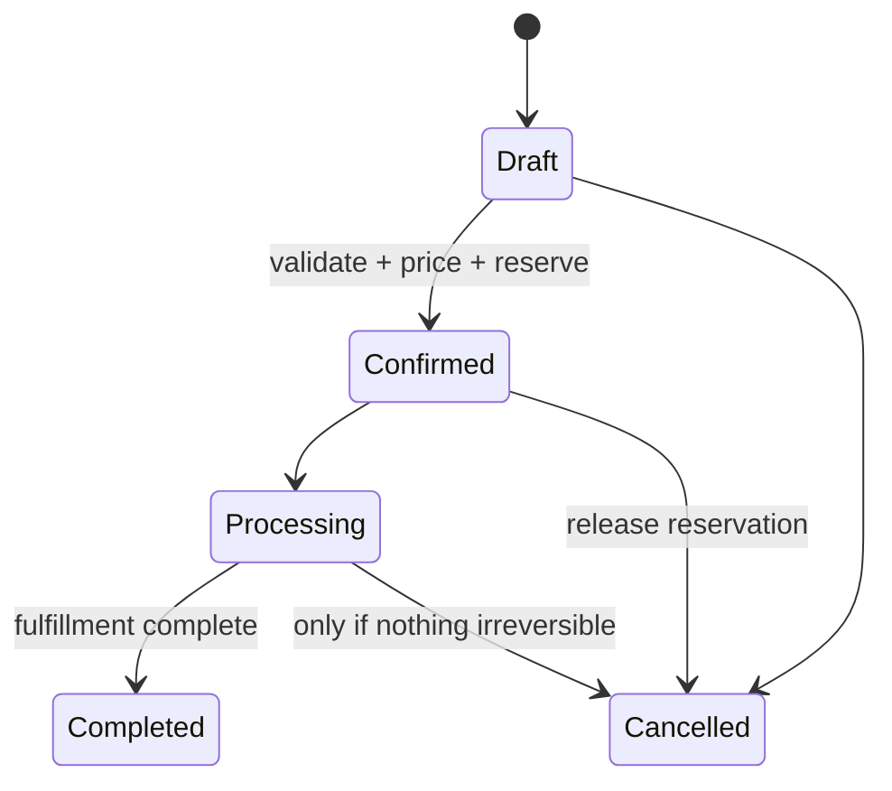
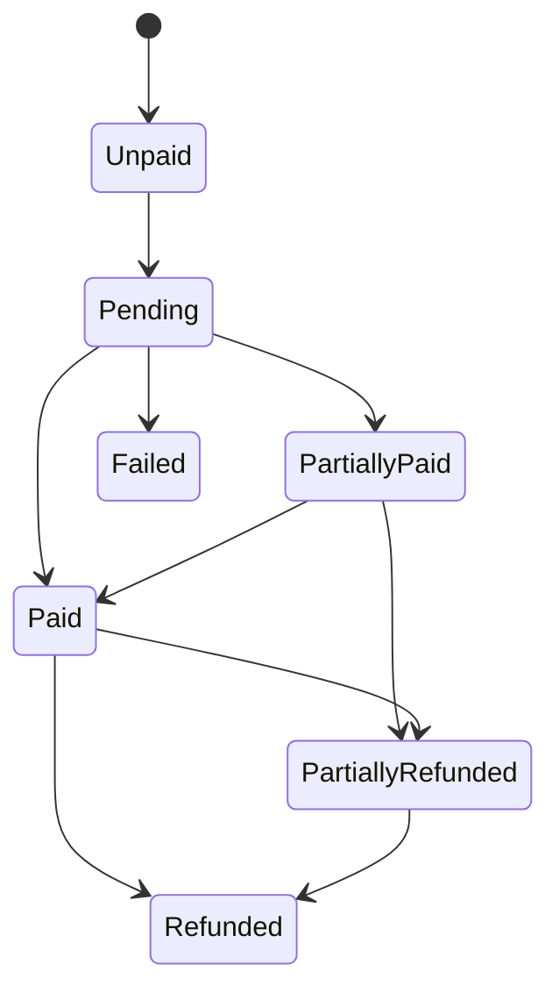
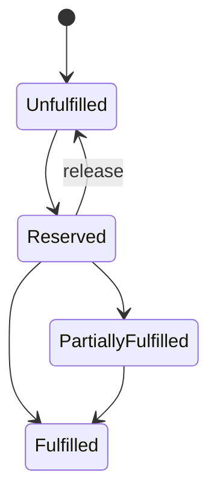
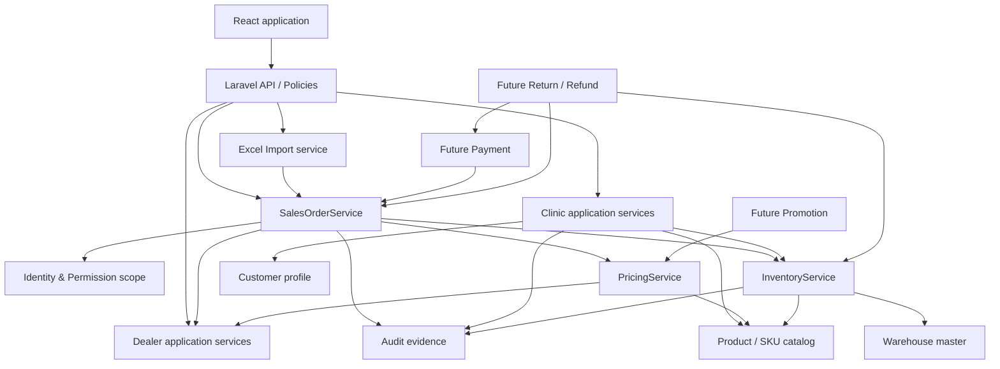

# ERP Core Design

> **Project:** Junie Clinic + B2B Dealer ERP  
> **Document type:** Architecture and implementation design only  
> **Status:** Proposed baseline for phased delivery  
> **Scope guard:** This document does not implement ERP tables, migrations, APIs, UI, or production data changes.

## 1. Executive Summary

Junie should evolve as a **modular monolith**, preserving the existing Laravel REST API, React application, MySQL database, Sanctum authentication, appointment booking, and clinic operations. A second B2B dealer domain is added beside the clinic domain; it does not replace booking and does not require a second authentication system.

The target system has two business flows that share a product and inventory kernel:

- Clinic: `Customer -> Appointment -> Service -> Doctor -> Material Usage -> Inventory`.
- B2B: `Dealer -> Tier -> Price List -> Sales Order -> Payment -> Fulfillment -> Inventory`.

The current system already provides useful patterns: Form Requests and API Resources, database transactions and row locking inside `BookingService`, an append-oriented audit service, Sanctum session authentication, React Query, and role-gated application shells. Those patterns should be reused, but the large booking service must not become a general ERP service.

The principal architectural gaps are:

- `users.role` is a single identity role, while ERP access needs permissions plus business-profile scope.
- The canonical `customers` table exists but is not populated, and existing customer screens still read `users`.
- Product/SKU, dealer, warehouse, inventory, order, payment, and import domains do not exist yet.
- Appointments and vouchers are clinic concepts and must not be repurposed as sales orders or ERP promotions.

Delivery must therefore be additive. The next coding task remains Customer Foundation Step 2—normalization and restartable registered-customer backfill—before any ERP master or transactional table is introduced.

## 2. Current System Audit

### 2.1 Runtime and structure

| Area | Audited state |
|---|---|
| Backend | Laravel 13.31, PHP 8.4, MySQL 8.4, Sanctum 4.3 |
| Frontend | React 19, TypeScript, TanStack Start/Router/Query, Tailwind CSS 4, Vite 8 |
| API | REST routes in `backend/routes/api.php`; 103 non-vendor routes at audit time |
| Backend inventory | 13 models, 35 controllers, 43 requests, 24 resources, 14 services, 1 policy |
| Frontend inventory | 69 route files, 21 pages, 11 API service clients, shared `AuthContext` |
| Database | 27 tables and 34 applied migrations at audit time |
| Background infrastructure | Database queue/cache/session configured; after-commit queued notifications are already used |
| Baseline tests | Most recent recorded backend baseline: 334 tests / 1,821 assertions passing |

### 2.2 Current business data

The current database contains clinic users, doctors, services, appointments, schedules, vouchers, loyalty records, reviews, audit logs, and framework infrastructure. At the time of audit there were 8 users, 22 appointments, 5 services, 6 doctors, 3 vouchers, and no canonical customer records. Two database triggers enforce appointment ownership compatibility.

The Customer Foundation Step 1 schema exists, including the canonical `customers` table and nullable `appointments.customer_id`, but all existing appointments still use the legacy `appointments.user_id`/guest snapshot paths. Admin and receptionist customer listings still query `users` with role `customer`. That is an intentional transitional state, not the final customer architecture.

No current code or table implements dealer accounts, products, variants/SKUs, warehouses, stock balances, stock movements, price lists, sales orders, bulk order imports, payments, returns, refunds, or ERP promotions.

### 2.3 Reusable patterns and boundaries

| Existing pattern | Reuse | Boundary |
|---|---|---|
| `BookingService` transactions and `lockForUpdate()` | Transaction and locking discipline | Do not add ERP order/inventory responsibilities to this large service |
| Form Requests and API Resources | Validation and response contracts | Create domain-specific requests/resources |
| `AuditLogger` | Actor/action/module/snapshot conventions | Add explicit system actor support and redact import PII |
| Sanctum auth | One login/session for every profile | Authorization must move beyond a single role string |
| Appointment policy | Ownership checks | Dealer scope must be membership-based, not appointment ownership |
| React Query/API wrapper | Query invalidation and uniform error handling | Add feature-local keys and clients; keep backend authoritative |
| Queued after-commit notifications | Safe side effects | Order/import notifications must dispatch only after commit |

## 3. Current Architecture Findings

1. **Authentication identity and business identity are currently conflated.** `User` contains a single role and the customer interface is still user-backed. The proposal keeps `users` for authentication and introduces explicit business profiles and memberships.
2. **The Customer migration is intentionally incomplete.** Writing Dealer or Order code before customer backfill would compound two identity models. Customer normalization and compatibility reads should finish first.
3. **Booking has strong integrity patterns but excessive domain breadth.** ERP logic should use small application services such as `PricingService`, `InventoryService`, and `SalesOrderService`, coordinated within explicit transactions.
4. **The audit trail is suitable as a base, not as a stock ledger.** Audit entries explain who changed business state; stock movements prove quantity changes. They are separate immutable concerns.
5. **Frontend route guards improve navigation but are not security controls.** All permissions and dealer/warehouse scope must be checked in Laravel policies or middleware.
6. **Existing appointment, voucher, and loyalty records cannot model ERP orders, promotions, or dealer tiers.** Reuse would create ambiguous state machines and accounting semantics; the new domains require separate tables.

Compatibility must be maintained through staged reads and dual references only where explicitly planned. New ERP code must not depend on legacy customer-by-role queries.

### Evidence-backed boundary changes

#### Identity and business profiles

- **CURRENT — Files:** `backend/app/Models/User.php`, `backend/app/Http/Controllers/Api/AuthController.php`, `backend/app/Http/Resources/UserResource.php`, and `frontend/src/contexts/AuthContext.tsx`.
- **Current behavior:** Registration creates a User with role `customer`; authenticated resources/frontend context primarily expose and branch on one role.
- **Issue:** One User cannot safely express independent clinic/dealer profiles and resource-scoped ERP abilities through that field alone.
- **PROPOSED architecture:** Keep User/Sanctum authentication, resolve profiles through relationships/memberships, and add abilities plus policies incrementally.
- **Why:** It permits Customer, Dealer, or both without a second login or a tier-as-permission mistake.
- **Compatibility:** Retain `role` and current response fields while additive ability/profile fields roll out.
- **Migration:** Map current roles idempotently, migrate route-by-route, then retire role-only ERP decisions.
- **Tests:** Existing auth/role regression plus multi-profile, missing-ability, inactive membership, and cross-scope denial.

#### Canonical customer boundary

- **CURRENT — Files:** `backend/app/Http/Controllers/Api/Admin/CustomerController.php`, `backend/app/Http/Controllers/Api/Staff/ReceptionistAppointmentController.php`, `backend/app/Models/Customer.php`, and `backend/app/Models/Appointment.php`.
- **Current behavior:** The canonical Customer schema/relationships exist, but admin/receptionist customer lists still query User rows with customer role and existing appointments have no customer linkage.
- **Issue:** Dealer work built on this transitional read model would preserve identity ambiguity and make recipient matching unsafe.
- **PROPOSED architecture:** Complete versioned normalization and restartable Customer backfill, then cut reads/writes over with compatibility releases.
- **Why:** Clinic identity becomes stable before a second business profile and import channel arrive.
- **Compatibility:** Keep legacy appointment ownership/snapshots and triggers until verified coverage and a separately approved constraint phase.
- **Migration:** Dry-run, collision report, chunk/checkpoint, idempotent rerun, reconciliation, dual/shadow read, then constrain.
- **Tests:** Registered/guest identity, conflicts, interruption/restart, booking regression, ownership and trigger compatibility.

#### Transactional service boundary

- **CURRENT — File:** `backend/app/Services/BookingService.php`.
- **Current behavior:** Booking already uses database transactions, row locks, cache locks, audit, voucher, loyalty, slot, and notification coordination.
- **Issue:** Adding dealer pricing, ordering, Excel, and inventory would turn a large clinic service into an untestable cross-domain coordinator.
- **PROPOSED architecture:** Reuse its transaction/locking discipline in separate `SalesOrderService`, `PricingService`, `InventoryService`, and import orchestration boundaries.
- **Why:** Each ledger and state machine retains one owner while the modular monolith can still use atomic MySQL transactions.
- **Compatibility:** Booking behavior and public/authenticated booking APIs do not change.
- **Migration:** Introduce new services only with their modules; no Booking rewrite prerequisite.
- **Tests:** Service-level workflow tests, cross-service atomicity, concurrent reservation/usage, and complete booking regression.

#### Authorization and ownership

- **CURRENT — Files:** `backend/app/Policies/AppointmentPolicy.php` and `backend/routes/api.php`.
- **Current behavior:** Appointment ownership is based on `appointments.user_id`; route middleware uses the four current roles.
- **Issue:** A dealer account can have multiple members and warehouse access is independent of appointment ownership or global role.
- **PROPOSED architecture:** Policies combine named ability with active dealer membership or warehouse assignment scope.
- **Why:** Frontend visibility cannot prevent cross-dealer/cross-warehouse access.
- **Compatibility:** Appointment policy remains intact; ERP resources get new policies as their APIs appear.
- **Migration:** Add permissions/memberships before routes, map current access, and deny unassigned scope by default.
- **Tests:** Direct HTTP cross-scope attempts, suspended membership, inactive warehouse, and admin/non-admin behavior.

#### Audit versus business ledgers

- **CURRENT — File:** `backend/app/Services/AuditLogger.php`.
- **Current behavior:** The request-aware logger records action/module and redacted before/after snapshots.
- **Issue:** It does not replace quantity/payment ledgers and needs explicit non-HTTP actor context for queued import/payment work.
- **PROPOSED architecture:** Extend audit modules/actor sources while maintaining immutable stock movements, reservations, payments, histories, and snapshots as domain facts.
- **Why:** Operational explanation and mathematical reconciliation have different invariants and retention needs.
- **Compatibility:** Existing audit calls and UI remain valid; new context is additive.
- **Migration:** Add safe metadata fields/actions only when needed and never backfill invented ledger facts from generic audit JSON.
- **Tests:** Same-transaction audit, explicit system actor, PII/secret redaction, and ledger reconciliation independent of audit.

## 4. Business Domain Boundaries

| Module | Owns | May depend on | Must not own |
|---|---|---|---|
| Identity & Access | User authentication, roles, abilities | Sanctum | Customer/dealer business state |
| Customer | Canonical clinic customer profile | User identity optionally | Dealer commercial rules |
| Clinic | Appointment, service, doctor, material confirmation | Customer, SKU, inventory | Sales orders and price lists |
| Dealer | Account, contacts/memberships, tier assignment | User identity | Authentication credentials |
| Catalog | Category, brand, unit, product, variant/SKU | None | Stock quantities or selling prices |
| Warehouse & Inventory | Warehouses, balances, reservations, movements, lots | SKU | Commercial order snapshots |
| Pricing | Price lists and resolved base price | Dealer tier, SKU, warehouse | Promotion orchestration or payment |
| Sales | Sales orders, order items, fulfillment state | Dealer, pricing, inventory | Appointment state |
| Import | Upload, validation, preview, idempotent confirmation | Sales application service | A parallel order-creation implementation |
| Payment | Payment attempts/events and allocation | Sales order | Inventory mutation |
| Return & Refund | Return authorization, accepted quantities, refunds | Sales, payment, inventory | Original order mutation |
| Promotion | Eligibility and discounts | Pricing, dealer/order context | Voucher compatibility assumptions |
| Audit | Actor and business-change evidence | Every module | Source-of-truth inventory/accounting ledger |

Cross-module writes occur through application services. Controllers validate and authorize, then call one use-case service. Models do not coordinate workflows through hidden observers.

## 5. User / Customer / Dealer / Recipient

These concepts remain deliberately separate:

- **User:** a login identity, authentication credentials, platform status, and authorization assignments.
- **Customer:** the canonical person receiving clinic care. A customer may link to one user, but guests and imported historic patients may have no login.
- **Dealer account:** a B2B legal/commercial account with code, billing identity, tier, credit/commercial status, and one or more user memberships.
- **Recipient:** the delivery contact captured as an immutable snapshot on a sales order. It is not automatically a User, Customer, or Dealer member.

A User may be linked to a Customer, a Dealer, both, or neither. A dealer account may have multiple users even if the first UI release allows only one active member. Model this with `dealer_account_users` from day one to avoid a destructive one-to-many redesign later.

Recommended cardinalities:

- `users 1 -> 0..1 customers` through nullable unique `customers.user_id`.
- `users * <-> * dealer_accounts` through memberships containing status and dealer-scoped role.
- `dealer_accounts 1 -> * sales_orders`.
- `sales_orders 1 -> 1 recipient snapshot` stored directly on the order for V1.

Recipient matching by phone is useful for suggestions only. It must never silently merge clinic customers, authentication identities, or dealer memberships.

## 6. Authentication & Profile Strategy

Keep the current Sanctum authentication flow and `users` table as the sole credential source. Do not create dealer passwords or a dealer-auth guard.

Before exposing dealer routes, add an incremental authorization layer:

1. Preserve `users.role` as a temporary compatibility classification.
2. Introduce named abilities/permissions and policy checks for ERP operations.
3. Resolve business scope independently: customer link, active dealer memberships, and warehouse assignments.
4. Extend the authenticated-user resource with profile summaries and abilities without removing current fields.
5. Migrate frontend menus from direct role equality toward returned abilities.

Illustrative additive response:

```json
{
  "id": 8,
  "name": "Example",
  "role": "customer",
  "abilities": ["dealer.orders.view", "dealer.orders.create"],
  "profiles": {
    "customer_id": 41,
    "dealer_accounts": [{"id": 12, "code": "DLR-001", "status": "active"}]
  }
}
```

The backend remains authoritative. Selecting a dealer context in the frontend changes scope, not permissions. Every dealer request verifies an active membership for the selected account.

## 7. Dealer Foundation

Proposed core tables:

### `dealer_accounts`

- Identity: `id`, unique immutable `code`, legal/trading name.
- Contact and tax: tax code, email, phone, billing address components.
- Commercial state: `status` (`draft`, `active`, `suspended`, `inactive`), current tier reference, optional credit settings for future use.
- Governance: timestamps, creator/updater, optional inactivation metadata.

### `dealer_account_users`

- `dealer_account_id`, `user_id`, dealer-scoped membership role, status, invited/activated timestamps.
- Unique membership per `(dealer_account_id, user_id)`.
- Index `(user_id, status)` for resolving accessible dealers.

Dealer code changes should be prohibited after transactional references exist. Suspension blocks new ordering but preserves access to authorized history according to policy. Tier is a commercial classification and must not grant platform permissions.

## 8. Product Master

`products` represents the shared commercial concept; it is not a stock unit. Proposed fields include:

- Unique stable product code; translatable/display name, description.
- `product_category_id`, nullable `brand_id`.
- Product type/capabilities, such as clinic material, resale item, or both.
- `status`, sale/stock flags, batch/expiry flags, tax classification readiness.
- Optional default low-stock threshold; a warehouse/SKU threshold table may override it later.
- Optional default image and structured metadata.

Products may be inactivated but not deleted once referenced. Product descriptions and names are copied into order item snapshots so historic documents survive master-data edits.

The table should be named `product_categories`, not `categories`, because the current application already contains category-like clinic/content concepts and future ambiguity is costly.

## 9. SKU / Product Variant

`product_variants` is the authoritative sellable and stockable entity. “SKU” is its unique business identifier.

Recommended fields:

- `product_id`, globally unique normalized `sku`, variant name.
- `unit_id`, barcode, specification JSON for display-only flexible attributes.
- Stock and sale flags, status, optional weight/dimensions.
- Future flags: lot tracking, expiry tracking, serial tracking.

All order items, balances, movements, reservations, service material templates, usage records, returns, and price-list entries reference `product_variant_id`, never only `product_id`. Variant-defining data that participates in equality or reporting belongs in typed columns or normalized tables; JSON is not a substitute for keys or constraints.

SKU normalization must be deterministic (trim/case policy) and shared by UI, API, and Excel import. A normalized SKU may not be reused after it has transactional history.

## 10. Category / Brand / Unit

- `product_categories`: unique code, name, optional parent, sort order, active status. Prevent cycles at the application layer.
- `brands`: unique code/name policy and active status.
- `units`: immutable code, display name, decimal precision, active status.

V1 inventory uses one base unit per SKU. Unit conversion is explicitly out of scope until a conversion model, rounding policy, and valuation impact are approved. Quantity columns use fixed precision decimal types; they must not use floating point.

Master inactivation blocks new assignment while preserving old references. Unique identifiers remain reserved after inactivation.

## 11. Warehouse

`warehouses` owns a unique code, name, address/timezone details, type, status, and operational flags. Inventory always belongs to a warehouse; there is no global `products.stock` field.

Recommended V1 rule: one sales order and one clinic material confirmation consume from exactly one warehouse. Multi-warehouse fulfillment is deferred because it introduces split reservations, shipments, pricing, and returns.

If warehouse staff need scoped access, use `warehouse_user_assignments` rather than adding a single warehouse column to `users`. Admins may have global permission; operators receive explicit warehouse scope. Warehouse inactivation is blocked while open reservations or fulfillments exist.

Bin-level inventory is not justified for V1. The upgrade path is `warehouse -> zone -> bin/location`, followed by location-level balances/movements or allocations; warehouse identity must therefore remain stable and must not be encoded into SKU.

## 12. Inventory Core

`inventory_balances` is the fast current-state projection keyed by `(warehouse_id, product_variant_id)`:

- `on_hand_quantity`: physically held quantity.
- `reserved_quantity`: quantity committed to open demand.
- Available quantity is derived as `on_hand_quantity - reserved_quantity`; do not store a third drifting value.
- Optimistic version or updated timestamp may support diagnostics, but writes still use row locks.

Required invariants:

```text
on_hand_quantity >= 0              (recommended V1 policy)
reserved_quantity >= 0
reserved_quantity <= on_hand_quantity
available = on_hand - reserved
```

Every balance mutation must have a corresponding durable movement or reservation transition under one database transaction. Direct controller/model updates to balance columns are prohibited. Reconciliation compares balances with immutable ledgers and reports differences; it does not silently rewrite history.

Low-stock reporting compares **available**, not on-hand, against the effective threshold. V1 may use a Product/SKU default; future `warehouse_stock_policies` can define warehouse/SKU-specific threshold and replenishment values without changing the balance schema. Alerts are derived projections and never stock facts.

## 13. Stock Movement

`stock_movements` is an immutable physical quantity ledger. Each row contains warehouse, SKU, signed quantity, movement type, reference type/id, idempotent operation key, actor/source, occurred timestamp, and before/after on-hand snapshots.

Initial movement types:

- Opening/adjustment in and out.
- Purchase or manual receipt.
- Sales fulfillment/issue.
- Clinic material usage.
- Accepted return/restock.
- Warehouse transfer out/in as a paired future operation.

Reservations are commitments, not physical movements, and use their own ledger. Movement records are never edited or deleted; correction is an explicit reversing movement. A unique operation key prevents retries from applying the same quantity twice.

### Transfer and adjustment direction

A stock transfer is an aggregate with source, destination, lines, and lifecycle. Dispatch creates `TRANSFER_OUT` at warehouse A; receipt creates `TRANSFER_IN` at warehouse B. In-transit quantity remains explainable. Never implement transfer by changing `warehouse_id` on a balance or movement. This workflow is deferred until inventory core is stable.

An adjustment command requires SKU, warehouse, signed quantity, reason code/detail, actor, timestamp, and before/after quantity. It creates `ADJUSTMENT_IN` or `ADJUSTMENT_OUT`, updates the locked balance, and writes audit evidence atomically. No generic CRUD screen may edit `inventory_balances.on_hand_quantity`.

## 14. Batch / Expiry Strategy

V1 schema should be readiness-aware without forcing lot allocation for every SKU:

- Variant flags declare whether lot and expiry tracking are required.
- Future `inventory_lots` stores lot number, manufacture/expiry dates, supplier/reference, and status.
- Future `inventory_lot_balances` keys quantity by warehouse, SKU, and lot.
- Movement/reservation allocation tables can attach quantities to lots.

When expiry tracking is enabled, fulfillment should default to FEFO (first-expire, first-out), with privileged override and audit. Expired/quarantined lots are unavailable. Do not add nullable `batch_no` only to a balance row: it cannot represent multiple lots and makes reconciliation impossible.

Injectables, implants, medicines, and regulated/sterile consumables normally require lot traceability and often expiry; ordinary expiring consumables may require expiry without regulatory lot workflow; durable tools/equipment and non-expiring supplies may require neither. Final flags are governed per SKU by compliance/operations, not inferred from category name.

Lot enforcement is deferred until product data quality, receiving workflow, and clinic usage requirements are agreed. The first inventory phase must avoid constraints that block adding these tables later.

## 15. Clinic Material Usage

Material usage is a clinic workflow tied to an appointment but consuming the shared inventory kernel.

Use a header and lines:

- `appointment_material_usages`: appointment, warehouse, status (`draft`, `confirmed`, `reversed`), recorder/confirmer, timestamps, confirmation idempotency key.
- `appointment_material_usage_items`: usage header, SKU, planned quantity optional, actual quantity, note, source template reference, and descriptive snapshots.

A doctor with appropriate permission may record and confirm actual usage for an appointment they can access. They cannot perform arbitrary stock adjustments. Confirmation locks the usage header, relevant inventory rows in deterministic order, validates availability, creates physical movement rows, updates balances, and marks the usage confirmed in one transaction. Re-confirmation is idempotent. A correction uses a controlled reversal/corrected usage; confirmed lines are not edited in place.

## 16. Service Material Template

`service_materials` maps a clinic service to the SKUs normally consumed:

- `service_id`, `product_variant_id`, default quantity, optional note, effective dates, active status.
- Unique active template line per service/SKU/effective range according to the chosen history policy.
- Quantities use the SKU base unit and precision.

When an appointment usage draft is created, active template lines are copied as suggestions. The template is not inventory demand, does not reserve stock, and does not retroactively change an existing draft or confirmed usage. Actual usage may differ with a required reason when policy requires it. This separates clinical guidance from inventory facts.

Current evidence: `backend/app/Models/Service.php` stores clinic-service identity, editorial content (including a JSON `content` field), duration, display price, category, status, doctors, appointments, and reviews; it has no product/material relationship. The new relational many-to-many entity must be added beside those fields. Material lists must not be embedded into the editorial JSON.

## 17. Dealer Tier

`dealer_tiers` is configurable master data with immutable unique code, name, ranking/display order, active status, and optional qualification metadata. Avoid hard-coding Bronze/Silver/Gold in source code.

Tier qualification is based on an agreed rolling period and **net settled sales**:

```text
eligible sales = successfully settled/captured allocated payments
                 - completed refunds attributable to those sales
```

Created order value, unpaid value, cancelled value, and requested-but-unpaid returns do not qualify. The calculation period, currency, tax inclusion, refund attribution, and downgrade grace period remain business decisions in Section 45.

Tier affects base price resolution; it does not grant access permissions or change dealer status.

## 18. Tier History & Override

Do not overwrite a dealer's current tier without retaining why and when it changed.

Proposed records:

- `dealer_tier_histories`: dealer, previous/new tier, effective range, source (`calculated`, `manual_override`, `migration`), qualification snapshot, reason, actor.
- `dealer_tier_overrides`: dealer, forced tier, start/end, reason, status, creator/approver metadata.

At any instant, a dealer has at most one effective override and one calculated tier. An active override wins for price resolution; calculation may continue in the background so the dealer can return to the correct calculated tier after expiry. Scheduling and recalculation require idempotent period keys and should not modify historic order pricing.

## 19. Price List

Use `price_lists` and `price_list_items` rather than putting prices on products or tiers.

Header fields include code, name, scope type (`default`, `tier`, `dealer`), optional tier/dealer, optional warehouse, currency, effective range, priority/status, and approval metadata. Items reference SKU and contain unit price, optional minimum quantity, and effective range if item-level dating is required.

Recommended deterministic precedence for otherwise eligible records:

1. Dealer + warehouse.
2. Dealer, all warehouses.
3. Tier + warehouse.
4. Tier, all warehouses.
5. Default + warehouse.
6. Default, all warehouses.

Within one precedence level, overlapping active records for the same SKU/quantity must be rejected or treated as configuration error; do not silently select the newest row. `PricingService` returns price, currency, source list/item, tier/override context, and a resolution/version fingerprint. Orders snapshot all results. Promotions are applied afterward by a separate component.

## 20. Sales Order

`sales_orders` is independent of appointments. Recommended fields:

- Identity: unique order number, dealer account, warehouse, channel (`manual`, `dealer_excel`, `admin_excel`, future API), external reference.
- State: separate order, payment, and fulfillment status columns.
- Recipient snapshot: name, phone, email optional, full delivery address, delivery instructions.
- Commercial snapshots: dealer code/name, tier, currency, subtotal, discount, tax, shipping, grand total.
- Traceability: price-resolution fingerprint, import group optional, creator/confirmer/canceller, timestamps, cancellation reason.
- Idempotency: client/import operation key with an appropriate scoped unique constraint.

One warehouse and one currency per order are recommended for V1. Header totals are stored for documents and reconciliation, but are calculated only by the domain service from items—not accepted as authoritative client input.

## 21. Sales Order Items

`sales_order_items` references SKU while preserving immutable commercial snapshots:

- SKU/product code and name snapshots, variant and unit snapshots.
- Ordered quantity, unit price, base price, discount allocation, tax, line total.
- Price-list/item reference and promotion result references where applicable.
- Fulfilled, cancelled, returned, and refunded quantities, preferably derived from event/detail records when those modules arrive.

The server resolves SKU and pricing from trusted master data. Dealer spreadsheets cannot supply a trusted dealer name, tier, price, or line total. Snapshot columns are populated by `SalesOrderService`; they protect historic documents from later catalog and pricing edits.

## 22. Order / Payment / Fulfillment State Machines

The three axes are independent and transitions are explicit.

### Order status



### Payment status



### Fulfillment status



Use backed enums or equivalent domain constants when implemented and one transition service per workflow. Do not let controllers assign arbitrary status strings. Whether confirmation immediately reserves stock, and whether payment is required before fulfillment, are configurable policy decisions recorded in Section 45.

## 23. Inventory Reservation

`inventory_reservations` is a durable commitment ledger containing warehouse, SKU, sales order/item, original/reserved/released/consumed quantities, status, expiry, and idempotent operation key. A unique order-item relationship prevents duplicate active reservation creation.

Reservation algorithm:

1. Begin a database transaction and lock the order/use-case aggregate.
2. Sort requested inventory keys by `(warehouse_id, product_variant_id)`.
3. Lock every corresponding balance row in that order; create missing zero rows safely.
4. Recalculate `available = on_hand - reserved` inside the transaction.
5. Reject the complete operation if any line is insufficient under the no-oversell policy.
6. Create reservation rows and increment reserved quantities.
7. Commit, then dispatch notifications/events.

Fulfillment atomically decreases both `on_hand` and `reserved`, records a stock movement, and marks reservation quantity consumed. Cancellation/expiry decreases only `reserved`. Partial operations retain exact quantities and never infer them only from order statuses.

## 24. Excel Bulk Order Import

Dealer and admin uploads use the same pipeline but different trust boundaries:

- Dealer import derives the dealer solely from the authenticated membership; dealer code/name/tier/price columns are ignored or rejected.
- Admin import may specify dealer code per group, subject to permission and active-account validation.

The versioned dealer template contains: External Order Ref; Recipient Name, Phone, and optional Email; Address Line 1/2, City, Province, Country, Postal Code; SKU; Quantity; and Note. It intentionally excludes Dealer Code, Tier, Price, and Product Name. The admin multi-dealer template adds Dealer Code; it is a distinct import type and cannot be submitted through the dealer endpoint.

Pipeline:

```text
private upload -> parse -> normalize -> validate/resolve -> group
-> durable preview -> explicit confirmation -> SalesOrderService
```

The Excel adapter may parse cells, normalize values, attach row numbers, and build candidate groups. It must not duplicate pricing, stock checks, reservation, or order creation. Both manual and imported orders call the same `SalesOrderService` command.

Security controls include extension and MIME checks, size/row/column limits, private storage, malware scanning integration point, formula neutralization for later exports, strict header/schema version, timeout/memory limits, and scheduled PII/file retention. Parsing may run in a queue; batch status and progress must be visible.

## 25. Excel Grouping Rules

The canonical group key is:

```text
(resolved dealer_account_id, normalized external_order_reference)
```

Within a group, recipient name, normalized phone, delivery address, warehouse, and currency must be consistent. Conflict fails the group with a stable error such as `ORDER_RECIPIENT_CONFLICT`; it must not choose the first row silently.

If external reference is optional, a fallback normalized recipient fingerprint may group rows for one shipment, but it never establishes person identity. The recommended launch rule is to require an external order reference for admin and large imports; a generated reference is acceptable only for a deliberately single-order dealer upload.

Duplicate SKU rows may be aggregated only when unit, price-affecting fields, and recipient/order context match. Preserve every original row association so errors and final order lines remain traceable. Normalize whitespace, Unicode, phone, SKU casing, and references through one versioned normalizer.

## 26. Import Preview

Preview is a persisted validation result, not a stock guarantee. It shows:

- File and batch summary, row/group counts, schema and normalizer version.
- Per group: resolved dealer, recipient, warehouse, external reference, totals, readiness.
- Per row: source row, normalized SKU, resolved product/variant, quantity, resolved unit price/source, available stock at preview time, warnings, and stable errors.
- A fingerprint covering normalized input and pricing/config version.

Errors block the affected group; warnings require acknowledgement only where business policy says so. Confirmation always re-authorizes, re-resolves time-sensitive price eligibility, revalidates master status, and locks/rechecks stock. If the fingerprint or critical resolution changed, return a conflict and require refreshed preview rather than silently creating a different order.

## 27. Import History & Idempotency

Proposed persistence:

- `import_batches`: import code, type, uploader, optional fixed dealer, private file metadata/hash, client idempotency key, schema/normalizer version, status, counts, failure summary, expiry and confirmation timestamps.
- `import_batch_rows`: source row number, restricted raw/normalized JSON, group key, validation status and structured errors/warnings.
- `import_batch_groups`: unique `(batch_id, group_key)`, recipient fingerprint, validation/confirmation status, confirmation token, resulting sales order.

Statuses include `uploaded`, `parsing`, `preview_ready`, `confirming`, `confirmed`, `partially_confirmed`, `failed`, and `expired`. Confirmation locks the batch/group, gates allowed states, and relies on unique group-to-order and operation-key constraints. A retry returns the existing result rather than creating another order.

Recommended transaction boundary is one order/group, not the entire file. This avoids long locks and lets valid independent groups succeed, while the final UI clearly reports partial confirmation. The business must approve this policy. Raw row PII and uploaded files receive a documented retention period and restricted access; audit logs store identifiers and summaries, not full rows.

## 28. Payment Dependency

Payment is a downstream module, not a column casually toggled on orders. Future tables should represent payment attempts/transactions and, if needed, allocations across orders. Required concepts include provider, method, amount/currency, status, provider reference, idempotency key, captured/settled/refunded timestamps, and append-only provider event evidence.

Only trusted captured/settled outcomes contribute to `payment_status` and dealer tier calculations. Webhooks verify signature, preserve raw evidence under a retention policy, and are idempotent. Payment failures never release stock unless an explicit reservation-expiry policy does so. Orders keep their commercial snapshot regardless of payment outcome.

No gateway integration is included in the initial ERP core phases.

### Future wallet/deposit and quotation direction

A dealer Wallet/deposit is a future financial sub-ledger: top-up/payment/refund entries produce a derived balance, and allocations pay orders. It must follow—not precede—a stable Payment Core with currency, reconciliation, idempotency, and refund rules. Never store only a mutable `dealer.balance` value.

Quotation is a separate future pre-order aggregate: Dealer requests quote, Admin issues a dated offer, Dealer accepts, and a conversion command creates a Sales Order with new validation, price snapshots, and idempotency. A quote does not reserve inventory or become revenue unless explicit future policy says so. Neither wallet nor quotation is implemented by this design task.

## 29. Return / Refund Dependency

Return and refund are related but separate:

- `sales_returns` and items model request, authorization, receipt, inspection, acceptance/rejection, and disposition.
- Refund transactions model money returned and integrate with the payment module.
- Only accepted, restockable quantities create inventory-in movements. A requested or refunded item does not automatically increase stock.

Return quantities cannot exceed fulfilled quantities net of previous accepted returns. Refund quantities/amounts cannot exceed eligible paid amounts net of previous refunds. Corrections are new events, not edits to original order items, movements, or payments. Dealer tier net-sales calculations consume completed refund facts.

## 30. Promotion Dependency

ERP promotion logic should use separate future `promotions`, eligibility/rule, and reward/application structures. The current clinic voucher implementation is not a general dealer promotion engine.

The price pipeline is:

```text
eligible price list -> base unit price -> promotion evaluation
-> allocated discount/tax -> immutable order item snapshot
```

Promotion stacking, caps, dealer/tier/SKU eligibility, date ranges, coupon use, budget, and priority require explicit rules. The order stores applied promotion identifiers and calculated amounts so later rule changes do not rewrite history. Promotion should not directly mutate price lists.

## 31. Permission Design

Permissions are named capabilities plus resource scope, not synonyms for dealer tier. Initial capability groups:

```text
dealer.view                 dealer.manage
product.view                product.manage
warehouse.view              warehouse.manage
inventory.view              inventory.receive
inventory.adjust            inventory.transfer
appointment.material_usage.view
appointment.material_usage.record
appointment.material_usage.confirm
sales_order.view            sales_order.create
sales_order.manage          sales_order.cancel
sales_order.fulfill
pricing.view                pricing.manage
import.orders
payment.view                payment.manage
return.view                 return.manage
audit.view
```

| Capability | Admin | Warehouse operator | Doctor | Dealer member |
|---|---:|---:|---:|---:|
| Manage dealer accounts/memberships | Yes | No | No | No |
| Manage catalog/price lists/tiers | Yes | No | No | No |
| View all orders | Yes | Scoped operational view | No | No |
| View/create own dealer orders | Optional support | No | No | Active membership |
| Admin Excel import | Yes | Optional scoped | No | No |
| Dealer Excel import | Optional impersonation policy | No | No | Active membership |
| Receive/adjust inventory | Yes | Assigned warehouses | No | No |
| Reserve/fulfill inventory | Yes | Assigned warehouses | No | No |
| Record/confirm clinic material usage | Optional | No | Assigned appointment/service scope | No |
| View audit/import PII | Restricted | No | No | Own batch summary only |

Policies combine the capability with active user status, active dealer membership, dealer ownership of the resource, and warehouse assignment. The existing role string remains a compatibility input during migration but is not sufficient for ERP authorization. Sensitive actions—manual adjustment, tier override, price approval, returns, and refunds—should be separately granted and audited.

## 32. Audit Strategy

Extend the existing `AuditLogger` conventions with ERP modules and stable action names. Audit business transitions, authorization-sensitive master changes, import confirmation, manual stock adjustment, tier override, price approval, and reversals.

Requirements:

- Write the audit entry in the same transaction as the protected state change when atomic evidence is required.
- Support explicit actor context for queued/system operations; do not depend only on the current HTTP request.
- Store resource identifiers, reason, safe before/after fields, correlation/operation key, source channel, and request metadata where appropriate.
- Redact secrets, tokens, payment credentials, raw Excel rows, and unnecessary recipient PII.
- Restrict audit viewing and define retention/export policy.

Audit records answer who did what and why. `stock_movements`, reservation rows, payment events, tier histories, and order snapshots remain their own business ledgers and are not replaced by generic audit JSON.

## 33. Transaction Strategy

| Operation | Atomic database work | Post-commit work |
|---|---|---|
| Confirm order | Lock order/config as needed, price snapshot, reserve stock, transition, audit | Notification, document generation |
| Fulfill order | Lock order/reservations/balances, consume reservation, movement, transition, audit | Notification/integration |
| Cancel order | Lock order/reservations, release remaining reservation, transition, audit | Notification |
| Confirm clinic usage | Lock usage/balances, movements, balance update, transition, audit | Notification |
| Adjust stock | Validate permission/reason, lock balance, movement, balance update, audit | Reporting event |
| Confirm import group | Lock batch/group, invoke common order transaction, link result | Progress notification |
| Accept return | Lock return/order/balance, restock movement where eligible, transition, audit | Refund orchestration |

Transactions should be short and contain database consistency work only. File parsing, remote calls, email, and PDF generation stay outside. Domain services throw stable exceptions mapped by controllers to existing API error conventions. Events that trigger external effects dispatch after commit.

## 34. Concurrency Strategy

- Lock aggregates and all inventory balance rows before calculating availability.
- Acquire multi-SKU locks in deterministic `(warehouse_id, product_variant_id)` order.
- Enforce invariants both in domain validation and database check/unique constraints where MySQL supports them.
- Retry recognized deadlocks a small bounded number of times (recommended three) at the application-service boundary.
- Use unique idempotency/operation keys for import confirmation, movement application, payment webhooks, usage confirmation, and order submission.
- Never hold database locks while parsing Excel or calling providers.
- Recheck effective date, active status, permission, price configuration, and stock at commit time.

Concurrent attempts that cannot both succeed return a conflict with current state. They must not oversell, create duplicate orders, or partially update balances. Missing balance rows should be initialized through a conflict-safe path before or during the locked transaction.

## 35. Database Constraints & Indexes

Core constraints/indexes should include:

| Table | Constraint/index |
|---|---|
| `dealer_accounts` | unique code; status index |
| `dealer_account_users` | unique dealer/user; `(user_id, status)` |
| `products` | unique product code; category/brand/status indexes |
| `product_variants` | unique normalized SKU; product/status index; optional unique barcode policy |
| `warehouses` | unique code; status index |
| `inventory_balances` | unique warehouse/SKU; non-negative and reserved-within-on-hand checks |
| `stock_movements` | unique operation key; warehouse/SKU/time; reference composite |
| `inventory_reservations` | unique operation key; order item/status; warehouse/SKU/status/expiry |
| `service_materials` | service/SKU/effectivity uniqueness; active lookup |
| `appointment_material_usages` | appointment/status; unique confirmation key |
| `dealer_tier_histories` | dealer/effective dates; source index |
| `dealer_tier_overrides` | dealer/status/effective dates; application guard against overlap |
| `price_lists` | code unique; scope/status/effective lookup |
| `price_list_items` | list/SKU/min quantity/effective lookup; overlap validated |
| `sales_orders` | order number unique; scoped external ref unique by agreed policy; dealer/status/date; import group unique |
| `sales_order_items` | order/SKU; price source indexes only if reporting needs them |
| `import_batches` | import code unique; uploader/status/date; scoped idempotency and file hash indexes |
| `import_batch_groups` | unique batch/group key; unique resulting order |

Foreign-key delete behavior should default to `restrict` for referenced masters and transactions. Use `cascade` only for true aggregate children whose parent is legally deletable before use. Validate actual query plans before adding redundant indexes; every index increases write cost.

## 36. Soft Delete / Inactive Strategy

Do not apply `SoftDeletes` indiscriminately.

- Reference masters (dealer, product, SKU, warehouse, tier, price list, unit, brand, category): use status/inactive timestamps; identifiers remain reserved.
- Transactional ledgers (orders, items after confirmation, movements, reservations, payments, returns, audit, histories): never delete; reverse/cancel with reason.
- Draft aggregates: hard delete may be allowed only before any external reference, ledger, or audit obligation exists.
- Import artifacts: expire and purge files/raw row payloads according to retention while retaining a minimal non-PII batch summary and order linkage.
- User/customer lifecycle follows existing privacy and Customer Foundation decisions rather than ERP shortcuts.

The application must filter active masters for new transactions while still resolving inactive referenced records in history.

## 37. API Boundary Proposal

Continue the current Laravel REST conventions and Sanctum session. Suggested additive route groups:

```text
/api/admin/dealers, /dealer-tiers, /price-lists
/api/admin/products, /product-variants, /brands, /product-categories, /units
/api/admin/warehouses, /inventory, /stock-movements, /inventory-adjustments
/api/admin/sales-orders, /order-imports
/api/dealer/context, /orders, /order-imports
/api/doctor/appointments/{appointment}/material-usage
```

Use Form Requests for shape validation, policies for ability plus scope, Resources for stable responses, and application services for use cases. List endpoints receive explicit filters, sort allowlists, pagination, and eager loading. Commands use idempotency tokens where retry is plausible. State transitions use dedicated endpoints such as `/confirm`, `/cancel`, `/fulfill`, or `/reverse`, not generic PATCH of status.

Versioning can remain compatible with the existing API initially. Breaking ERP contracts should introduce a versioned boundary deliberately; do not version only one arbitrary controller. Error responses should retain the current client-handled HTTP semantics, with stable machine error codes added for import, pricing, stock, and state conflicts.

## 38. Frontend Module Boundary

Add feature-local modules rather than growing a single admin page:

```text
features/
  identity-access/
  customers/
  dealers/
  catalog/
  warehouses/
  inventory/
  pricing/
  sales-orders/
  order-imports/
  clinic-materials/
```

Each owns types, API client functions, query-key factories, forms, and screens; shared primitives stay in existing shared component locations. Query keys include dealer/warehouse context and all list filters. Mutations invalidate only relevant keys. Import preview state is server-backed by batch ID, not a browser-only spreadsheet object.

Navigation uses returned abilities; route UI guards improve experience while Laravel policies enforce security. Dealer context is explicit and membership-validated. Desktop tables need accessible responsive/mobile alternatives for order and inventory tasks. No ERP frontend route should be added before its real backend API exists.

## 39. ERD

The ERD shows intended ownership and principal foreign keys; audit columns and some future allocation tables are omitted for readability.

```mermaid
erDiagram
    USERS ||--o| CUSTOMERS : authenticates
    USERS ||--o{ DEALER_ACCOUNT_USERS : joins
    DEALER_ACCOUNTS ||--o{ DEALER_ACCOUNT_USERS : has
    DEALER_TIERS ||--o{ DEALER_ACCOUNTS : current_classification
    DEALER_ACCOUNTS ||--o{ DEALER_TIER_HISTORIES : classified_by
    DEALER_TIERS ||--o{ DEALER_TIER_HISTORIES : records
    DEALER_ACCOUNTS ||--o{ DEALER_TIER_OVERRIDES : overrides
    DEALER_TIERS ||--o{ DEALER_TIER_OVERRIDES : forces

    PRODUCT_CATEGORIES ||--o{ PRODUCTS : classifies
    BRANDS ||--o{ PRODUCTS : brands
    PRODUCTS ||--|{ PRODUCT_VARIANTS : has
    UNITS ||--o{ PRODUCT_VARIANTS : measures

    WAREHOUSES ||--o{ INVENTORY_BALANCES : holds
    PRODUCT_VARIANTS ||--o{ INVENTORY_BALANCES : balanced_as
    WAREHOUSES ||--o{ STOCK_MOVEMENTS : records
    PRODUCT_VARIANTS ||--o{ STOCK_MOVEMENTS : moved_as
    WAREHOUSES ||--o{ INVENTORY_RESERVATIONS : commits
    PRODUCT_VARIANTS ||--o{ INVENTORY_RESERVATIONS : reserved_as

    SERVICES ||--o{ SERVICE_MATERIALS : templates
    PRODUCT_VARIANTS ||--o{ SERVICE_MATERIALS : suggested
    APPOINTMENTS ||--o{ APPOINTMENT_MATERIAL_USAGES : consumes_for
    APPOINTMENT_MATERIAL_USAGES ||--|{ APPOINTMENT_MATERIAL_USAGE_ITEMS : contains
    PRODUCT_VARIANTS ||--o{ APPOINTMENT_MATERIAL_USAGE_ITEMS : consumed_as

    PRICE_LISTS ||--|{ PRICE_LIST_ITEMS : contains
    PRODUCT_VARIANTS ||--o{ PRICE_LIST_ITEMS : prices
    DEALER_TIERS ||--o{ PRICE_LISTS : scopes
    DEALER_ACCOUNTS ||--o{ PRICE_LISTS : scopes
    WAREHOUSES ||--o{ PRICE_LISTS : scopes

    DEALER_ACCOUNTS ||--o{ SALES_ORDERS : places
    WAREHOUSES ||--o{ SALES_ORDERS : fulfills_from
    SALES_ORDERS ||--|{ SALES_ORDER_ITEMS : contains
    PRODUCT_VARIANTS ||--o{ SALES_ORDER_ITEMS : snapshots
    SALES_ORDER_ITEMS ||--o{ INVENTORY_RESERVATIONS : commits

    IMPORT_BATCHES ||--|{ IMPORT_BATCH_ROWS : parses
    IMPORT_BATCHES ||--|{ IMPORT_BATCH_GROUPS : groups
    IMPORT_BATCH_GROUPS ||--o| SALES_ORDERS : creates

    SALES_ORDERS ||--o{ PAYMENTS : paid_by
    SALES_ORDERS ||--o{ SALES_RETURNS : returned_by
    SALES_RETURNS ||--|{ SALES_RETURN_ITEMS : contains
    SALES_RETURNS ||--o{ REFUNDS : refunded_by
```



## 40. Module Dependency Diagram

Arrows mean “uses,” with transactional orchestration flowing downward. Cyclic writes are avoided.



Shared database transactions are appropriate inside the modular monolith. Module ownership is enforced in service boundaries and tests, not separate databases or premature microservices.

## 41. Migration Strategy

All migrations are additive and deployable in stages:

1. Finish Customer Foundation normalization/backfill and compatibility reads first.
2. Add new tables/nullable references without changing existing behavior.
3. Seed configuration/master data through reviewed, idempotent deployment mechanisms—not hidden destructive migrations.
4. Backfill in restartable chunks with checkpoints, metrics, dry-run/reporting where relevant, and deterministic matching.
5. Deploy dual-read or compatibility code before making new references required.
6. Verify counts, orphan queries, uniqueness, balance/ledger reconciliation, and representative API behavior.
7. Enable new write paths behind permission/feature rollout.
8. Only after stable observation, enforce non-null/unique constraints or retire legacy reads in a separate release.

Large tables use online-safe patterns: add nullable columns, backfill, verify, then constrain. Migrations must not parse spreadsheets, call remote services, or perform unbounded application-model loops. Each phase defines forward rollback: disable feature writes, preserve created business records, reverse only safe schema additions, and use compensating ledger entries rather than deleting transactions.

## 42. Implementation Roadmap

Every phase below is independently reviewable. “Rollback” means safe operational rollback; once transactional data exists, rollback favors disabling writes and forward repair over dropping data.

This sequence intentionally differs from the suggested baseline in two ways revealed by the audit. First, it finishes canonical Customer migration and inserts an identity/permission compatibility bridge before Dealer Foundation; otherwise a User who is both Customer and Dealer cannot be represented or authorized safely. Second, wallet, quotation, and ticketing are not bundled into the first advanced phase: wallet waits for Payment/Refund stability, quotation waits for Sales/Pricing stability, and ticketing has no approved domain requirements. Phase 16 therefore prioritizes reconciliation/reporting and lot/expiry capabilities that protect the newly created ledgers; wallet/quotation/ticket remain separately approved follow-on modules.

### Phase 0 — Current-system stability baseline (completed/audited)

1. **Objective:** Preserve the booking/clinic baseline and record actual architecture.
2. **Dependencies:** Existing application and production-like schema only.
3. **Database changes:** None.
4. **Backend:** Inventory routes, services, policies, transactions, and ownership behavior.
5. **Frontend:** Inventory route/module/API/auth patterns and build contract.
6. **Permissions:** Document current role and ownership checks.
7. **Migration/data:** Record table/migration counts and transitional customer state.
8. **Tests:** Retain recorded 334-test/1,821-assertion backend baseline plus existing frontend checks.
9. **Acceptance:** Existing behavior is understood and no ERP code changes it.
10. **Out of scope:** Any ERP table, endpoint, or screen.
11. **Risk:** Designing from assumptions instead of deployed code.
12. **Rollback:** Documentation-only; revert document if materially incorrect.

### Phase 1 — Architecture and Customer Foundation completion

1. **Objective:** Approve this design and complete canonical customer normalization/backfill.
2. **Dependencies:** Phase 0; Customer Foundation Step 1 schema.
3. **Database changes:** Only previously designed customer indexes/constraints needed after verified backfill.
4. **Backend:** Restartable normalization/backfill command/service; compatibility reads; no ERP runtime.
5. **Frontend:** Migrate customer screens to canonical customer resources without breaking current flows.
6. **Permissions:** Preserve existing clinic authorization while separating profile from role assumptions.
7. **Migration/data:** Dry-run, chunk/checkpoint, collision report, idempotent rerun, appointment linkage.
8. **Tests:** Normalization, duplicate/collision, interruption/rerun, registered/guest booking compatibility.
9. **Acceptance:** Canonical customers exist, backfill reconciles, clinic tests pass, legacy path has a retirement plan.
10. **Out of scope:** Dealer, product, inventory, sales order.
11. **Risk:** Incorrect identity merges or partially linked appointments.
12. **Rollback:** Stop command, retain checkpoints/reports, revert reads; do not delete verified profiles blindly.

### Phase 2 — Identity/profile and permission compatibility bridge

1. **Objective:** Allow one User to hold customer and/or dealer profiles with capability-based access.
2. **Dependencies:** Phase 1 canonical customer state.
3. **Database changes:** Permission assignments and profile/membership-ready constraints according to chosen authorization approach.
4. **Backend:** Ability resolver, policy conventions, additive authenticated-user resource, compatibility with `users.role`.
5. **Frontend:** Ability-aware navigation and profile context while retaining current role fallback.
6. **Permissions:** Define/administer initial ERP abilities; backend is authoritative.
7. **Migration/data:** Map current roles to equivalent abilities idempotently; report unmapped users.
8. **Tests:** Multi-profile user, disabled user, missing ability, scope denial, auth response compatibility.
9. **Acceptance:** Existing users behave unchanged and permissions can express dealer/warehouse scopes.
10. **Out of scope:** Dealer business data and ERP screens.
11. **Risk:** Privilege escalation during mixed role/ability period.
12. **Rollback:** Disable ability-driven UI/new policies and use mapped compatibility behavior; preserve assignments.

### Phase 3 — Dealer foundation

1. **Objective:** Manage dealer accounts and multi-user membership safely.
2. **Dependencies:** Phase 2 abilities/profile model.
3. **Database changes:** `dealer_accounts`, `dealer_account_users`, indexes and foreign keys.
4. **Backend:** Admin CRUD/status service, membership service, resources, policies.
5. **Frontend:** Admin dealer list/detail/member management; dealer context selector shell.
6. **Permissions:** Dealer manage/view plus active membership scope.
7. **Migration/data:** Import/seed dealers through explicit reviewed process; uniqueness/collision report.
8. **Tests:** Code uniqueness, activation/suspension, membership scope, cross-dealer denial, API resources.
9. **Acceptance:** A user can belong to multiple dealers and access only allowed dealer context.
10. **Out of scope:** Tiers, prices, orders, stock.
11. **Risk:** Treating membership as a single user foreign key and blocking later expansion.
12. **Rollback:** Disable dealer routes/UI; preserve inactive accounts and memberships.

### Phase 4 — Product/SKU master

1. **Objective:** Create one shared catalog for clinic materials and dealer goods.
2. **Dependencies:** Phase 2 permissions; approved master-data ownership.
3. **Database changes:** Product categories, brands, units, products, product variants, optional images.
4. **Backend:** Master CRUD, SKU normalization, status rules, Resources/Requests/policies.
5. **Frontend:** Searchable master lists and forms with product/variant separation.
6. **Permissions:** Catalog view/manage/activate abilities.
7. **Migration/data:** Import product/SKU masters with validation; no stock quantity import yet.
8. **Tests:** SKU/code uniqueness, normalization, inactive reference visibility, validation, query count.
9. **Acceptance:** Every stockable/sellable item has exactly one stable SKU record.
10. **Out of scope:** Warehouse quantity, pricing, batch allocation.
11. **Risk:** Duplicate SKUs or storing variant identity only in JSON.
12. **Rollback:** Disable master writes; inactivate imported masters rather than deleting referenced records.

### Phase 5 — Warehouse foundation

1. **Objective:** Define physical inventory locations and operator scope.
2. **Dependencies:** Phases 2 and 4.
3. **Database changes:** `warehouses` and optional `warehouse_user_assignments`.
4. **Backend:** Warehouse CRUD/status and assignment policies.
5. **Frontend:** Admin warehouse/assignment screens and scoped selector.
6. **Permissions:** Warehouse view/manage and assignment-based access.
7. **Migration/data:** Create verified warehouse codes; identify default clinic/order warehouses explicitly.
8. **Tests:** Unique code, inactive behavior, assignment scope, no unauthorized cross-warehouse access.
9. **Acceptance:** Operational users resolve an explicit warehouse; no implicit global stock location exists.
10. **Out of scope:** Balances, movements, reservations.
11. **Risk:** Choosing defaults that silently route stock to the wrong location.
12. **Rollback:** Disable assignments/routes; retain warehouse masters as inactive if needed.

### Phase 6 — Inventory balance and movement kernel

1. **Objective:** Establish reconciliable, concurrency-safe stock truth.
2. **Dependencies:** Product/SKU and warehouse masters.
3. **Database changes:** `inventory_balances`, `stock_movements`, required checks/unique/indexes.
4. **Backend:** Inventory service, receipts/adjustments, reconciliation query/report, deterministic locking.
5. **Frontend:** Stock view and privileged adjustment/receipt workflow with reason.
6. **Permissions:** Inventory view, receipt, adjustment separated by warehouse scope.
7. **Migration/data:** Controlled opening-balance import produces movement rows; reconcile totals before activation.
8. **Tests:** Concurrent increments/decrements, no-negative rule, idempotency, reversal, deadlock retry, reconciliation.
9. **Acceptance:** Every on-hand change has one immutable movement and balances reconcile.
10. **Out of scope:** Sales reservation, lot allocation, automated purchasing.
11. **Risk:** Direct balance updates or inaccurate opening stock.
12. **Rollback:** Stop mutations; reconcile/compensate erroneous entries—never delete ledger history.

### Phase 7 — Clinic material template and actual usage

1. **Objective:** Connect appointments/services to actual shared-SKU consumption.
2. **Dependencies:** Phase 6 inventory, current clinic services/appointments.
3. **Database changes:** `service_materials`, usage headers/items, confirmation constraints.
4. **Backend:** Template resolution, draft/edit/confirm/reverse use cases and inventory integration.
5. **Frontend:** Service template admin and doctor appointment material-use workflow.
6. **Permissions:** Template manage; doctor record/confirm within appointment scope; no arbitrary adjustment.
7. **Migration/data:** Optional reviewed service templates; no fabricated historic actual usage.
8. **Tests:** Template copy, actual variance, concurrent confirmation, insufficient stock, retry/idempotency, reversal.
9. **Acceptance:** One confirmation atomically records usage, movement, balance, and audit.
10. **Out of scope:** Automatic batch/FEFO allocation and costing.
11. **Risk:** Double consumption or conflating planned with actual quantity.
12. **Rollback:** Disable confirmation; reverse incorrect confirmed usage with compensating movement.

### Phase 8 — Dealer tier and history

1. **Objective:** Establish configurable dealer classification with explainable history and override.
2. **Dependencies:** Dealer foundation; payment facts may be absent, so V1 can use manual/calculated test inputs only.
3. **Database changes:** `dealer_tiers`, histories, overrides, effective-date indexes.
4. **Backend:** Tier CRUD, assignment/history service, override approval/expiry, qualification interface.
5. **Frontend:** Tier configuration, dealer history, override form/reason and effective dates.
6. **Permissions:** Tier manage and separate override/approve abilities.
7. **Migration/data:** Create approved tier codes and initial assignments with `migration` source.
8. **Tests:** Effective selection, overlapping override rejection, expiry, history immutability, permission denial.
9. **Acceptance:** Current tier is deterministic for any date and every change is explainable.
10. **Out of scope:** Final payment-derived automatic qualification until payment/refund facts exist.
11. **Risk:** Using order totals as paid sales or allowing overlapping overrides.
12. **Rollback:** Disable automatic/override writes; preserve histories and restore via a new effective record.

### Phase 9 — Price lists and resolution

1. **Objective:** Resolve one deterministic trusted base price per dealer/SKU/warehouse/date.
2. **Dependencies:** Dealer, tier, catalog, warehouse.
3. **Database changes:** Price-list headers/items and scope/effective indexes.
4. **Backend:** Price-list CRUD/approval, overlap validator, `PricingService` with source fingerprint.
5. **Frontend:** Price-list configuration, effective-date/conflict display, price simulation.
6. **Permissions:** Price view/manage/approve separated.
7. **Migration/data:** Load reviewed prices; report gaps and same-precedence overlaps before activation.
8. **Tests:** All six precedence levels, boundary dates, inactive masters, quantity break, conflict, currency.
9. **Acceptance:** Same inputs return the same price/source and ambiguous configuration blocks ordering.
10. **Out of scope:** Promotions, dynamic currency conversion, negotiated quote workflow.
11. **Risk:** Silent overlap or stale cached pricing.
12. **Rollback:** Inactivate faulty lists and restore with new effective records; order snapshots remain unchanged.

### Phase 10 — Manual sales order

1. **Objective:** Create and manage dealer orders through the common domain service.
2. **Dependencies:** Identity, dealer, catalog, warehouse, pricing.
3. **Database changes:** `sales_orders`, items, status/snapshot/idempotency constraints.
4. **Backend:** Draft/create/price/confirm/cancel services, transitions, Resources, policies.
5. **Frontend:** Admin and dealer order forms/detail/history using server-resolved prices.
6. **Permissions:** Own-dealer create/view; admin view/manage; no cross-dealer access.
7. **Migration/data:** No legacy appointment conversion; configure order number generation safely.
8. **Tests:** Snapshot correctness, totals, scope, state transitions, idempotent submit, price conflict.
9. **Acceptance:** Manual orders are independent of appointments and retain immutable commercial snapshots.
10. **Out of scope:** Reservation/fulfillment, Excel, payment, returns, promotion.
11. **Risk:** Trusting client totals or permitting invalid status assignments.
12. **Rollback:** Disable confirmation/new writes; leave created orders readable/cancellable under policy.

### Phase 11 — Reservation and fulfillment

1. **Objective:** Prevent oversell and turn confirmed demand into physical stock issue.
2. **Dependencies:** Inventory kernel and manual orders.
3. **Database changes:** Reservation table, fulfillment detail if partial fulfillment is enabled.
4. **Backend:** Reserve/release/expire/consume services and order-fulfillment transitions.
5. **Frontend:** Availability, reservation state, pick/fulfill/cancel actions and conflicts.
6. **Permissions:** Order confirm, reserve, fulfill, release scoped independently.
7. **Migration/data:** Existing pre-feature orders are explicitly marked non-reserved or reconciled; never infer silently.
8. **Tests:** Concurrent last-unit orders, partial fulfillment, cancel/release, expiry, retry, movement reconciliation.
9. **Acceptance:** No oversell; every fulfilled quantity consumes a reservation and produces a movement once.
10. **Out of scope:** Multi-warehouse split, shipment carrier, lot/serial allocation.
11. **Risk:** Deadlocks, leaked reservations, mismatch between three state axes.
12. **Rollback:** Stop confirm/fulfill, release safe open reservations through service, preserve movements.

### Phase 12 — Excel import, preview, and confirmation

1. **Objective:** Safely convert bulk dealer/admin files into orders through the common service.
2. **Dependencies:** Manual order and reservation workflows stable.
3. **Database changes:** Import batches, rows, groups, idempotency/order linkage.
4. **Backend:** Private upload, queued parser, versioned normalizer, validator, preview, group confirmation.
5. **Frontend:** Template guidance, upload progress, group/row preview, conflict refresh, confirmation result.
6. **Permissions:** Separate dealer import and admin import; own-batch visibility and restricted raw PII.
7. **Migration/data:** No historic file import required; configure retention cleanup and schema versions.
8. **Tests:** Malformed files, limits, grouping conflict, duplicate SKU, price/stock changes, double click/retry, partial groups.
9. **Acceptance:** Preview precedes confirmation and repeated confirmation cannot duplicate an order.
10. **Out of scope:** Email inbox ingestion, macros, arbitrary spreadsheet layouts, ERP integration feed.
11. **Risk:** PII exposure, memory exhaustion, inconsistent preview/confirm, duplicate orders.
12. **Rollback:** Disable uploads/confirmation; expire files; preserve batch summary and created order linkage.

### Phase 13 — Payment integration

1. **Objective:** Record trustworthy payment facts and derive payment state.
2. **Dependencies:** Stable orders; approved provider/accounting rules.
3. **Database changes:** Payment transactions/events and optional allocations.
4. **Backend:** Initiation, signed webhook handling, idempotency, allocation, derived order status.
5. **Frontend:** Payment initiation/status/history and operations reconciliation.
6. **Permissions:** Pay-own-order and restricted payment operations/refund preparation.
7. **Migration/data:** Import opening payment facts only with provider/reference reconciliation.
8. **Tests:** Valid/invalid signatures, duplicate/out-of-order webhooks, partial payment, currency/amount bounds.
9. **Acceptance:** Provider retries never double-count; payment status reconciles to payment ledger.
10. **Out of scope:** Returns/refunds, credit account, full accounting ledger.
11. **Risk:** Financial duplication or trusting browser success callbacks.
12. **Rollback:** Disable initiation; continue safe webhook capture/reconciliation; never delete settled payments.

### Phase 14 — Return and refund

1. **Objective:** Control post-fulfillment goods and money reversals.
2. **Dependencies:** Fulfillment and payment ledgers.
3. **Database changes:** Return headers/items, inspections/dispositions, refunds/linkages.
4. **Backend:** Request/authorize/receive/accept/reject/restock/refund orchestration.
5. **Frontend:** Dealer return request and privileged operations inspection/refund views.
6. **Permissions:** Return request, approve, inspect, restock, refund separated.
7. **Migration/data:** No inferred historic returns; explicitly import only reconciled open cases.
8. **Tests:** Quantity/amount ceilings, duplicate processing, non-restock disposition, partial return/refund, concurrency.
9. **Acceptance:** Stock rises only on accepted restock; refunds reconcile and affect net paid sales once.
10. **Out of scope:** Supplier returns and automated reverse logistics.
11. **Risk:** Refunding unpaid value or restocking unusable goods.
12. **Rollback:** Stop new actions; finish/reconcile in-flight provider events; correct via compensating records.

### Phase 15 — Promotions

1. **Objective:** Apply configurable discounts after base-price resolution without changing price history.
2. **Dependencies:** Stable pricing/orders; approved stacking and budget rules.
3. **Database changes:** Promotion definitions, rules/rewards, applications/redemptions.
4. **Backend:** Deterministic eligibility/evaluation and discount allocation service.
5. **Frontend:** Promotion configuration/simulation and applied-discount explanation.
6. **Permissions:** Promotion manage/approve and restricted budget override.
7. **Migration/data:** Do not convert clinic vouchers automatically; load approved ERP campaigns explicitly.
8. **Tests:** Boundaries, stacking, caps, concurrent redemption, refund allocation, snapshot persistence.
9. **Acceptance:** Promotion outcome is reproducible from stored snapshot and never changes base price-list rows.
10. **Out of scope:** Loyalty-program redesign and AI/dynamic pricing.
11. **Risk:** Excess discount, ambiguous stacking, redemption race.
12. **Rollback:** Inactivate campaign; preserve existing order applications and use corrective commercial process.

### Phase 16 — Reporting, automation, and advanced inventory

1. **Objective:** Add reconciled operational reporting, tier automation, and approved lot/expiry capabilities.
2. **Dependencies:** Mature inventory, order, payment, return data.
3. **Database changes:** Lot/allocation tables, reporting projections/checkpoints as justified.
4. **Backend:** FEFO allocation, scheduled tier qualification, reconciliation/report queries.
5. **Frontend:** Expiry/lot operations, dashboards, exception and reconciliation reports.
6. **Permissions:** Report/export, lot override, automation administration.
7. **Migration/data:** Lot opening allocation and report backfill with explicit reconciliation totals.
8. **Tests:** FEFO, expiry/quarantine, scheduled idempotency, financial/stock report reconciliation, scale tests.
9. **Acceptance:** Reports reconcile to ledgers and automation is restartable/explainable.
10. **Out of scope:** Microservices, data warehouse, forecasting unless separately approved.
11. **Risk:** Treating projections as source of truth or migrating unknown lot data.
12. **Rollback:** Disable automation/advanced allocation; preserve facts and rebuild projections from ledgers.

## 43. Testing Strategy

Testing follows the existing PHPUnit project conventions and prioritizes behavior at domain and HTTP boundaries.

Required coverage maps directly to the requested business risks:

| Area | Required cases |
|---|---|
| Dealer/profile | Dealer creation; User↔Dealer membership; User both Customer and Dealer; dealer access security |
| Catalog/warehouse | Product Code uniqueness; SKU uniqueness; warehouse creation; inventory warehouse/SKU uniqueness |
| Inventory | Available calculation; signed stock movement; concurrent reservation; adjustment/transfer invariants |
| Sales | Order creation and calculation; all state transitions; snapshot and server-authoritative pricing |
| Clinic usage | Planned/actual usage; confirmation; double/concurrent confirmation; insufficient stock |
| Tier/pricing | Tier calculation and override; Payment effects on Tier; Refund effects on Tier; precedence; dealer-specific future compatibility |
| Excel | SKU validation; grouping; conflicting recipient; preview/confirm changes; import idempotency |
| Cross-cutting | Permission enforcement; audit logging/redaction; Existing Booking regression |

### 43.1 Unit/domain tests

- SKU/reference/phone normalization and import group fingerprints.
- Price precedence, effective dates, quantity breaks, conflict detection, and result fingerprints.
- Order, payment, and fulfillment transition matrices.
- Tier effective selection, override expiry, and net-paid qualification calculations.
- Quantity precision, total/discount/tax allocation, recipient consistency, and promotion rules.

### 43.2 Feature/API tests

- Authentication, abilities, dealer membership, warehouse scope, and cross-tenant denial for every sensitive endpoint.
- Form Request validation and Resource contract stability.
- Master lifecycle: active/inactive behavior and referenced-record protection.
- Manual/import order equivalence through `SalesOrderService`.
- Clinic usage confirmation and doctor restriction.
- Audit entry presence, actor/source, correlation key, and sensitive-field redaction.

### 43.3 Database and concurrency tests

- Unique/check/foreign-key enforcement and representative index/query plans.
- Two transactions competing for the final available units; exactly one succeeds.
- Deterministic multi-SKU lock order and bounded deadlock retry.
- Idempotent order submission, usage confirmation, import confirmation, movement application, and webhook replay.
- Reservation release/consume and stock movement/balance reconciliation after every transition.

Run MySQL-backed concurrency tests against the same engine semantics as production; SQLite is insufficient for locking behavior.

### 43.4 Import tests

- Correct template, missing/duplicate headers, wrong MIME/extension, empty/oversized file, row/column limits.
- Locale/Unicode/decimal/date normalization, blank rows, formulas, duplicate SKUs, unknown/inactive masters.
- Dealer-derived identity, admin dealer resolution, mixed dealer groups, recipient conflicts, missing external reference.
- Preview price/stock followed by changed configuration/stock at confirmation.
- Worker interruption/restart, duplicate upload/key, double confirmation, partially successful group policy, retention cleanup.

Use generated fixtures that contain no real PII and assert durable structured errors by code and row.

### 43.5 End-to-end and regression tests

- Existing registration, login, booking, reschedule/cancel, voucher/loyalty, admin and receptionist customer flows.
- User with customer and dealer profiles switching context without privilege leakage.
- Dealer manual order and Excel order producing equivalent snapshots/reservations.
- Doctor confirms usage; inventory and appointment views update consistently.
- Responsive and accessible order/import/inventory critical paths.

Each phase runs its narrow suite during development, the complete backend suite, frontend typecheck/lint/build, and selected E2E journeys before release. Performance gates should cover catalog/order pagination, a business-approved maximum spreadsheet, and bulk reservation query counts.

## 44. Risks

| Risk | Impact | Mitigation |
|---|---|---|
| Customer canonicalization remains incomplete | Duplicate identities and inconsistent ownership | Finish Phase 1 before Dealer/Sales dependencies |
| Single role string used as ERP authorization | Privilege escalation or inaccessible multi-profile user | Capability plus policy/scope bridge in Phase 2 |
| SKU/product conflation | Incorrect pricing and stock | Every commercial/stock line references variant/SKU |
| Direct balance mutation | Unreconciled stock | Inventory service only; movement/reservation ledger and constraints |
| Concurrency/oversell | Financial and fulfillment failure | Row locks, deterministic order, invariants, idempotency, conflict response |
| Ambiguous price lists | Non-reproducible pricing | Fixed precedence, overlap rejection, source snapshot |
| Excel path duplicates manual logic | Divergent validation/pricing/stock | Common `SalesOrderService`; adapter only parses/groups |
| Preview treated as guarantee | Wrong order after price/stock change | Commit-time revalidation and fingerprint conflict |
| Raw import PII leakage | Privacy/security incident | Private storage, restricted payload, redacted audit, retention purge |
| Long transactions/queue misuse | Lock contention and outages | Parse/remote work outside transactions; bounded group transactions |
| Dealer/customer/recipient auto-merge | Data corruption/privacy crossover | Explicit links only; recipient remains snapshot |
| Existing large BookingService grows further | Fragile coupling | Separate modular application services |
| Payment/refund semantics guessed early | Incorrect tier and financial status | Future ledgers and explicit business decisions |
| Soft-deleting transactional truth | Broken reconciliation | Cancel/reverse/inactivate, never delete ledger facts |
| Lot readiness overbuilt or ignored | Delayed delivery or later redesign | Capability flags and extension path; defer allocation workflow |
| Reporting from snapshots only | Accounting/inventory disagreement | Reconcile projections to immutable ledgers |

## 45. Open Decisions

These decisions require business/product/operations approval before the named phase. Recommendations are architectural defaults, not hidden implementation choices.

| # | Problem | Option A | Option B | Trade-off | Recommendation |
|---:|---|---|---|---|---|
| 1 | Authorization package | Project-native permission tables/policies | Adopt a maintained permission package | Native minimizes dependency but costs maintenance; package accelerates proven patterns | Evaluate installed-stack compatibility in Phase 2, prefer proven package only with approval |
| 2 | Dealer membership at launch | Exactly one active user | Multiple users with scoped roles | Single-user UI is simpler; one-to-many schema avoids redesign | Multi-user schema, optionally single-user V1 UI |
| 3 | Negative inventory | Never allow | Allow privileged negative balance | Strict prevents hidden shortages; negative supports exceptional operation but weakens truth | Never allow in V1; use documented receipt/adjustment first |
| 4 | Reservation timing | On order confirmation | After payment approval | Early protects stock but may hold it; later risks paid oversell | Reserve on confirmation with expiry policy |
| 5 | Reservation expiry | Fixed automatic timeout | Manual/no expiry | Timeout releases stale demand but requires business-safe duration | Configurable by channel/payment method; no silent one-size-fits-all value |
| 6 | Partial fulfillment | Allow from launch | Whole-order only | Partial adds quantities/state/UI complexity | Whole-order V1 unless operations explicitly require partial |
| 7 | Price scope | One national price | Warehouse-aware precedence | Warehouse pricing is flexible but more configuration | Retain nullable warehouse scope and fixed precedence |
| 8 | Price overlap | Priority/newest wins | Reject ambiguity | Auto-selection is convenient but difficult to explain | Reject same-precedence overlap |
| 9 | External reference | Required for every import group | Optional with generated/fingerprint fallback | Required improves idempotency; optional improves ease | Required for admin/multi-order files; generated only for explicit single order |
| 10 | Import transaction | Entire file atomic | Per order/group atomic | File atomicity is simple conceptually but holds locks and blocks good groups | Per group with clear partial-confirmation report |
| 11 | Import re-price | Lock preview price | Re-resolve at confirmation | Locking needs quote semantics; re-resolve can surprise | Re-resolve and return conflict when fingerprint changes |
| 12 | Raw Excel retention | Purge quickly | Retain for long-term audit | Short retention protects PII; long retention aids support | Configurable short retention; retain non-PII summary and hash |
| 13 | Order warehouse | Single warehouse | Split fulfillment | Split is operationally flexible but multiplies reservation/shipping complexity | Single warehouse per order V1 |
| 14 | Unit conversion | Base unit only | Conversion from launch | Conversion helps purchasing/packing but requires rounding/valuation design | Base unit V1; design separately |
| 15 | Batch/expiry | Enforce immediately | Add readiness, enforce later | Immediate compliance may be necessary but needs receiving/lot data | Confirm regulatory need; default to readiness then dedicated phase |
| 16 | Tier calculation window | Calendar period | Rolling N months | Calendar is simpler; rolling reflects recent performance | Business decision; rolling 12 months is provisional recommendation |
| 17 | Tier metric tax/currency | Gross tax-inclusive | Net tax-exclusive/base currency | Direct invoice totals are simple; normalized metric compares fairly | Net settled, tax-exclusive, approved base currency |
| 18 | Tier downgrade | Immediate | Grace period/manual review | Immediate is objective; grace improves dealer stability | Configurable grace with recorded effective history |
| 19 | Doctor confirmation scope | Treating doctor only | Any authorized clinic doctor | Narrow is safer; broader supports team workflow | Treating doctor plus explicit delegated clinic permission |
| 20 | Recipient address book | Snapshot only | Saved recipient entities | Saved data improves repeat orders but creates identity/privacy lifecycle | Snapshot V1; separately design opt-in address book later |
| 21 | Order numbering | Database-backed sequence | Random/ULID display code | Sequence is human-friendly with contention considerations; ULID is distributed-friendly | Human-readable database-backed generator, never `max + 1` |
| 22 | Payment before fulfillment | Always required | Credit/approved exception | Strict reduces risk; dealers may need terms | Default required with explicit future credit-policy exception |
| 23 | Promotion relation to clinic voucher | Shared engine | Separate ERP promotion | Sharing seems economical but semantics/lifecycle differ | Separate; integrate later only through an explicit abstraction |
| 24 | Historic material usage | Infer from completed appointments | Start recording prospectively | Inference creates false stock facts | Prospective only unless verified source records exist |
| 25 | Appointment warehouse | One configured clinic default | Select per appointment/service/location | Default is simpler; selection supports multi-location operation but changes booking/usage UX | Configure an explicit clinic default in V1 and require selection when multiple operational locations are approved |
| 26 | Appointment material reservation | Reserve from service template before visit | Consume only confirmed actual usage | Early reserve improves availability planning but templates are estimates and may lock excess stock | Do not reserve appointment materials in initial usage phase; design a separate planning policy if shortages justify it |
| 27 | Dealer stock visibility | Show exact on-hand/available | Show availability band or purchasable quantity only | Exact data aids ordering but exposes operations; bands reduce leakage but can frustrate bulk buyers | Return purchasable availability needed for validation, with exact stock restricted to authorized internal users |

## 46. Recommended Next Coding Task

**Phase 1, Step 2 — Customer Normalization + Restartable Registered Customer Backfill.**

The task should implement the already designed normalization contract, a dry-run/report mode, deterministic matching, chunked checkpointed execution, collision handling, idempotent rerun, and verified linkage of eligible registered appointments to canonical customers. It should then move admin/receptionist customer reads toward the canonical resource through a compatibility-safe release.

Acceptance must include reconciliation counts, zero unexplained collisions/orphans, restart-after-interruption coverage, preservation of guest bookings, current clinic regression coverage, and an explicit rollback/stop procedure. Dealer, catalog, warehouse, inventory, price, order, and Excel code remain out of scope for that task.
