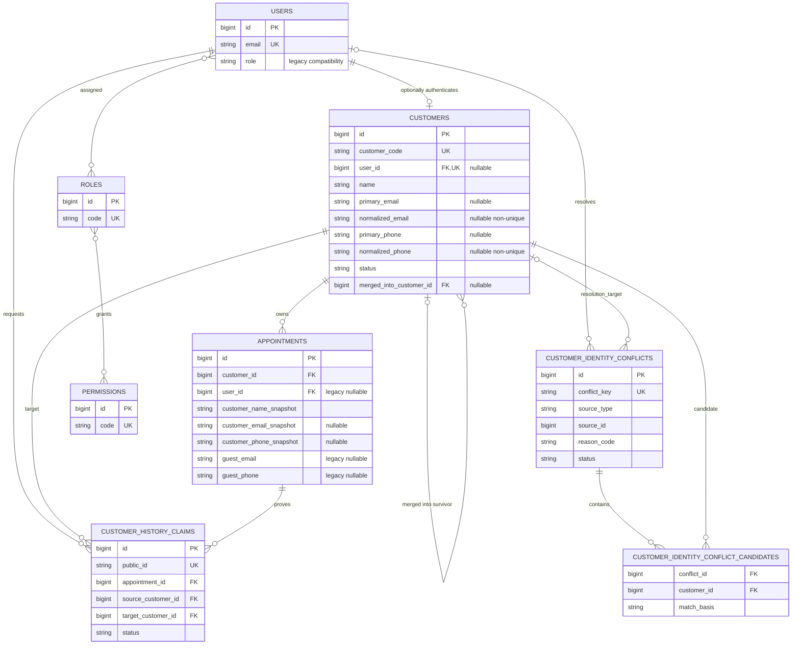

# 1. Executive Summary

Ngày thiết kế: 2026-09-23  
Phạm vi: canonical Customer dùng chung cho Booking và ERP, migration/backfill an toàn, conflict/claim/merge lifecycle, appointment snapshots và permission foundation. Step 1 Expand và Step 2 registered-customer normalization/backfill đã được triển khai; guest backfill, claim/merge, constraint tightening và legacy cleanup vẫn chưa triển khai.

## Implementation status — 2026-09-23

- Step 1 Expand: đã có `customers`, conflict/candidate tables, `customer_migration_map`, nullable Appointment Customer reference/snapshots, models, relationships và constraints additive.
- Step 2 Registered Backfill: đã có normalizer `customer-v1`, command `customers:backfill-registered`, dry-run, canary `--limit`, persisted source mapping, deterministic conflict key, per-User transaction/lock, appointment linkage, reconciliation và idempotent rerun.
- Registration và registered booking đã dual-write canonical Customer; profile update dùng cùng normalizer. Guest booking vẫn giữ legacy behavior và `customer_id=null`.
- Admin Customer List/Detail và Receptionist Customer Search đã đọc canonical `customers` với response fields compatibility. Appointment display/ownership, loyalty, vouchers và reviews vẫn giữ User compatibility trong phase này.
- Development backfill: 4/4 eligible Users có Customer; 19/19 registered Appointments link đúng; 3 guest Appointments không đổi; 4 migration maps; 0 conflict, mismatch, orphan hoặc duplicate code. Chi tiết tại `docs/CUSTOMER_FOUNDATION_STEP2_IMPLEMENTATION.md`.

Quyết định kiến trúc chính:

- `users` tiếp tục là authentication identity; `customers` là business identity.
- Customer có thể tồn tại không có account; `customers.user_id` nullable và unique khi có giá trị.
- Mọi appointment cuối cùng phải có `customer_id`, kể cả guest, nhưng vẫn giữ snapshot contact tại thời điểm đặt lịch.
- Email/phone normalized phục vụ lookup, không unique toàn cục trong giai đoạn đầu và không đủ một mình để merge legacy data.
- Legacy guest backfill mặc định bảo thủ: mỗi appointment chưa có bằng chứng verification bền vững được gắn một customer riêng; các candidate trùng được đưa vào conflict queue, không tự merge.
- Guest booking mới sau cutover có thể reuse một customer chỉ khi verification evidence và candidate uniqueness đạt rule rõ ràng; trường hợp mơ hồ vẫn được booking bằng customer tạm riêng và tạo conflict.
- Migration theo `expand → backfill registered → backfill guest → verify → dual write/read → cutover → constraint → cleanup`, có migration map để restart/rollback có kiểm soát.
- Role hiện tại vẫn hoạt động; permission/ability được bổ sung song song rồi migrate từng route/module, không rewrite 103 routes một lần.

Thứ tự ưu tiên xuyên suốt: data integrity → backward compatibility → security → traceability → tốc độ triển khai.

# 2. Current Identity Model

## User và customer hiện tại

- `users` chứa bốn role: `admin`, `customer`, `receptionist`, `doctor`.
- Customer đăng nhập được nhận diện bằng `users.role=customer`; không có bảng/model Customer.
- `users.email` unique; `users.phone` nullable và không unique.
- Register tạo trực tiếp user role customer rồi đăng nhập. Register hiện không đặt `email_verified_at`; profile chỉ sửa `name` và `phone`.
- Admin customer API thực chất query `users WHERE role=customer`; appointment, review, voucher và loyalty hiện đều đi qua `user_id`.

## Appointment ownership hiện tại

- Registered appointment: `user_id` có giá trị, ba field `guest_*` null.
- Guest appointment: `user_id=null`, bắt buộc `guest_name`, `guest_email`, `guest_phone`.
- Hai MySQL trigger insert/update ép đúng một trong hai mode trên và yêu cầu `booking_code`.
- Policy/customer queries kiểm ownership bằng `appointments.user_id === users.id`.
- Guest lookup/cancel/reschedule dùng booking code + phone normalized; guest booking ban đầu dùng OTP email.
- Guest OTP verification chỉ tồn tại tạm trong cache. Appointment không lưu verification method/timestamp, nên backfill không thể chứng minh row legacy nào thật sự đi qua OTP hay được seed/import trực tiếp.

## Permission hiện tại

- Route groups và middleware hard-code `admin`, `customer`, `receptionist`, `doctor`.
- Appointment policy kiểm customer ownership; doctor controller/service kiểm linked doctor ID; receptionist/admin có endpoint riêng.
- Backend boundary hiện an toàn, nhưng chưa có ability nhỏ như `customer.merge`, `inventory.adjust`, `pricing.override`, `refund.approve` hoặc resource scope.

# 3. Problems Confirmed From Phase 0

Code/schema được kiểm chứng lại ngày 2026-09-23; repository vẫn ở Laravel 13.31.0, PHP 8.4.12, MySQL 8.4.3, 29 migrations đã chạy và 103 non-vendor routes.

Aggregate development hiện tại, không ghi PII:

| Chỉ số | Giá trị |
| --- | ---: |
| Customer users | 4 |
| Customer users đã verify email | 3 |
| Customer users có phone | 4 |
| Tổng appointments | 22 |
| Registered appointments | 19 |
| Guest appointments | 3 |
| Nhóm guest email trùng | 1 |
| Nhóm guest phone trùng | 1 |
| Guest rows trùng email customer user | 3 |
| Guest email groups có nhiều phone | 0 |
| Guest phone groups có nhiều email | 0 |
| Guest phone groups có nhiều tên | 1 |
| Guest rows có email và phone trỏ hai customer khác nhau | 0 |

Các vấn đề đã xác nhận:

1. Business identity và authentication identity đang là một đối với registered customer nhưng hoàn toàn tách rời với guest.
2. Guest history không được claim khi đăng ký account.
3. Contact guest lặp ở mỗi appointment; contact customer đăng nhập được đọc động từ user nên chưa có snapshot lịch sử riêng.
4. Dữ liệu hiện tại chứng minh cùng email/phone có thể đi kèm nhiều tên. Name không thể dùng để merge; contact equality cũng cần evidence.
5. `PhoneNumber::normalize()` hiện chỉ bỏ ký tự không phải số và đổi chuỗi 11 chữ số bắt đầu `84` sang dạng `0...`; chưa phải international/E.164 normalizer.
6. Guest email được lower/trim trong request/service, nhưng user registration không có một normalizer dùng chung và database collation đang gánh một phần case-insensitive behavior.
7. Vouchers/reviews/loyalty hiện thuộc `users`, nên không thể chuyển wholesale sang customer trong cùng migration foundation.
8. Trigger appointment hiện tại sẽ xung đột nếu repurpose `guest_*` thành generic snapshots; cần thêm cột snapshot mới và giữ trigger trong compatibility stages.

# 4. Proposed Canonical Customer Model

## Vai trò domain

`Customer` là party/person mà Junie phục vụ và là owner nghiệp vụ của appointment, future Sales Order, loyalty account và các báo cáo customer. `User` chỉ là account đăng nhập có credential, session và role.

```text
User (authentication, optional)
        0..1
          |
          v
Customer (business identity, canonical)
          |
          +-- Appointments
          +-- future Sales Orders
          +-- future loyalty/payment references
```

## Schema đề xuất

```text
customers
  id                         bigint unsigned PK
  customer_code              varchar(16)
  user_id                    bigint unsigned nullable
  name                       varchar(255)
  primary_email              varchar(255) nullable
  normalized_email           varchar(255) nullable
  primary_phone              varchar(30) nullable
  normalized_phone           varchar(16) nullable
  verified_email_at          timestamp nullable
  verified_phone_at          timestamp nullable
  status                     varchar(20)
  source                     varchar(30)
  merged_into_customer_id    bigint unsigned nullable
  created_at                 timestamp
  updated_at                 timestamp
```

Status ban đầu chỉ gồm `active`, `inactive`, `merged`. Không thêm `blocked` cho tới khi có business rule riêng. Source ban đầu: `registered`, `guest_booking`, `admin`, `legacy_backfill`, `import`.

## Global data invariants

1. `customers.user_id` nullable nhưng unique khi không null.
2. User không có role customer không mặc định có Customer.
3. Sau cutover, mọi Appointment có đúng một canonical `customer_id` hợp lệ.
4. Appointment contact snapshots là historical facts và không đổi theo Customer profile.
5. Raw primary contact và normalized contact phải được ghi/cập nhật atomically; normalized null chỉ khi raw null hoặc legacy invalid đang được review.
6. `verified_*_at` chỉ áp dụng cho primary contact hiện tại; thay contact reset verification.
7. Email/phone equality không tự tạo merge invariant; duplicates được phép cho tới explicit resolution.
8. Merged Customer không nhận transaction mới và luôn trỏ trực tiếp tới một active survivor.
9. Claim, link/unlink, merge và conflict resolution phải idempotent, authorized và audited.
10. Không hard delete Customer đã có transaction.

## Các field không đưa vào bản đầu

- `customer_type`: không thêm. “Guest” là trạng thái acquisition, không phải loại customer vĩnh viễn; customer guest có thể link account sau này.
- `notes`: không thêm generic notes vào master PII. Khi có use case, cần loại note, permission và retention cụ thể.
- `created_by`, `updated_by`: chưa thêm. `source` mô tả provenance, còn actor/change history đi qua Audit Log. `updated_by` chỉ giữ actor cuối và không thay thế audit.
- Address, tax, company, demographic hoặc ERP-only fields: không thêm khi chưa có requirement.

# 5. Field-by-Field Schema Design

| Field | Required/nullable | Unique/index/FK | PII | Mục đích và lifecycle |
| --- | --- | --- | --- | --- |
| `id` | Required | PK | Không | Internal immutable key; mọi FK dùng field này. |
| `customer_code` | Nullable ở Expand, required sau backfill | Unique | Không trực tiếp | Business-readable identifier, immutable; không dùng thay PK. |
| `user_id` | Nullable | Unique nullable; FK `users.id`, ban đầu `RESTRICT` | Gián tiếp | Optional 1:1 account link. Unlink/delete account phải qua service có audit, không để cascade âm thầm. |
| `name` | Required | Không index mặc định | Có | Tên hiện tại của customer. Không dùng làm identity key. |
| `primary_email` | Nullable | Không unique | Có | Raw/display email hiện tại. Thay đổi không rewrite transaction snapshots. |
| `normalized_email` | Nullable | Non-unique exact-lookup index | Có | Giá trị matching. Dùng binary/deterministic collation; luôn đồng bộ với `primary_email`. |
| `primary_phone` | Nullable | Không unique | Có | Raw/display phone; giữ format người dùng nhập hoặc format hiển thị đã duyệt. |
| `normalized_phone` | Nullable | Non-unique exact-lookup index | Có | E.164 candidate phục vụ matching; invalid legacy data để null và tạo conflict. |
| `verified_email_at` | Nullable | Không cần index riêng ban đầu | Có | Chỉ chứng minh **primary email hiện tại** đã verify. Đổi email phải reset null. |
| `verified_phone_at` | Nullable | Không cần index riêng ban đầu | Có | Chỉ set sau phone verification thật; không suy ra từ việc phone từng dùng lookup. |
| `status` | Required, default `active` | Composite `(status,id)` | Không | Lifecycle business identity: active/inactive/merged. |
| `source` | Required | Không index riêng ban đầu | Không | Provenance tạo record. Không phải authorization hoặc customer type. |
| `merged_into_customer_id` | Nullable | FK self `RESTRICT`, indexed | Gián tiếp | Survivor của source customer đã merge. Không được tự trỏ, tạo cycle hoặc chain nhiều tầng. |
| timestamps | Required | Theo framework | Không | Trace creation/update; không thay Audit Log. |

Quy tắc null contact:

- Schema cho phép email hoặc phone null để chứa walk-in/legacy invalid data mà không mất record.
- New active customer bình thường phải có ít nhất một contact hợp lệ ở validation layer; guest booking hiện phải có cả email và phone.
- Không thêm DB CHECK “email hoặc phone bắt buộc” trước khi backfill/dry-run chứng minh toàn bộ legacy data đáp ứng.

## Customer code

Recommended default: `CUS00000001`, độ rộng tối thiểu tám chữ số, sinh backend từ immutable customer PK sau insert trong cùng transaction.

- Collision-safe nhờ PK và unique index.
- Không chứa ngày, contact hoặc PII.
- Không dùng làm FK, authorization key hoặc idempotency key.
- Insert ở Expand có thể để code null, sau đó set ngay trong transaction; Stage Constraint mới đặt NOT NULL.
- Format cho phép vượt tám chữ số thay vì truncate.
- Trade-off: lộ gần đúng volume customer. Nếu business không chấp nhận, dùng random Crockford code có retry; đây là `OPEN-003`.

# 6. Customer/User Relationship

## Invariants

1. Customer không bắt buộc có User.
2. Một User chỉ link tối đa một Customer nhờ unique `customers.user_id`.
3. Chỉ user role customer được link theo flow mặc định.
4. Admin/receptionist/doctor không được tự động tạo customer profile trong backfill hoặc login.
5. Staff chỉ trở thành customer qua một explicit, audited business operation nếu sau này thật sự cần; không đổi role ngầm.
6. Xóa/unlink account không xóa Customer hoặc transaction history.
7. `users.email` là login identifier; `customers.primary_email` là business contact. Hai giá trị có thể khởi tạo giống nhau nhưng không mặc định đồng bộ hai chiều mãi mãi.

## Authority sau cutover

- `users`: email đăng nhập, password, session, role, account status/security.
- `customers`: name/contact business hiện tại, verification, merge/lifecycle.
- Trong transition, `users.name/phone` vẫn được giữ cho compatibility. Profile update phải dual-write có kiểm soát hoặc chuyển sang Customer service ở một task riêng; không xóa field user trong Phase 1.
- Nếu login email thay đổi, không tự đổi customer email khi chưa verify. Nếu customer email thay đổi, không tự đổi credential.

## Future Customer API

Giữ path list/detail hiện có để giảm frontend breakage, nhưng đổi source từ User sang Customer sau compatibility adapter/versioned contract:

```text
GET    /api/admin/customers
POST   /api/admin/customers
GET    /api/admin/customers/{customer}
PATCH  /api/admin/customers/{customer}
```

Không có `DELETE /customers/{customer}`. High-risk operations là resource riêng để có authorization/idempotency/audit boundary:

```text
POST /api/admin/customer-merges
POST /api/admin/customer-user-links
POST /api/customer-history/claims
POST /api/customer-history/claims/{claim}/verify
```

Chỉ thêm unlink/reverse endpoints khi lifecycle tương ứng được duyệt. Không dùng generic customer update để set `user_id`, `merged_into_customer_id`, verification timestamps hoặc status merged.

## Future Customer UI

Release đầu chỉ mở tab có data canonical thật:

- Thông tin chung;
- Lịch hẹn;
- Audit/identity conflicts cho actor có permission.

Đơn hàng, Thanh toán, Voucher và Loyalty chỉ xuất hiện sau khi từng module có `customer_id` authoritative. Không hiển thị tab placeholder hoặc suy diễn voucher/loyalty user-owned là customer-canonical.

# 7. Guest Identity Strategy

## Guest booking mới sau dual-write

Guest vẫn không cần account. Flow đề xuất:

```text
OTP verifies submitted email
  ↓
normalize email + phone
  ↓
resolve candidates under lock
  ├─ one safe candidate → AUTO_MATCH
  ├─ no candidate → CREATE_NEW
  └─ ambiguous/contradictory → create isolated customer + REQUIRES_REVIEW
  ↓
create appointment with customer_id + immutable snapshot
```

Safe candidate cho guest mới mặc định yêu cầu:

- email vừa được OTP verify;
- đúng một active, non-merged customer có cùng `normalized_email` và `verified_email_at`;
- không có verified phone contradiction;
- nếu incoming phone match verified phone của candidate thì confidence tăng; incoming phone chưa verify không được overwrite primary phone tự động.

Phone-only match không AUTO_MATCH vì hệ thống chưa có SMS verification. Same name không bao giờ là match rule.

Customer mới được tạo từ một OTP vừa consume có `verified_email_at=now()` cho đúng primary email đó; `verified_phone_at` vẫn null. Điều này áp dụng cả isolated customer khi candidate mơ hồ: email đã được chứng minh, nhưng quyền sở hữu một customer cũ chưa được chứng minh.

## Ambiguous booking không bị chặn

Nếu nhiều candidate hoặc email/phone chỉ về các customer khác nhau:

- vẫn cho phép booking sau OTP;
- tạo một Customer riêng `source=guest_booking` cho transaction đó;
- link appointment vào customer mới;
- tạo conflict record/candidates;
- không sửa contact của customer cũ.

Cách này ưu tiên không mất booking và không gắn sai lịch sử. Duplicate tạm thời tốt hơn false merge.

# 8. Email Normalization

Contract đề xuất cho `normalizeEmail()`:

1. Nhận string; loại whitespace đầu/cuối, bao gồm whitespace Unicode đã được nhận diện an toàn.
2. Validate email theo cùng contract ở mọi entry point trước khi coi là identity.
3. Lowercase bằng multibyte-aware function để nhất quán với hành vi hiện tại.
4. Không bỏ dấu chấm Gmail.
5. Không bỏ hoặc canonicalize `+tag`.
6. Không rewrite provider-specific aliases.
7. Không tự map Unicode look-alike, NFKC hoặc IDN nếu runtime/requirement chưa được chuẩn hóa.
8. Raw/display value nằm ở `primary_email`; normalized value chỉ dùng matching/index.

Ví dụ:

| Input | Normalized |
| --- | --- |
| `  Customer@Example.COM ` | `customer@example.com` |
| `john.smith+promo@gmail.com` | `john.smith+promo@gmail.com` |
| `johnsmith@gmail.com` | `johnsmith@gmail.com` — không coi là cùng địa chỉ trên |

Unicode/EAI edge case:

- PHP CLI hiện thiếu `intl`, nên không thiết kế normalization phụ thuộc ngầm vào IDNA extension.
- Recommended default cho implementation đầu: giữ nguyên code points sau trim/lower, validation fail thì không tạo normalized identity và đưa legacy row vào conflict.
- Nếu sau này hỗ trợ internationalized email, phải version normalization, backfill dry-run và collision report trước khi đổi algorithm.

# 9. Phone Normalization

## Canonical representation

Recommended target là E.164, tối đa 15 chữ số cộng dấu `+`, với default country configurable là `VN`:

| Input Việt Nam hợp lệ | Canonical |
| --- | --- |
| `0912345678` | `+84912345678` |
| `+84 912 345 678` | `+84912345678` |
| `84912345678` | `+84912345678` nếu parse hợp lệ như country code |

Rules:

1. Giữ raw/display input ở `primary_phone` hoặc transaction snapshot.
2. Bỏ separator hiển thị như space, dash, parentheses; không âm thầm bỏ extension.
3. Input bắt đầu `+` phải parse như international number.
4. Input local không có `+` dùng `default_country=VN`; leading `0` được chuyển sang `+84` sau validation.
5. `00<country code>` có thể đổi sang `+<country code>` khi parser xác nhận.
6. Invalid/ambiguous legacy number → `normalized_phone=null` + conflict, không đoán.
7. New writes invalid → 422; legacy backfill không được bỏ row.

Không thay trực tiếp `App\Support\PhoneNumber` trong một deployment. Helper hiện trả local `0...` và đang được guest lookup/rate-limit/tests dùng. Implementation phải đưa normalizer customer mới vào song song, có compatibility tests, rồi migrate từng call site được duyệt. Một phone library chuẩn có thể được đánh giá sau; thêm dependency cần approval riêng.

# 10. Matching Rules

## Evidence levels

| Level | Evidence | Default result |
| --- | --- | --- |
| A | Existing `user_id ↔ customer` relation | `AUTO_MATCH` |
| B | New request: OTP-verified email, exactly one verified active candidate, no verified contradiction | `AUTO_MATCH` |
| C | Verified phone + verified email both point cùng một customer | `AUTO_MATCH` |
| D | One verified identifier nhưng identifier còn lại verified và mâu thuẫn | `CONFLICT` |
| E | Legacy unverified email/phone equality | `REQUIRES_REVIEW` |
| F | Multiple candidates cho bất kỳ identifier | `REQUIRES_REVIEW` |
| G | Không candidate và input hợp lệ | `CREATE_NEW` |
| H | Same normalized name only | `CREATE_NEW`; không candidate lookup theo name |
| I | Invalid/insufficient legacy contact | `CREATE_NEW` isolated + `REQUIRES_REVIEW` |

## Meaning của kết quả

- `AUTO_MATCH`: link transaction vào một customer đã xác định; ghi decision/evidence.
- `CREATE_NEW`: tạo customer mới, không conflict nếu không có candidate.
- `REQUIRES_REVIEW`: tạo customer riêng để transaction tiếp tục và tạo conflict queue với candidate list.
- `CONFLICT`: dùng cho claim/link/merge operation có contradiction mạnh; operation bị dừng. Với booking mới, hạ xuống isolated create + conflict để không mất booking.

## Matrix edge cases

| Trường hợp | Xử lý |
| --- | --- |
| Same email, different verified phone | Không auto-match; conflict. |
| Same phone, different verified email | Không auto-match; conflict. |
| Same unverified phone, names khác | Không auto-match; shared household có thể xảy ra. |
| Same verified email, phone incoming chưa verified và khác | Không overwrite; isolated/review theo risk policy. |
| Email và phone trỏ hai customers | Conflict, không chọn một bên. |
| Candidate status merged | Resolve survivor, rồi chạy lại rule; không link vào merged source. |
| Candidate inactive | Không auto-match cho transaction mới; review/reactivate explicit. |
| Name trùng hoàn toàn | Không có tác dụng nếu thiếu verified identifiers. |

# 11. Conflict Resolution

Conflict queue là bắt buộc cho backfill/claim traceability. Không dùng một JSON `candidate_customer_ids` duy nhất vì sẽ mất FK integrity.

## `customer_identity_conflicts`

```text
id
conflict_key char(64) unique
source_type varchar(30)
source_id bigint unsigned
reason_code varchar(50)
status varchar(20)          pending|resolved|dismissed
resolution varchar(40) nullable
resolution_customer_id bigint unsigned nullable FK customers
resolved_by bigint unsigned nullable FK users SET NULL
resolved_at timestamp nullable
resolution_note text nullable
created_at
updated_at
```

`conflict_key` là hash deterministic của normalization-version + source + reason + sorted candidate IDs, không chứa plaintext PII và làm rerun idempotent.

## `customer_identity_conflict_candidates`

```text
conflict_id FK conflicts CASCADE
customer_id FK customers RESTRICT
match_basis varchar(30)     verified_email|email|verified_phone|phone|multiple
confidence varchar(20)      high|medium|low
created_at
unique(conflict_id, customer_id, match_basis)
```

Không lưu full email/phone lặp lại trong conflict metadata. Reviewer đọc snapshot/source theo permission; danh sách/log có masking.

Resolution codes tối thiểu:

- `LINK_TO_EXISTING`
- `KEEP_SEPARATE`
- `MERGE_INTO_EXISTING`
- `INVALID_SOURCE_DATA`
- `SUPERSEDED`

Mọi resolution cần transaction, actor, timestamp và Audit Log. Chỉ role có `customer.resolve_identity_conflict` được thao tác.

# 12. Claim Guest History

## Proof mặc định

Claim không dùng `WHERE guest_email=user.email UPDATE...`. Recommended proof kết hợp:

1. User đã đăng nhập.
2. Booking code + phone khớp snapshot hiện tại bằng generic 404 behavior.
3. OTP gửi tới **email snapshot của appointment**, không gửi tới email do requester tự khai.
4. OTP/token one-time, TTL ngắn; không persist plaintext OTP.

Login email đã verified có thể là supporting evidence nhưng không thay OTP của lịch sử guest, vì shared/reused email và account-link conflicts vẫn có thể tồn tại.

## Workflow

```text
POST claim request
  ↓ generic accepted response
verify booking code + phone without enumeration
  ↓ send OTP to snapshot email
POST claim verification
  ↓ row-lock claim, appointment, source/target customers
re-run conflict rules
  ├─ safe → reassign appointment.customer_id, preserve snapshots
  ├─ already target → idempotent success
  └─ conflict → no mutation, queue review
```

## Workflow state

Khi implement, cần bảng `customer_history_claims` thay vì chỉ dựa Audit Log:

```text
id
public_id uuid/ulid unique
idempotency_key uuid unique
requester_user_id FK users
target_customer_id FK customers
appointment_id FK appointments
source_customer_id FK customers
status pending|verified|applied|rejected|reversed|expired
verification_channel email
verified_at/applied_at/reversed_at nullable
conflict_id nullable FK conflicts
created_at/updated_at
```

Token/OTP chỉ lưu hash/cache như flow hiện tại. Claim table là durable workflow/audit support, không lưu OTP.

## Security và rollback

- Rate limit theo authenticated user + IP + hash booking code; OTP request còn limit theo destination hash.
- Response request/verify không tiết lộ booking/email/customer tồn tại hay không.
- Source appointment snapshot không đổi.
- Audit action riêng: `CUSTOMER_HISTORY_CLAIM` và `CUSTOMER_HISTORY_CLAIM_REVERSED`, không ghi full contact.
- Rollback dùng claim record để restore `source_customer_id` dưới lock; nếu sau claim đã có downstream transaction phụ thuộc target, không auto-reverse mà chuyển manual review.
- Nếu source customer hết references sau claim, chỉ mark merged vào target qua merge workflow; không hard delete.

# 13. Customer Merge Strategy

Merge là explicit high-risk operation, không phải side effect của search/update.

```text
Source Customer A
        +
Target/Survivor Customer B
        ↓
move approved references → mark A merged_into B
```

## Preconditions

- Lock source và target theo thứ tự ID để giảm deadlock.
- Source ≠ target; target phải active và không merged.
- Source chưa merged; không tạo cycle hoặc chain.
- Nếu hai customers link hai user khác nhau, block merge. Account consolidation là decision riêng.
- Nếu target chưa có user và source có user, việc chuyển link phải explicit trong cùng reviewed plan.
- Mọi unresolved high-confidence conflict phải được reviewer acknowledge.

## Transaction

1. Tạo merge operation record với source/target/actor/reason/status.
2. Snapshot field choices; reviewer quyết định target name/contact, không dùng “last write wins”.
3. Reassign appointments và future orders/loyalty references theo registry các relation hỗ trợ merge.
4. Không tự chuyển current user-owned vouchers/reviews/loyalty cho tới khi các module đó được migrate sang `customer_id` và có rule riêng.
5. Mark source `status=merged`, set `merged_into_customer_id=target.id`.
6. Ghi audit và số lượng/mapping references đã chuyển.

Để rollback đáng tin cậy, implementation merge phải có `customer_merge_operations` và `customer_merge_items` (reference type/id/from/to), không chỉ một audit message tổng số. Không hard delete source hoặc xóa contacts. Merged customer không nhận transaction mới; resolver luôn trả survivor.

## Deactivate/delete lifecycle

- `active`: được nhận transaction mới nếu các business checks khác pass.
- `inactive`: giữ identity/history nhưng không được chọn cho transaction mới; reactivation là explicit audited action.
- `merged`: terminal source state; mọi navigation nội bộ resolve tới survivor, nhưng source code/history vẫn xem được bởi authorized staff.
- Disabled User chỉ chặn authentication; không tự inactive Customer. Inactive Customer cũng không tự disable User.
- Không có public/admin hard-delete endpoint cho Customer có appointment hoặc future transaction. Record chưa từng được tham chiếu và tạo lỗi có thể được xử lý bằng một guarded maintenance operation sau này, nhưng default vẫn là inactive + audit.
- Privacy erasure tương lai là anonymization/retention workflow riêng, không đồng nhất với deactivate hoặc delete.

# 14. Appointment Integration

## Cột mới đề xuất

```text
appointments.customer_id              bigint unsigned nullable (Expand)
appointments.customer_name_snapshot   varchar(255) nullable
appointments.customer_email_snapshot  varchar(255) nullable
appointments.customer_phone_snapshot  varchar(30) nullable
```

- `customer_id` FK `customers.id` với `RESTRICT` delete.
- Index `(customer_id, appointment_date, id)` phục vụ lịch sử/pagination và bao phủ FK prefix; không thêm single index dư thừa nếu MySQL đã dùng composite này.
- Snapshot raw/display, không normalized, vì đây là evidence tại thời điểm giao dịch.

## Registered booking

```text
authenticated user role customer
  ↓ resolve unique linked Customer
  ↓
appointment.customer_id = customer.id
snapshot = current approved customer contact
user_id vẫn ghi như hiện tại trong compatibility period
```

Nếu user chưa có Customer trong transition, service tạo/link customer transactionally theo unique `user_id` hoặc trả controlled conflict; không silently book với `customer_id=null` sau khi dual-write được enforce.

## Guest booking

```text
verified guest input
  ↓ matching rules
  ↓ existing/new isolated Customer
  ↓
appointment.customer_id + snapshots
user_id=null và guest_* vẫn được ghi trong compatibility period
```

## Ownership cutover

- Trước cutover: reads/policies có fallback legacy `user_id`; writes dual-write cả cũ và mới.
- Sau verify: customer appointment ownership là `appointment.customer.user_id === authenticated user.id`.
- Public guest lookup vẫn dùng booking code + snapshot phone trong giai đoạn đầu; không expose Customer ID.
- Admin/receptionist/doctor resources tiếp tục masking theo role.
- `user_id` không drop trong Phase 1 vì reviews/vouchers/loyalty và legacy code còn phụ thuộc.

# 15. Snapshot Strategy

Canonical Customer biểu diễn thông tin hiện tại; appointment snapshot biểu diễn lúc giao dịch.

Ví dụ:

```text
Customer phone hiện tại: +84909999999
Appointment 2026-01 phone snapshot: 0911111111
```

Đổi customer phone không update appointment cũ.

## Legacy fields

- `guest_name`, `guest_email`, `guest_phone` không bị rewrite hoặc drop trong customer foundation.
- Backfill copy chính xác guest raw values sang generic snapshot; registered appointment snapshot lấy từ current user/customer vì lịch sử cũ không có snapshot. Báo cáo phải ghi rõ đây là “backfilled current profile”, không tuyên bố là contact thật tại thời điểm booking.
- Trong dual-write, guest flow tiếp tục ghi `guest_*` để thỏa hai trigger hiện tại; registered flow tiếp tục để `guest_*` null.
- Generic snapshot mới áp dụng cho cả hai mode.
- Sau ít nhất một compatibility window và verify hash/count, `guest_*` mới được đánh dấu deprecated. Việc drop/archival là task riêng cần backup và approval; không nằm trong Phase 1 implementation đầu.

## Immutability

- Snapshot fields chỉ fill lúc create/backfill khi đang null.
- Không đưa snapshot vào generic appointment update `$fillable`/request payload nếu không cần.
- Reschedule/status/contact profile update không đổi snapshot.
- Correction vì data-entry error phải là explicit audited correction ability, không dùng customer profile update.

# 16. Backfill Algorithm

Backfill không đặt trong schema migration dài. Dùng restartable Artisan command/service, `chunkById`, dry-run, batch ID, progress metrics và transaction nhỏ theo source.

## Operational mapping

Đề xuất bảng tạm-dài-hạn `customer_migration_map` để idempotency/recovery:

```text
id
batch_key
normalization_version
source_type        user|appointment
source_id
customer_id FK
decision           AUTO_MATCH|CREATE_NEW|REQUIRES_REVIEW
conflict_id nullable FK
input_fingerprint char(64)
created_at/updated_at
unique(source_type, source_id)
index(batch_key)
```

Giữ table qua cutover/rollback window; sau đó archive thay vì xóa ngay.

## Backfill registered customers

Với từng `users WHERE role=customer`, ordered/chunked by ID:

1. Transaction + lock user.
2. Nếu migration map hoặc customer `user_id` đã tồn tại, validate fingerprint và reuse; không create lại.
3. Tạo Customer nếu chưa có:
   - name/email/phone từ user;
   - email/phone normalization versioned;
   - `verified_email_at=user.email_verified_at`;
   - `verified_phone_at=null` vì hiện không có phone verification evidence;
   - source `registered`, status active;
   - customer code sau insert.
4. Update **chỉ** registered appointments của user còn `customer_id=null`.
5. Fill generic snapshots chỉ khi null. Phone thiếu vẫn được phép.
6. Ghi migration map và metrics trong cùng transaction.
7. Staff roles không nằm trong query và có assertion không tạo customer.

Unique `customers.user_id` và unique global migration source là guard cuối cho concurrent/retry; command bắt duplicate-key rồi reload canonical row, không tạo bản sao. Đổi `batch_key` khi resume không được tạo mapping thứ hai cho cùng source.

## Backfill guest appointments

Mặc định bảo thủ vì legacy row không giữ verification evidence:

1. Process `appointments WHERE user_id IS NULL AND customer_id IS NULL` theo ID.
2. Lock appointment; nếu migration map đã có, verify và resume.
3. Copy raw guest contact vào generic snapshot; normalize email/phone bằng version cố định.
4. Chạy candidate search để **phát hiện conflict**, không auto-link legacy row chỉ vì contact equality.
5. Tạo một Customer `source=legacy_backfill` cho appointment đó; verified timestamps null.
6. Set `appointment.customer_id` vào customer mới.
7. Nếu candidate/duplicate/invalid data tồn tại, tạo conflict + candidate rows và decision `REQUIRES_REVIEW`; nếu không, `CREATE_NEW`.
8. Ghi migration map cùng transaction.

Không group legacy appointments thành một customer theo name, email hoặc phone. Có thể group nguồn chỉ để báo cáo/conflict batching; resolution/merge diễn ra sau verification/review. Nếu production volume quá lớn, strict clustering là một open decision cần dry-run evidence, không phải default.

## Required answers cho edge cases

| Edge case | Backfill action |
| --- | --- |
| Email giống, phone khác | Customer riêng + conflict `EMAIL_MATCH_PHONE_MISMATCH`. |
| Phone giống, name khác | Customer riêng + conflict `SHARED_OR_REUSED_PHONE`; name không quyết định. |
| Email trùng registered customer | Customer riêng + conflict; không claim legacy tự động. |
| Email và phone map hai customers | Customer riêng + high-risk conflict, không chọn candidate. |
| Contact invalid | Customer riêng, normalized field null, conflict `INVALID_LEGACY_CONTACT`. |
| Rerun | Migration map + non-null appointment customer_id + transaction làm no-op/verify. |
| Source thay đổi sau lần chạy | Fingerprint mismatch; dừng source và tạo operational conflict, không overwrite. |

# 17. Migration Stages

## Stage 0 — Preflight

- Duyệt open decisions và normalization version.
- Backup/restore rehearsal; capture row counts, orphan/duplicate/contact-quality metrics.
- Xác định deploy feature flags: `customer_dual_write`, `customer_read`, `customer_enforce`.
- Dry-run trên copy production-like; đo chunk size/locks/query plans.

## Stage 1 — Expand

- Tạo `customers`, conflict/candidate tables và `customer_migration_map`.
- Thêm nullable `appointments.customer_id` và nullable generic snapshots.
- Chưa đổi trigger ownership, legacy columns, policies hoặc reads.
- Index online/lock impact phải kiểm tra trên representative data.

## Stage 2 — Compatibility deploy

- Thêm model/service/normalizers sau khi migration expand tồn tại.
- Legacy reads vẫn authoritative; code có thể hiểu new columns.
- Customer code generation và audit actions được bật nhưng booking chưa buộc dual-write.

## Stage 3 — Backfill registered

- Dry-run → canary batch → bounded chunks → metrics.
- Tạo 1:1 customer cho role customer và fill registered appointments.
- Verify không staff user nào bị link.

## Stage 4 — Backfill guest

- Mỗi legacy guest appointment có isolated customer và mapping.
- Sinh conflict queue; không merge trong backfill command.
- Invalid rows không bị bỏ hoặc sửa raw snapshot.

## Stage 5 — Verify

Gate bắt buộc trước dual-write/cutover:

- 100% appointments có valid customer_id.
- 100% appointments có name snapshot; email/phone null được report rõ.
- 0 orphan FK; 0 non-customer user links; 0 duplicate non-null user_id.
- Mapping coverage đúng source count; rerun dry-run tạo 0 row mới.
- Merged graph không cycle; mọi conflict có source/candidates hợp lệ.
- Hash/count legacy guest snapshots bằng source copy.

## Stage 6 — Dual write

- Registered và guest booking mới ghi customer_id + generic snapshot + legacy fields tương thích.
- Profile/link/claim/merge operations qua transaction/locks và audit.
- Observe mismatch metrics; tự động alert nếu dual-write thất bại.

## Stage 7 — Dual read/cutover

- Shadow-read so sánh legacy vs customer ownership trước.
- Chuyển từng query/resource/policy sang customer relation, có feature flag fallback.
- Customer admin API chuyển từ User sang Customer; frontend contract được version/compatibility adapter.

## Stage 8 — Constraints

Chỉ sau stable window:

- `appointments.customer_id` NOT NULL.
- `customers.customer_code` NOT NULL + unique.
- Giữ unique nullable `customers.user_id`.
- Thêm lifecycle CHECK nếu dữ liệu đã sạch: merged status phải có target, non-merged không có target, source không tự trỏ.
- Không drop `appointments.user_id` hoặc `guest_*` ở stage này.

## Stage 9 — Legacy cleanup

- Deprecated reads/writes được đo về zero.
- Trigger cũ chỉ thay khi mọi create path có customer/snapshot invariants tương đương.
- Drop/archive legacy fields là migration riêng, không reversible giả và không thực hiện nếu chưa có signed verification/backup.

# 18. Rollback Strategy

## Trước cutover

- Roll back code về compatibility release; legacy `user_id/guest_*` và triggers vẫn nguyên nên booking tiếp tục hoạt động.
- Tắt feature flags dual-read/dual-write.
- Giữ customers/conflicts/maps đã tạo; không drop data mới.
- Forward-fix normalizer/backfill rồi rerun idempotent.

## Backfill lỗi giữa chừng

- Dừng command; transaction hiện tại rollback, các chunk đã commit được giữ.
- Rerun dùng migration map và source fingerprint.
- Nếu cần undo một batch trước cutover, dùng `batch_key` để clear **chỉ** new appointment FK/snapshot values mà batch đó tạo và mark customer records inactive/orphan-review; không hard delete hàng loạt.
- Conflict/resolution/audit history được giữ.

## Sau dual-write nhưng trước NOT NULL

- Code legacy vẫn đọc cột cũ; customer data mới được giữ để điều tra.
- Reconciliation tìm appointments legacy thành công nhưng customer write thiếu; fill forward, không xóa appointment.

## Sau cutover/constraint

- Không deploy thẳng code pre-customer vì không hiểu invariant mới. Rollback target phải là compatibility release có thể đọc cả hai schema.
- Không dùng migration `down()` để drop populated customer columns/tables. Production recovery là forward-fix migration.
- Appointment history vẫn hoạt động vì legacy columns chưa bị xóa.

# 19. Permission Foundation

## Mô hình đề xuất

```text
User
  ↓ many-to-many
Role (job function)
  ↓ many-to-many
Permission/Ability (action)
  ↓
Policy resource scope
```

Conceptual tables:

```text
roles(id, code unique, name, is_system, timestamps)
permissions(id, code unique, module, description, timestamps)
role_permission(role_id, permission_id, unique pair)
user_role(user_id, role_id, unique pair)
```

Không thêm direct user allow/deny override trong phiên đầu; nó tạo precedence khó audit. Chỉ thêm khi có use case không biểu diễn được bằng role/job function.

## Compatibility path từ `users.role`

1. Tạo roles cho bốn code hiện tại và seed ability mapping parity.
2. Backfill một `user_role` từ `users.role`; giữ column `users.role` authoritative cho middleware cũ.
3. Permission evaluator/Gates fallback sang legacy static map nếu user chưa có role rows, tránh downtime.
4. New ERP routes dùng `auth:sanctum` + `can:<ability>` từ đầu.
5. Migrate từng route/module cũ sau parity tests; không yêu cầu sửa 103 routes một lần.
6. Specialized doctor health checks (linked profile, password setup, active doctor) vẫn là middleware/policy condition ngoài ability.
7. Chỉ deprecate `users.role` sau khi tất cả route, UI, notification audience và tests không còn phụ thuộc; không nằm trong Customer Phase 1.

Không dùng admin wildcard ngầm. Mỗi permission mới phải được seed/approve explicit, đặc biệt price override, stock adjustment, payment và refund approval.

# 20. ERP Ability Matrix Proposal

## Ability catalog

| Domain | Abilities |
| --- | --- |
| Customer | `customer.view`, `customer.view_contact`, `customer.create`, `customer.update`, `customer.link_user`, `customer.merge`, `customer.resolve_identity_conflict`, `customer.claim_history` |
| Appointment | `appointment.view_all`, `appointment.view_assigned`, `appointment.view_own`, `appointment.create_own`, `appointment.confirm`, `appointment.check_in`, `appointment.start_examination`, `appointment.finish_examination`, `appointment.complete`, `appointment.cancel_all`, `appointment.cancel_own`, `appointment.reschedule_own` |
| Doctor/staff/catalog | `doctor.view`, `doctor.manage`, `staff.view`, `staff.manage`, `service.view`, `service.manage` |
| Voucher/loyalty | `voucher.view`, `voucher.manage`, `loyalty.view_own` |
| Product | `product.view`, `product.manage` |
| Warehouse | `warehouse.view`, `warehouse.manage` |
| Inventory | `inventory.view`, `inventory.adjust`, `inventory.transfer` |
| Sales | `sales_order.view`, `sales_order.create`, `sales_order.confirm`, `sales_order.cancel` |
| Pricing | `pricing.view`, `pricing.manage`, `pricing.override` |
| Payment/refund | `payment.view`, `payment.collect`, `refund.create`, `refund.approve` |
| Promotion | `promotion.view`, `promotion.manage` |
| Audit | `audit.view` |

## Baseline mapping giữ behavior hiện tại

`✓` là grant mặc định sau khi endpoint/domain tồn tại; `Scoped` còn cần resource policy.

| Ability group | Admin | Receptionist | Doctor | Customer |
| --- | --- | --- | --- | --- |
| `customer.view` | ✓ | ✓ | Scoped | Own only |
| `customer.view_contact` | ✓ | ✓ | Assigned appointment snapshot only | Own only |
| `customer.create/update` | Chưa grant đến khi CRUD được duyệt | — | — | Own profile qua flow riêng |
| `customer.link_user/merge/resolve_identity_conflict` | Explicit high-risk grant | — | — | — |
| `customer.claim_history` | — | — | — | ✓ |
| Appointment front desk confirm/check-in/complete/cancel-all | ✓ | ✓ | — | — |
| Appointment examination start/finish | — | — | Assigned only | — |
| Appointment own create/cancel/reschedule | — | — | — | ✓ |
| Doctor/staff/service management | ✓ | — | — | — |
| Voucher management/audit view | ✓ | — | — | — |
| ERP product/warehouse/inventory/sales/pricing/payment/refund | Không auto-grant chỉ vì role admin; approve per rollout | — | — | — |

Separation of duties:

- `refund.create` không suy ra `refund.approve`.
- `inventory.view` không suy ra `inventory.adjust` hoặc `inventory.transfer`.
- `pricing.manage` không suy ra `pricing.override` nếu override cần approval.
- `customer.update` không suy ra merge/link/resolve conflict.

Không tạo hàng chục role theo từng action. Role là bundle công việc; permission mới là nguồn kiểm tra hành động.

# 21. Warehouse Scope Readiness

Ability trả lời “được làm gì”; scope/policy trả lời “trên resource nào”. Không encode scope vào permission code như `inventory.view.q1`.

Khi warehouse module được duyệt, thêm một membership riêng:

```text
user_warehouse_scopes
  user_id FK
  warehouse_id FK
  unique(user_id, warehouse_id)
```

Authorization mẫu:

```text
user has inventory.view
AND
resource.warehouse_id belongs to user's warehouse scope
```

- Global/cross-warehouse access phải là explicit policy/grant, không suy ra từ role name.
- Nếu sau này cần per-ability-per-warehouse, có thể mở rộng pivot bằng `permission_id`; core ability codes không đổi.
- Sales Order create phải validate warehouse scope ở policy/service, không chỉ ẩn dropdown UI.
- Chưa tạo warehouse hoặc scope table trong Phase 1; thiết kế permission không khóa đường mở rộng này.

# 22. Security / PII Rules

## PII

`name`, raw/normalized email, raw/normalized phone và future address đều là PII. Normalized/hash không tự hết là PII nếu vẫn link được một người.

## Access

- Full contact cần `customer.view_contact`; list mặc định mask email/phone nếu actor chỉ có `customer.view`.
- Doctor chỉ xem snapshot cần thiết cho assigned appointment, không browse customer master.
- Customer chỉ xem own linked customer; cross-customer trả non-enumerating 404 khi phù hợp.
- Conflict, claim và merge endpoints chỉ trả candidate data cho authorized internal user; customer không thấy data của candidate khác.

## Audit

- Audit link/unlink, claim/reverse, merge, status/contact change và conflict resolution.
- Không snapshot full normalized email/phone vào generic audit metadata. Lưu changed-field names, masked display, last digits hoặc one-way fingerprint khi cần correlation.
- Không log OTP, verification token, session, claim token hoặc idempotency secret.
- Merge operation record giữ reference mappings; Audit Log giữ actor/request context.

## Abuse controls

- Claim/request OTP có generic responses, TTL, attempt limit và combined IP/account/destination rate limits.
- Candidate lookup không public.
- Link user và merge dùng transaction, row locks, re-authorization tại commit và CSRF/session protection hiện có.
- UI permission chỉ là convenience; backend Gate/Policy là authority.

## Privacy lifecycle

- Account disabled/deleted khác customer inactive.
- Customer inactive không xóa transaction.
- Merged giữ traceability.
- Future privacy erasure cần policy/anonymization theo pháp lý; không dùng hard delete Customer có transaction và không giả định GDPR rule khi chưa có jurisdiction requirement.

# 23. Indexes and Constraints

## Customers

| Index/constraint | Lý do |
| --- | --- |
| PK `id` | Internal joins. |
| Unique `customer_code` | Business identifier; nullable trong Expand, NOT NULL ở Constraint. |
| Unique `user_id` | Optional 1:1; MySQL cho phép nhiều null. |
| Index `normalized_email` | Exact candidate lookup; non-unique. |
| Index `normalized_phone` | Exact candidate lookup; non-unique. |
| Composite `(status,id)` | Stable customer list/pagination. |
| FK/index `merged_into_customer_id` | Resolve survivor; restrict delete. |

Không đặt unique trên normalized email/phone. Shared household, reused contact và legacy conflicts là hợp lệ/khả dĩ.

Staged constraint:

1. Add nullable fields + non-unique indexes.
2. Backfill và report duplicates/invalid values.
3. Enforce new-write validation/verification.
4. Nếu business sau này yêu cầu exclusive verified identifiers, thiết kế identity-claim table với explicit `exclusive` semantics và conditional unique key; không retrofit naive unique lên customer columns.

## Appointments

- FK `customer_id` RESTRICT.
- Composite `(customer_id, appointment_date, id)` cho customer history và FK prefix.
- `customer_id` nullable ở Expand, NOT NULL chỉ sau 100% coverage.
- Không add unique; một customer có nhiều appointments.

## Conflict/claim/migration

- Conflict unique `conflict_key`; index `(status,created_at,id)` và `(source_type,source_id)`.
- Candidate unique `(conflict_id,customer_id,match_basis)`.
- Migration map unique `(source_type,source_id)`; indexes `batch_key` và `customer_id`.
- Claim unique `public_id`, `idempotency_key`; index `(requester_user_id,status,created_at)` và `appointment_id`.

Index cuối cùng phải được kiểm bằng `EXPLAIN` trên production-like data. Không thêm single FK index nếu composite leading column đã đáp ứng và MySQL không cần index khác.

# 24. Logical ERD



Warehouse scope chỉ là conceptual policy dependency ở Phase 1; không thêm warehouse entity vào ERD này.

# 25. Acceptance Tests

Test plan ưu tiên feature tests qua request/service contract, real test database, `LazilyRefreshDatabase`, factories có states rõ, time/randomness/notification fakes khi cần.

## Customer schema/link

1. Customer-role user backfill tạo đúng một Customer, giữ user link unique và appointment trỏ đúng.
2. Backfill chạy hai lần không tạo thêm customer, conflict hoặc mapping.
3. Admin/receptionist/doctor backfill không tạo Customer.
4. Hai Customers không thể link cùng một user; duplicate race reload canonical result hoặc conflict có kiểm soát.
5. Xóa/unlink account không xóa Customer/appointments; operation có audit.

## Guest booking/matching

6. Guest mới sau OTP, không candidate → tạo Customer + appointment snapshots đầy đủ.
7. Guest booking nhiều lần với cùng verified email và một safe candidate → reuse Customer, không duplicate.
8. Same verified email + different verified phone → không auto-match, tạo isolated customer/conflict.
9. Same phone + different names → không auto-merge.
10. Same name, contacts khác → hai Customers.
11. Email và phone trỏ hai candidates → booking vẫn thành công nhưng isolated + conflict.
12. Invalid new phone/email → 422; invalid legacy row vẫn backfill isolated và conflict.
13. Concurrent guest requests cùng verified identity không tạo hai safe canonical customers ngoài policy cho phép.

## Snapshot

14. Customer đổi phone/email/name không đổi appointment snapshots cũ.
15. Reschedule/status transition không đổi snapshots.
16. Registered legacy appointment backfill fill snapshot một lần; rerun không overwrite correction.
17. Guest raw fields và generic snapshots hash/count khớp sau backfill.

## Claim

18. Guest → register → booking code + phone + OTP đúng → claim đúng appointment/customer.
19. Wrong booking code/phone/OTP trả generic failure, không enumeration.
20. Claim lặp cùng target là idempotent.
21. Claim vào customer khác hoặc có contradictory verified identity tạo conflict, không mutate.
22. Claim rate limits theo user/IP/destination.
23. Claim audit không chứa OTP/full contact; reversal dùng source mapping.

## Merge/lifecycle

24. Merge chuyển approved references và mark source merged; source không nhận transaction mới.
25. Merge hai customers link hai users khác nhau bị chặn.
26. Merge cycle/self/merged target bị chặn.
27. Merge rollback uses item mappings; không hard delete source.
28. Inactive khác merged; account disabled không tự đổi customer status.

## Permission

29. Complete ability matrix ở Gate/Policy layer.
30. Mỗi endpoint mới có unauthenticated, insufficient ability, cross-customer/scope và success tests.
31. Legacy admin/receptionist/doctor/customer route behavior giữ nguyên khi permission tables được bật.
32. Warehouse-scoped policy từ chối resource ngoài membership kể cả user có global action ability.
33. `refund.create` không cho `refund.approve`; `inventory.view` không cho adjust.

## Migration gates

34. Dry-run không write và report đúng counts.
35. Interrupted batch resume không duplicate.
36. Source fingerprint changed dừng row và tạo conflict.
37. Verify command fail nếu orphan/null coverage/non-customer user link tồn tại.
38. Compatibility release vẫn đọc/ghi legacy khi customer feature flags tắt.

# 26. Risks

| Risk | Severity | Mitigation |
| --- | --- | --- |
| False merge legacy guest | Critical | Không auto-match legacy; isolated owner + conflict review. |
| Registered historical snapshot không chính xác | High | Gắn provenance “backfilled current profile”; không tuyên bố lịch sử tuyệt đối. |
| Dual-write partial failure | Critical | Một DB transaction, metrics/reconciliation, feature flags. |
| Current trigger blocks changed ownership shape | High | Giữ legacy mode, thêm generic columns; replace trigger chỉ ở cleanup riêng. |
| Normalizer change tạo collision | High | Versioned normalizer, dry-run collision report, không unique contact. |
| Shared household contact | High | Multiple candidates → review; no contact-only merge. |
| Long-running backfill/locks | High | Command chunkById, small transactions, canary, observe replication/lock time. |
| Customer merge breaks voucher/loyalty | High | Không merge user-owned modules trước khi có customer FK/rules riêng. |
| Rollback after constraint | High | Roll back tới compatibility release, forward-fix schema; không destructive down. |
| Permission migration grants quá rộng | Critical | Explicit grants, parity/negative tests, no admin wildcard, route-by-route rollout. |
| PII leak in conflicts/audit | High | Masking, restricted abilities, minimal metadata, no OTP/token logs. |
| Customer code sequence disclosure | Low | Accept explicitly hoặc chọn opaque code trước implementation. |

# 27. Open Decisions

## OPEN-001

Question: Legacy guest appointments có được strict-cluster khi cùng normalized email + phone + name không, hay mỗi appointment luôn tạo customer riêng?  
Why it matters: Cluster giảm duplicates nhưng vẫn có nguy cơ false merge vì legacy không persist verification evidence; dữ liệu hiện tại đã có cùng email/phone nhưng nhiều tên.  
Recommended default: Mỗi legacy appointment tạo một isolated Customer; conflict queue hỗ trợ merge sau review/claim.  
Alternative: Strict cluster full tuple trong một migration batch, vẫn tạo conflict khi contact group có nhiều tên.  
Impact: Default tạo nhiều duplicate tạm hơn nhưng an toàn và rollback/traceability tốt hơn.

## OPEN-002

Question: Proof nào đủ để claim toàn bộ guest history liên quan thay vì chỉ một appointment?  
Why it matters: OTP email có thể thuộc shared household; booking code chứng minh một lịch, không tự chứng minh mọi row cùng contact.  
Recommended default: Claim một appointment bằng booking code + phone + OTP; mở rộng sang group chỉ sau review hoặc persisted verified identity evidence.  
Alternative: OTP verified email tự claim mọi guest row cùng normalized email.  
Impact: Default chậm hơn cho user nhiều lịch nhưng tránh mass mis-claim.

## OPEN-003

Question: Customer code dùng `CUS00000001` từ PK hay opaque random code?  
Why it matters: Sequential code đơn giản/collision-safe nhưng lộ gần đúng volume.  
Recommended default: `CUS` + zero-padded PK, immutable và không dùng làm security token.  
Alternative: Crockford/Base32 random code với unique index và bounded retry.  
Impact: Quyết định phải chốt trước backfill vì code không nên đổi sau phát hành.

## OPEN-004

Question: Receptionist có được update canonical customer contact ở release đầu không?  
Why it matters: Hiện receptionist chỉ xem customer list; update contact ảnh hưởng matching, claim và future sales.  
Recommended default: Giữ read-only; chỉ Admin có explicit `customer.update` sau khi audit/correction flow sẵn sàng.  
Alternative: Grant receptionist update non-verified display fields, nhưng verified contact change cần re-verification.  
Impact: Quyết định ảnh hưởng ability seed, UI và operational workload.

## OPEN-005

Question: Có cần thêm `blocked` vào Customer status ngay không?  
Why it matters: Block transaction khác inactive identity và khác disabled login; chưa có business rule hiện tại.  
Recommended default: Chỉ `active|inactive|merged`; thêm blocked khi có reason, actor, expiry và appeal policy.  
Alternative: Thêm ngay status blocked nhưng chưa dùng.  
Impact: Default tránh trạng thái chết/không có semantics.

# 28. Recommended Implementation Order

1. Review/approve năm open decisions, đặc biệt legacy clustering, claim scope và customer code.
2. Viết implementation specification nhỏ cho normalization version, schemas và feature flags; review query/index plans.
3. Tạo Stage 1 Expand migrations **trong task riêng**, không backfill trong migration.
4. Thêm Customer model/factories/relationships và contract tests, chưa đổi booking reads.
5. Implement email/phone normalizers song song helper cũ, kèm matrix tests/collision dry-run.
6. Implement restartable dry-run/backfill command + migration map; chạy trên test/prod-like copy.
7. Backfill registered canary, verify, rồi full registered.
8. Backfill legacy guest isolated + conflict queue; verify coverage/idempotency.
9. Implement transactional dual-write cho registered/guest booking phía sau feature flag.
10. Implement shadow-read/reconciliation, sau đó cutover từng query/policy/resource.
11. Chỉ sau stable window mới add NOT NULL/check constraints; chưa drop legacy fields.
12. Implement claim workflow; merge UI/API chỉ sau khi merge registry/rollback mappings hoàn chỉnh.
13. Triển khai permission tables/evaluator parity riêng; new ERP modules chỉ bắt đầu sau ability foundation và Customer constraint gates pass.

# 29. Files Inspected

- Phase/context: `docs/ERP_PHASE0_AUDIT.md`, `.codex/HANDOFF_RULES.md`, `.codex/HANDOFF.md`, root `AGENTS.md`.
- Dependencies/config/routes: `backend/composer.json`, `backend/routes/api.php`, `backend/bootstrap/app.php`, `backend/app/Providers/AppServiceProvider.php`, `backend/phpunit.xml`.
- Identity/booking migrations: users, appointments, guest booking support, doctor-user link, review/voucher pricing, public booking-code migrations; runtime `migrate:status`, indexes và appointment triggers.
- Models/support: `User.php`, `Appointment.php`, `PhoneNumber.php`, liên quan Voucher/Review/Audit relationships từ Phase 0.
- Auth/booking: `AuthController`, Register/UpdateProfile requests, `AppointmentController`, `GuestAppointmentController`, `StoreAppointmentRequest`, `GuestBookingVerificationService`, relevant `BookingService` create/ownership/limit methods.
- Authorization/audit: bốn role middleware, `AppointmentPolicy`, staff/doctor service checks, `AuditLogger`, admin customer controller/resources.
- Data creation: `UserFactory`, `AppointmentFactory`, `AestheticClinicSeeder`.
- Tests/conventions: Auth, Appointment, Guest Appointment, Guest Verification, Admin Access, Staff Portal, Audit Log và Database Foundation test suites.
- Read-only database aggregates ngày 2026-09-23: role counts, registered/guest appointment counts, verification/contact coverage, duplicate/conflict group counts; không đọc ra PII trong báo cáo.

# 30. Code Changes

No functional code changes.

Các thay đổi duy nhất trong Phase 1 design:

- Tạo `docs/ERP_PHASE1_CUSTOMER_FOUNDATION.md`.
- Cập nhật project handoff để ghi nhận thiết kế và bằng chứng kiểm chứng.

Không tạo migration, model, controller, route, test, Product, Warehouse, Inventory, Price List, Sales Order, Payment, Refund hoặc Promotion; không sửa database/business data.
