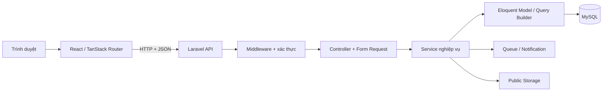

# Kiến trúc thư mục và luồng xử lý Laravel của dự án JUNIE

> Tài liệu đối chiếu các khái niệm trong `Slide_Laravel.pptx` với mã nguồn hiện tại. Cập nhật ngày 29/09/2026. Các đường dẫn bên dưới tính từ thư mục gốc project.

## 1. Sơ đồ tổng quan

- **PHP** là ngôn ngữ chạy backend; **Laravel** tổ chức HTTP, xác thực, truy cập dữ liệu và các tác vụ nền; **MySQL** lưu dữ liệu chính.
- Giao diện chính nằm trong `frontend/` và gọi API Laravel để nhận JSON. Laravel chỉ dùng Blade tại một số nội dung server render, hiện có mẫu email OTP.
- Logic nghiệp vụ không nằm toàn bộ trong Controller: các quy tắc đặt lịch, tính giá, tạo đơn, giữ hàng, ví và hoàn tiền nằm chủ yếu trong `backend/app/Services/`.

## 2. Các thư mục quan trọng

| Vị trí | Vai trò trong project | Ví dụ cần mở |
| --- | --- | --- |
| [`backend/public/index.php`](../backend/public/index.php) | Điểm vào của HTTP request Laravel. | Request từ trình duyệt đi qua file này trước khi ứng dụng xử lý. |
| [`backend/bootstrap/app.php`](../backend/bootstrap/app.php) | Đăng ký route, alias middleware, Sanctum stateful API và quy tắc trả lỗi JSON cho API. | Alias `admin`, `customer`, `doctor`, `receptionist`, `optional.sanctum`. |
| [`backend/routes/api.php`](../backend/routes/api.php) | Khai báo URL, HTTP method, Controller và nhóm middleware. Các route trong file có tiền tố `/api`. | `POST /api/appointments`, `GET /api/products`, nhóm `/api/admin/*`. |
| [`backend/routes/web.php`](../backend/routes/web.php) | Route web Laravel; hiện không chứa các trang giao diện chính. | Trang chính được định tuyến bên React. |
| [`backend/routes/console.php`](../backend/routes/console.php) | Lịch chạy command định kỳ. | Gửi nhắc lịch mỗi 5 phút, đối soát Auto Tier hằng ngày. |
| [`backend/app/Http/Middleware/`](../backend/app/Http/Middleware/) | Chặn hoặc cho request đi tiếp trước Controller. | `EnsureUserIsAdmin`, `EnsureUserIsCustomer`, `AuthenticateOptionalSanctum`. |
| [`backend/app/Http/Controllers/Api/`](../backend/app/Http/Controllers/Api/) | Nhận request API, gọi lớp xử lý và trả response. Nhóm `Admin/` dành cho API quản trị, `Staff/` cho nhân sự. | `AppointmentController`, `DealerQuickOrderController`, `Admin/InventoryController`. |
| [`backend/app/Http/Requests/`](../backend/app/Http/Requests/) | Form Request: kiểm tra quyền ở mức request và validate dữ liệu đầu vào. | `StoreAppointmentRequest`, `SubmitDealerQuickOrderRequest`. |
| [`backend/app/Http/Resources/`](../backend/app/Http/Resources/) | Quy định dữ liệu model nào được đưa ra JSON. | `AppointmentResource`, `DealerSalesOrderResource`. |
| [`backend/app/Services/`](../backend/app/Services/) | Quy tắc nghiệp vụ, transaction và phối hợp nhiều model/service. | `BookingService`, `SalesOrderService`, `DealerWalletService`. |
| [`backend/app/Models/`](../backend/app/Models/) | Eloquent Model, quan hệ dữ liệu, cast và một số trạng thái/quy tắc gắn với bản ghi. | `Appointment`, `Product`, `SalesOrder`, `DealerAccount`. |
| [`backend/app/Policies/`](../backend/app/Policies/) | Phân quyền trên từng bản ghi. | `AppointmentPolicy`: khách chỉ xem/hủy/đổi lịch của mình. |
| [`backend/app/Providers/`](../backend/app/Providers/) | Cấu hình dịch vụ dùng trong ứng dụng. | `AppServiceProvider`: rate limiter và binding cổng PayOS. |
| [`backend/database/`](../backend/database/) | `migrations/` tạo/sửa schema; `seeders/` thêm dữ liệu mẫu; `factories/` tạo dữ liệu phục vụ test. | `DemoDataSeeder`, migration bảng `appointments`. |
| [`backend/config/`](../backend/config/) | Cấu hình Laravel đọc từ biến môi trường. | `database.php`, `filesystems.php`, `queue.php`, `sanctum.php`. |
| [`backend/storage/`](../backend/storage/) | File do ứng dụng sinh ra: log, cache và dữ liệu của disk. | Ảnh sản phẩm ở public disk; `backend/public/storage` là liên kết phục vụ file public. |
| [`backend/tests/`](../backend/tests/) | Kiểm thử PHPUnit: `Feature/` kiểm tra luồng API/DB, `Unit/` cho logic độc lập. | `VoucherBookingTest`, các test về Dealer, Inventory, Payment. |
| [`frontend/src/`](../frontend/src/) | Giao diện React, route trang, state, API client và kiểu dữ liệu. | `routes/`, `pages/`, `features/`, `services/`, `contexts/`, `types/`. |

`backend/vendor/` là thư viện do Composer cài; `frontend/node_modules/` là thư viện JavaScript đã cài. Không đặt logic nghiệp vụ vào hai thư mục này.

## 3. MVC trong project này

| Thành phần lý thuyết | Cách project dùng |
| --- | --- |
| **Model** | Eloquent trong [`backend/app/Models/`](../backend/app/Models/). Ví dụ `Appointment` liên kết bác sĩ, dịch vụ, người đặt; `Product` liên kết biến thể và ảnh. |
| **Controller** | Các class trong [`backend/app/Http/Controllers/Api/`](../backend/app/Http/Controllers/Api/) nhận request, gọi service/model và trả JSON hoặc Resource. |
| **View** | Giao diện trang nằm ở React trong [`frontend/src/pages/`](../frontend/src/pages/) và [`frontend/src/features/`](../frontend/src/features/). Blade hiện có mẫu [`guest-booking-otp.blade.php`](../backend/resources/views/mail/guest-booking-otp.blade.php) cho email OTP. |

Ngoài ba phần MVC, project có **Form Request** để validate, **Resource** để định dạng JSON và **Service** để giữ logic nghiệp vụ phức tạp. Đây là các lớp quan trọng khi lần theo một tính năng.

## 4. Một request đi qua đâu?

Ví dụ khách gửi `POST /api/appointments`:

1. [`public/index.php`](../backend/public/index.php) nạp Laravel; [`bootstrap/app.php`](../backend/bootstrap/app.php) nạp route, middleware và cấu hình lỗi JSON.
2. [`routes/api.php`](../backend/routes/api.php) nối URL với `AppointmentController::store`. Route này dùng `optional.sanctum` để hỗ trợ cả khách đã đăng nhập và khách vãng lai, cùng throttle chống gọi quá mức.
3. [`StoreAppointmentRequest`](../backend/app/Http/Requests/StoreAppointmentRequest.php) kiểm tra dữ liệu như bác sĩ, dịch vụ, ngày/giờ; cấm client tự gửi giá, trạng thái hoặc `user_id`.
4. [`AppointmentController`](../backend/app/Http/Controllers/Api/AppointmentController.php) chọn nhánh khách đăng nhập hoặc khách vãng lai đã xác thực email, rồi gọi [`BookingService`](../backend/app/Services/BookingService.php).
5. `BookingService` kiểm tra lịch và thực hiện transaction/khóa bản ghi khi tạo lịch hẹn. Eloquent ghi vào MySQL qua model [`Appointment`](../backend/app/Models/Appointment.php).
6. Controller gửi thông báo qua [`AppointmentNotificationService`](../backend/app/Services/AppointmentNotificationService.php) và trả JSON bằng [`AppointmentResource`](../backend/app/Http/Resources/AppointmentResource.php).
7. React nhận JSON qua [`frontend/src/services/api.ts`](../frontend/src/services/api.ts), rồi trang cập nhật giao diện.

**Chỗ cần nhớ khi trình bày:** Route chọn nơi xử lý; middleware kiểm tra trước Controller; Form Request kiểm tra dữ liệu; service áp dụng quy tắc nghiệp vụ; model truy cập DB; Resource quyết định dữ liệu trả ra.

## 5. Middleware, xác thực, phân quyền và validation

### Middleware API ở đâu?

- Alias middleware được đăng ký tại [`backend/bootstrap/app.php`](../backend/bootstrap/app.php); các class nằm trong [`backend/app/Http/Middleware/`](../backend/app/Http/Middleware/).
- [`backend/routes/api.php`](../backend/routes/api.php) gắn `auth:sanctum` cho API cần đăng nhập, thêm `admin`/`customer`/`doctor`/`receptionist` cho từng nhóm chức năng. Route công khai như catalog không dùng nhóm đăng nhập.
- `throttle:*` giới hạn tần suất ở một số route. Các limiter có tên như `login`, `register`, `guest-otp-request` được định nghĩa trong [`AppServiceProvider`](../backend/app/Providers/AppServiceProvider.php).

### Ba câu hỏi bảo mật khác nhau

| Câu hỏi | Nơi trả lời trong project |
| --- | --- |
| **Ai đang gọi?** | Sanctum/session và `auth:sanctum`. [`AuthController`](../backend/app/Http/Controllers/Api/AuthController.php) xử lý đăng nhập, đăng xuất và phiên; [`frontend/src/services/api.ts`](../frontend/src/services/api.ts) gửi cookie và CSRF token. |
| **Có được thao tác tài nguyên này không?** | Middleware role, [`AppointmentPolicy`](../backend/app/Policies/AppointmentPolicy.php), và kiểm tra quyền trên bản ghi/tài khoản trong Controller hoặc Service. Ví dụ [`DealerQuickOrderController`](../backend/app/Http/Controllers/Api/DealerQuickOrderController.php) kiểm tra tài khoản đại lý thuộc người dùng hiện tại. |
| **Dữ liệu gửi lên hợp lệ không?** | Form Request trong [`backend/app/Http/Requests/`](../backend/app/Http/Requests/). Ví dụ `ReviewDealerQuickOrderRequest` bắt buộc quantity là số nguyên dương và cấm client gửi `dealer_account_id`, `unit_price`, `grand_total`. |

Frontend có thể ẩn nút theo vai trò để dễ dùng, nhưng quyền truy cập thật được kiểm tra ở Laravel. Một người đã đăng nhập vẫn không mặc nhiên được đọc hoặc sửa bản ghi của tài khoản khác.

Route webhook PayOS là trường hợp riêng: [`POST /api/webhooks/payos`](../backend/routes/api.php) không dùng phiên Dealer; [`PayOsWebhookController`](../backend/app/Http/Controllers/Api/PayOsWebhookController.php) chuyển việc kiểm tra thông điệp provider sang service/gateway.

## 6. Database: Migration, Model, Seeder và Factory

| Thành phần | Tác dụng | Ví dụ thực tế |
| --- | --- | --- |
| **Migration** | Quản lý cấu trúc bảng/cột/khóa qua mã nguồn. | [`create_appointments_table`](../backend/database/migrations/2026_09_15_000006_create_appointments_table.php); các migration Product, Sales Order, Wallet trong `backend/database/migrations/`. |
| **Eloquent Model** | Đọc/ghi bản ghi, khai báo quan hệ và cast. | [`Appointment`](../backend/app/Models/Appointment.php), [`Product`](../backend/app/Models/Product.php), [`ProductVariant`](../backend/app/Models/ProductVariant.php). |
| **Seeder** | Thêm dữ liệu ban đầu hoặc demo. | [`DatabaseSeeder`](../backend/database/seeders/DatabaseSeeder.php) gọi seed mặc định; [`DemoDataSeeder`](../backend/database/seeders/DemoDataSeeder.php) là bộ dữ liệu demo riêng. |
| **Factory** | Tạo bản ghi phục vụ test. | `backend/database/factories/` và các test trong `backend/tests/Feature/`. |

Cấu hình kết nối nằm ở [`backend/config/database.php`](../backend/config/database.php), nhận giá trị từ `DB_*` trong `.env`; môi trường phát triển của project đang dùng MySQL. `.env` chứa cấu hình riêng và không nên chép giá trị bí mật vào tài liệu. Migration thay schema, Seeder thêm dữ liệu, Factory hỗ trợ test; rollback migration không phải bản sao lưu dữ liệu.

Ví dụ Eloquent thực tế: [`AppointmentController::index`](../backend/app/Http/Controllers/Api/AppointmentController.php) lấy lịch từ quan hệ của user, dùng `with(...)` để nạp doctor/service và `paginate(15)` để phân trang. ORM giúp viết truy vấn theo model nhưng vẫn cần chú ý eager loading, index và transaction.

## 7. Logic nghiệp vụ nằm ở đâu?

| Nghiệp vụ | Service chính | Dữ liệu/kết quả liên quan |
| --- | --- | --- |
| Đặt và đổi lịch khám | [`BookingService`](../backend/app/Services/BookingService.php) | `Appointment`, bác sĩ, dịch vụ, khung giờ. |
| Product, SKU, giá | [`ProductWizardService`](../backend/app/Services/ProductWizardService.php), [`RetailPricingService`](../backend/app/Services/RetailPricingService.php), [`DealerEffectivePricingService`](../backend/app/Services/DealerEffectivePricingService.php) | `Product`, `ProductVariant`, bảng giá. |
| Kho và giữ hàng | [`InventoryService`](../backend/app/Services/InventoryService.php), [`InventoryReservationService`](../backend/app/Services/InventoryReservationService.php) | Tồn kho, stock movement, reservation. |
| Đơn bán và Dealer Quick Order | [`SalesOrderService`](../backend/app/Services/SalesOrderService.php), [`DealerQuickOrderService`](../backend/app/Services/DealerQuickOrderService.php) | Sales Order, giá, khuyến mãi, giữ hàng. |
| Ví, thanh toán, hoàn tiền | [`DealerWalletService`](../backend/app/Services/DealerWalletService.php), [`PaymentService`](../backend/app/Services/PaymentService.php), [`RefundService`](../backend/app/Services/RefundService.php) | Ledger ví, Payment/Allocation, Refund. |
| Mua hàng và báo cáo ERP | [`ProcurementService`](../backend/app/Services/ProcurementService.php), [`ErpReportService`](../backend/app/Services/ErpReportService.php) | Supplier, PO, Goods Receipt, báo cáo đọc từ dữ liệu nghiệp vụ. |

Ví dụ tạo Dealer Quick Order: [`routes/api.php`](../backend/routes/api.php) → [`SubmitDealerQuickOrderRequest`](../backend/app/Http/Requests/SubmitDealerQuickOrderRequest.php) → [`DealerQuickOrderController`](../backend/app/Http/Controllers/Api/DealerQuickOrderController.php) → [`DealerQuickOrderService`](../backend/app/Services/DealerQuickOrderService.php). Service dùng transaction, kiểm tra tài khoản/giá/tồn, tạo đơn và ghi nợ ví khi tổng phải trả lớn hơn 0. Client không quyết định giá hoặc số dư ví.

## 8. Frontend gọi Laravel như thế nào?

- [`frontend/src/routes/`](../frontend/src/routes/) khai báo các trang bằng TanStack Router. Ví dụ [`dealer.products.index.tsx`](../frontend/src/routes/dealer.products.index.tsx) gắn URL trang Dealer Products với component.
- [`frontend/src/pages/`](../frontend/src/pages/) và [`frontend/src/features/`](../frontend/src/features/) dựng giao diện, nhận thao tác và hiển thị trạng thái.
- [`frontend/src/services/`](../frontend/src/services/) chứa các hàm gọi API theo chủ đề. [`api.ts`](../frontend/src/services/api.ts) là HTTP client chung: base URL, cookie, CSRF, JSON và xử lý lỗi.
- [`frontend/src/contexts/`](../frontend/src/contexts/) và `frontend/src/types/` quản lý trạng thái/ngữ nghĩa dữ liệu dùng lại ở frontend.

React không trực tiếp đọc MySQL. Dữ liệu trên màn hình cần đi qua API và kiểm tra quyền ở backend.

## 9. Những tính năng Laravel hỗ trợ vận hành

- **Artisan**: chạy từ `backend/`. `php artisan route:list --path=api` xem API; `php artisan migrate:status` xem migration; `php artisan test --compact` chạy test. Các command nghiệp vụ/đối soát nằm ở [`backend/app/Console/Commands/`](../backend/app/Console/Commands/).
- **Composer**: [`backend/composer.json`](../backend/composer.json) khai báo PHP packages; `composer.lock` cố định phiên bản đã cài.
- **Notification/Queue**: [`backend/app/Notifications/`](../backend/app/Notifications/) định nghĩa thông báo. Một số thông báo được xếp hàng sau khi transaction hoàn tất; queue connection ở [`backend/config/queue.php`](../backend/config/queue.php). Queue worker phải chạy để xử lý tác vụ đã xếp hàng.
- **Scheduler**: [`backend/routes/console.php`](../backend/routes/console.php) đặt lịch chạy reminder và Auto Tier; scheduler cần tiến trình vận hành tương ứng.
- **Storage**: [`backend/config/filesystems.php`](../backend/config/filesystems.php) định nghĩa public disk. Ảnh sản phẩm lưu dưới public disk, URL được tạo từ file đã lưu; môi trường triển khai cần liên kết `public/storage` và nơi lưu file bền vững.
- **Cache/rate limit**: cấu hình trong `backend/config/`, các limiter theo request trong `AppServiceProvider`.
- **Testing**: PHPUnit tests ở [`backend/tests/Feature/`](../backend/tests/Feature/) và [`backend/tests/Unit/`](../backend/tests/Unit/). Feature test thường chạy qua HTTP/DB để kiểm tra cả quyền, validation và kết quả nghiệp vụ.

## 10. Cách lần theo một chức năng trong code

1. Tìm URL tại `backend/routes/api.php` hoặc trang tại `frontend/src/routes/`.
2. Từ route API, mở Controller được chỉ định và Form Request của action đó.
3. Theo service mà Controller gọi; tìm transaction, điều kiện nghiệp vụ và các Model liên quan.
4. Mở migration để biết bảng/cột thực tế, rồi mở Resource để biết JSON nào được trả ra.
5. Tìm test cùng nghiệp vụ trong `backend/tests/Feature/`; đối chiếu hàm gọi API ở `frontend/src/services/` và component hiển thị.

**Tóm tắt để thuyết trình:** Laravel trong project là backend API có phân lớp rõ: `Route/Middleware → Controller/Form Request → Service → Model/Database → Resource/JSON`. React nhận JSON và hiển thị giao diện. Quyền được kiểm tra ở backend, còn dữ liệu lâu dài được quản lý bằng migration, model và các service nghiệp vụ.
